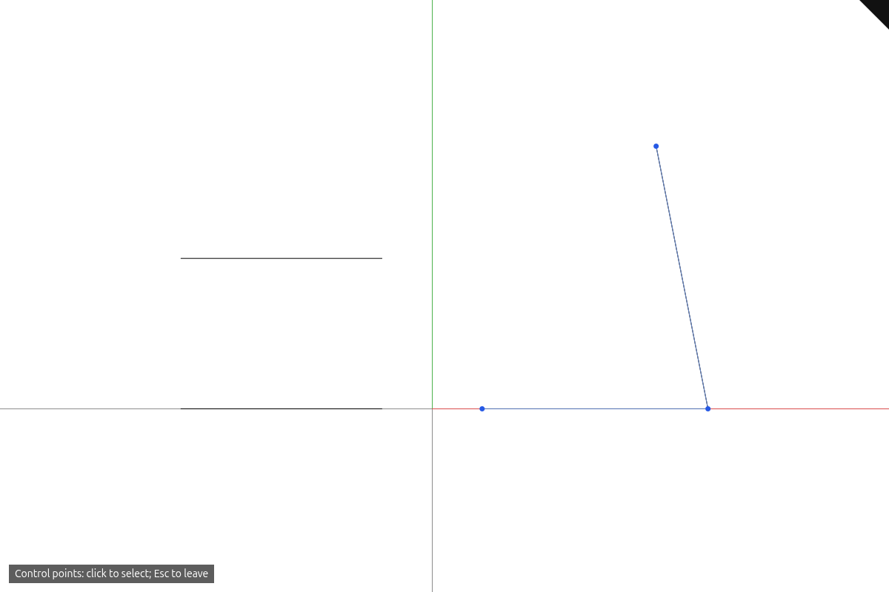

# Make control dragging respect object placement

## You are building

Drag polyline and NURBS controls on placed objects without a release jump. Keep source coordinates local, pointer rays in world coordinates, and previews outside kernel history.



Actual maintained viewer output. [Capture setup and five browser rounds](extensions/README.md).

## Starting point

Start from a fresh checkpoint **21**, not from another extension lesson. The lessons can be implemented separately. Every code block below is complete; there are no omitted method bodies. Execute every edit within one step before its check.

Use the tools installed in [00 · Environment](00-environment.md). From the maintained `session_viewer` repository, create your learning workspace once:

```bash
export COURSE_REPO="$PWD"
bash "$COURSE_REPO/docs/serve.sh" build --quiet
python3 "$COURSE_REPO/docs/extensions.py" --prepare "$HOME/viewer-controls"
cd "$HOME/viewer-controls/session_viewer"
export REGEN_PROTO=0
cargo check -j4 --lib
```

The build prepares the frozen checkpoint cache. The initializer copies its viewer and kernel into a new folder; it does **not** install the feature. Expected: `Finished` with no compiler errors. Keep this terminal in the new `session_viewer` directory. If the destination exists, use a new folder name.

For **CURRENT → REPLACE WITH**, find the complete CURRENT block in the named file and replace it once. For **ADD BELOW**, keep the shown anchor and insert the new block directly after it. For **NEW FILE**, create the named path and paste its complete block. Apply blocks in page order; compile only at the check marker. All required code and answers are visible here.

## Step 1 · Convert a world target back into source coordinates

The stored control point is local. Invert its full placement (file, ancestors and object) before Session::replace. A singular transform is refused. The regression test uses a translated and scaled file and confirms that a shared second placement remains unchanged.

### `src/app/edit.rs`

**TYPE THIS**

**CURRENT**

```rust
    pub fn set_control_point(&mut self, row: u32, index: usize, to: &Point) -> bool {
```

**ADD BELOW**

```rust
        if !self.streamed.is_empty() || !self.sheets.is_empty() {
            return false;
        }
        let Some(back) = self
            .placement_of(row)
            .and_then(|m| Xform::from_matrix(m).inverse())
        else {
            return false;
        };
        let local = to.transformed(&back);
        let to = &local;
```

**TYPE THIS**

**CURRENT**

```rust
        );
    }
}
```

**REPLACE WITH**

```rust
        );
    }
    #[test]
    fn control_edit_converts_world_to_local_under_file_placement() {
        let mut source = Session::new("placed");
        assert!(
            source
                .add_polyline(
                    session_rust::Polyline::new(vec![
                        Point::new(0.0, 0.0, 0.0),
                        Point::new(1.0, 0.0, 0.0)
                    ]),
                    None
                )
                .is_some()
        );
        let shared = Rc::new(source);
        let mut placed = file("placed", Rc::clone(&shared));
        placed.place = &Xform::translation(100.0, 0.0, 0.0) * &Xform::scale_xyz(10.0, 10.0, 10.0);
        let mut scene = Scene::new();
        scene.add_file(placed);
        scene.add_file(file("unmodified", shared));
        assert!(scene.set_control_point(0, 1, &Point::new(120.0, 30.0, 0.0)));
        let Geometry::Polyline(line) = scene.geometry(0).unwrap() else {
            panic!()
        };
        assert_eq!(line.get_point(1).unwrap()[0], 2.0);
        assert_eq!(line.get_point(1).unwrap()[1], 3.0);
        let Geometry::Polyline(other) = scene.geometry(1).unwrap() else {
            panic!()
        };
        assert_eq!(other.get_point(1).unwrap()[0], 1.0);
        assert!(scene.undo());
        let Geometry::Polyline(line) = scene.geometry(0).unwrap() else {
            panic!()
        };
        assert_eq!(line.get_point(1).unwrap()[0], 1.0);
    }

}
```

### Check step 1

**Verified:** the complete step compiles for WebAssembly.

```bash
cargo check -j4 --lib
```

## Step 2 · Keep hit tests in world space and previews local

At grab, project the transformed control and freeze the world-space plane origin. During movement, intersect the world ray with that plane and rank transformed neighbour controls as snaps. Convert the resulting world target back to local coordinates only for the GPU preview. On release, commit once through set_control_point.

### `src/state/edit.rs`

**TYPE THIS**

**CURRENT**

```rust
    plane: CPlane,
```

**ADD BELOW**

```rust
    origin: Point,
```

**TYPE THIS**

**CURRENT**

```rust
        let at = self.controls.points[index].position;
        let Some((sx, sy)) = self.project(at) else {
            return false;
```

**REPLACE WITH**

```rust
        let at = self.controls.points[index].position;
        let Some(place) = self.scene.placement_of(parent) else {
            return false;
        };
        let origin = Point::new(at[0], at[1], at[2]).transformed(&Xform::from_matrix(place));
        let Some((sx, sy)) = self.project([origin[0], origin[1], origin[2]]) else {
            return false;
```

**TYPE THIS**

**CURRENT**

```rust
            plane: CPlane::facing(&forward),
```

**ADD BELOW**

```rust
            origin,
```

**TYPE THIS**

**CURRENT**

```rust
        let index = active.index;
```

**ADD ABOVE**

```rust
        let Some(back) = self
            .scene
            .placement_of(active.parent)
            .and_then(|m| Xform::from_matrix(m).inverse())
        else {
            return false;
        };
        let point = point.transformed(&back);
```

**TYPE THIS**

**CURRENT**

```rust
        let Some(point) = self.control_target(&active, x, y) else {
```

**ADD ABOVE**

```rust
        if let Some(geometry) = self.scene.geometry(active.parent) {
            self.controls = crate::app::selection::Controls::from_geometry(geometry);
        }
        self.upload_controls();
        self.touch();
```

**TYPE THIS**

**CURRENT**

```rust
        let (from, dir) = self.camera.ray((x, y), self.viewport())?;
        let origin = {
            let at = self.controls.points[active.index].position;
            Point::new(at[0], at[1], at[2])
        };
        let free = active.plane.hit(&origin, &from, &dir)?;
        let mut candidates = Vec::new();
```

**REPLACE WITH**

```rust
        let (from, dir) = self.camera.ray((x, y), self.viewport())?;
        let free = active.plane.hit(&active.origin, &from, &dir)?;
        let place = Xform::from_matrix(self.scene.placement_of(active.parent)?);
        let mut candidates = Vec::new();
```

**TYPE THIS**

**CURRENT**

```rust
                    control.position[2],
                ),
                kind: SnapKind::Vertex,
                owner: active.parent,
            });
        }
        // The ranking is in SCREEN space, so the aperture means pixels wherever the camera is.
        let project = |p: &Point| self.project([p[0], p[1], p[2]]);
        match snap::best(&candidates, (x, y), SNAP_APERTURE_PX * self.pixel_scale(), project) {
            Some(hit) => Some(hit.point),
```

**REPLACE WITH**

```rust
                    control.position[2],
                )
                .transformed(&place),
                kind: SnapKind::Vertex,
                owner: active.parent,
            });
        }
        // The ranking is in SCREEN space, so the aperture means pixels wherever the camera is.
        let project = |p: &Point| self.project([p[0], p[1], p[2]]);
        match snap::best(
            &candidates,
            (x, y),
            SNAP_APERTURE_PX * self.pixel_scale(),
            project,
        ) {
            Some(hit) => Some(hit.point),
```

### Check step 2

**Verified:** the complete step compiles for WebAssembly.

```bash
cargo check -j4 --lib
```

## Step 3 · Restore previews on cancellation and failure

Re-uploading the modified preview cannot cancel it. Reconstruct controls from source, and restore the saved object placement before a failed gumball release can return. Cancel an active gesture before changing selection or clearing the scene. The existing gesture listener and GPU lanes remain unchanged.

### `src/state.rs`

**TYPE THIS**

**CURRENT**

```rust
    pub fn clear(&mut self) {
```

**ADD BELOW**

```rust
        self.cancel_gesture();
```

**TYPE THIS**

**CURRENT**

```rust
    pub fn select(&mut self, row: Option<u32>) {
```

**ADD BELOW**

```rust
        self.cancel_gesture();
```

### `src/state/edit.rs`

**TYPE THIS**

**CURRENT**

```rust
        let Some(active) = self.dragging.take() else {
            return false;
        };
```

**ADD BELOW**

```rust
        self.gpu
            .objects
            .set_placement(&self.gpu.ctx, active.row, &active.base_place);
        self.gpu.grew_bounds(active.row);
        self.touch();
```

**TYPE THIS**

**CURRENT**

```rust
        }
        if self.control_drag.take().is_some() {
            // The control preview is a dot in a temporary lane; re-uploading from the source
            // puts it back.
            self.upload_controls();
```

**REPLACE WITH**

```rust
        }
        if let Some(active) = self.control_drag.take() {
            if let Some(geometry) = self.scene.geometry(active.parent) {
                self.controls = crate::app::selection::Controls::from_geometry(geometry);
            }
            self.upload_controls();
```

### Check step 3

**Verified:** the complete step compiles for WebAssembly.

```bash
cargo check -j4 --lib
```

## Check

```bash
cargo xtest -j4 --lib app::edit
trunk serve --port 8780
```

Open <http://localhost:8780/?data=off&inspect=1>. Stop the server with **Ctrl+C**.

### Reproduce the screenshots

The screenshots use the small [nested fixture](extensions/nested.pb) and [manifest](extensions/nested.yaml), not private project files. Save both into your workspace:

```bash
cp "$COURSE_REPO/docs/extensions/nested.pb" assets/extension-nested.pb
cp "$COURSE_REPO/docs/extensions/nested.yaml" assets/extension-nested.yaml
```

Open <http://localhost:8780/?scene=extension-nested.yaml&data=off&inspect=1>.

## What changed

Only polyline and NURBS curve controls are editable. Mesh vertices and surface controls remain read-only. The construction plane is fixed at the grab position. Streamed scenes refuse commits that would discard streamed rows.

## Try

Load the supplied fixture. Select the placed polyline, press F10, click a control, then drag it. Release must not jump. Ctrl+Z restores the previous control. Drag again and press Escape before releasing: the source and dot return to their original positions.

## Questions and answers

**What goes to the GPU?** Modeling rebuilds existing geometry lanes; panels change object flags; controls upload a small preview. The solid gumball owns a fixed mesh, an unlit shader and a bounded antialiasing tile.

**Why clear row selection after rebuilding?** Row numbers are upload addresses, not permanent identities. A rebuild can assign the same number to a different object.

**Where is the exact patch?** [step 1](extensions/controls-1.patch), [step 2](extensions/controls-2.patch), [step 3](extensions/controls-3.patch). The patch and these visible instructions are generated from the same changes.
