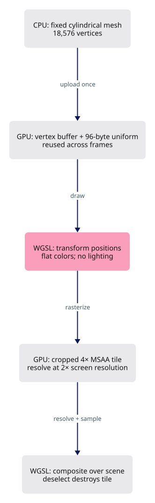
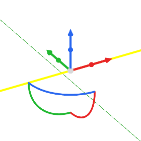

# Draw a solid, readable gumball

Draw the gumball as real meshes: cylinder shafts, cone tips, rotation tubes and spheres, antialiased in their own tile.



## Starting point

Copy checkpoint 21 and check it builds; the finished steps are in `lessons/gumball-1/`.

```bash
cp -r docs/lessons/21 docs/lessons/my-gumball
cd docs/lessons/my-gumball
cargo check -j4 --lib
```

## Step 1 · Build the mesh, smooth its edges and connect its lifetime

Build the widget mesh once, give it a uniform and a tile that lives while selected, and draw it after the scene.

### `src/app/gizmo.rs`

`lessons/gumball-1/src/app/gizmo.rs` · type this, replaces the `pub const ARM: f64 = 72.0;` line block

```rust
--8<-- "lessons/gumball-1/src/app/gizmo.rs:step-1"
```

### `src/app/input.rs`

`lessons/gumball-1/src/app/input.rs` · type this, replaces the `self.last_cursor = (position.x, position.y);` line block

```rust
--8<-- "lessons/gumball-1/src/app/input.rs:step-1"
```

`lessons/gumball-1/src/app/input.rs` · type this, replaces the `ElementState::Pressed => {` line block

```rust
--8<-- "lessons/gumball-1/src/app/input.rs:step-1b"
```

### `src/engine/gpu/mod.rs`

`lessons/gumball-1/src/engine/gpu/mod.rs` · type this, added at the start of `mod view`

```rust
--8<-- "lessons/gumball-1/src/engine/gpu/mod.rs:step-1"
```

`lessons/gumball-1/src/engine/gpu/mod.rs` · type this, replaces the `pub control_net: SegmentLane,` line block

```rust
--8<-- "lessons/gumball-1/src/engine/gpu/mod.rs:step-1b"
```

`lessons/gumball-1/src/engine/gpu/mod.rs` · type this, replaces the `+ self.control_net.allocated_bytes()` line block

```rust
--8<-- "lessons/gumball-1/src/engine/gpu/mod.rs:step-1c"
```

`lessons/gumball-1/src/engine/gpu/mod.rs` · type this, added after the `frame_textures` line

```rust
--8<-- "lessons/gumball-1/src/engine/gpu/mod.rs:step-1d"
```

`lessons/gumball-1/src/engine/gpu/mod.rs` · type this, replaces the `let control_net = SegmentLane::new(&ctx, &layouts, target);` line block

```rust
--8<-- "lessons/gumball-1/src/engine/gpu/mod.rs:step-1e"
```

`lessons/gumball-1/src/engine/gpu/mod.rs` · type this, replaces the `control_net,` line block

```rust
--8<-- "lessons/gumball-1/src/engine/gpu/mod.rs:step-1f"
```

Delete the `fn set_widget_rows` block from `lessons/21/src/engine/gpu/mod.rs`.

Delete the `fn widget_row` block from `lessons/21/src/engine/gpu/mod.rs`.

`lessons/gumball-1/src/engine/gpu/mod.rs` · type this, replaces the `self.control_net.retarget(&self.ctx, &self.layouts, target);` line block

```rust
--8<-- "lessons/gumball-1/src/engine/gpu/mod.rs:step-1g"
```

`lessons/gumball-1/src/engine/gpu/mod.rs` · type this, replaces the `self.control_net.reset();` line block

```rust
--8<-- "lessons/gumball-1/src/engine/gpu/mod.rs:step-1h"
```

`lessons/gumball-1/src/engine/gpu/mod.rs` · type this, replaces the `self.control_net.release(&self.ctx, &self.layouts);` line block

```rust
--8<-- "lessons/gumball-1/src/engine/gpu/mod.rs:step-1i"
```

### `src/engine/gpu/present.rs`

`lessons/gumball-1/src/engine/gpu/present.rs` · type this, added after the `self.frame.write(&self.ctx, input, &cx);` line

```rust
--8<-- "lessons/gumball-1/src/engine/gpu/present.rs:step-1"
```

### `src/engine/gpu/render.rs`

`lessons/gumball-1/src/engine/gpu/render.rs` · type this, added before the `(draws, self.objects.len())` line

```rust
--8<-- "lessons/gumball-1/src/engine/gpu/render.rs:step-1"
```

`lessons/gumball-1/src/engine/gpu/render.rs` · type this, replaces the `draws += self.controls.draw_dots(pass, &b);` line block

```rust
--8<-- "lessons/gumball-1/src/engine/gpu/render.rs:step-1b"
```

### `src/engine/gpu/widget.rs`

`lessons/gumball-1/src/engine/gpu/widget.rs` · type this, new file

```rust
--8<-- "lessons/gumball-1/src/engine/gpu/widget.rs"
```

### `src/engine/gpu/widget_mesh.rs`

`lessons/gumball-1/src/engine/gpu/widget_mesh.rs` · type this, new file

```rust
--8<-- "lessons/gumball-1/src/engine/gpu/widget_mesh.rs"
```

### `src/shaders/widget.wgsl`

`lessons/gumball-1/src/shaders/widget.wgsl` · type this, new file

```wgsl
--8<-- "lessons/gumball-1/src/shaders/widget.wgsl"
```

### `src/state.rs`

`lessons/gumball-1/src/state.rs` · type this, added at the start of `fn render`

```rust
--8<-- "lessons/gumball-1/src/state.rs:step-1"
```

### `src/state/edit.rs`

`lessons/gumball-1/src/state/edit.rs` · type this, replaces the `use crate::app::cplane::CPlane;` line block

```rust
--8<-- "lessons/gumball-1/src/state/edit.rs:step-1"
```

`lessons/gumball-1/src/state/edit.rs` · type this, added at the start of `fn world_per_px`

```rust
--8<-- "lessons/gumball-1/src/state/edit.rs:step-1b"
```

`lessons/gumball-1/src/state/edit.rs` · type this, replaces the `const ARC_STEPS: u32 = 12;` line block

```rust
--8<-- "lessons/gumball-1/src/state/edit.rs:step-1c"
```

Delete the `fn the_widget_draws_three_arms_three_arcs_and_four_balls` block from `lessons/21/src/state/edit.rs`.

`lessons/gumball-1/src/state/edit.rs` · type this, replaces the `let widget = gpu.widget_row();` line block

```rust
--8<-- "lessons/gumball-1/src/state/edit.rs:step-1d"
```

Delete the `fn the_arcs_are_where_the_hit_test_expects_them` block from `lessons/21/src/state/edit.rs`.

### Check step 1

Run `cargo check -j4 --lib`.

## Check

Run `cargo xtest -j4 --lib widget`, then `trunk serve --port 8780` and open <http://localhost:8780/?data=off&inspect=1>.

For the screenshot scene, copy the [nested fixture](extensions/nested.pb) and its [manifest](extensions/nested.yaml) into `assets/` as `extension-nested.pb` / `.yaml` and open <http://localhost:8780/?scene=extension-nested.yaml&data=off&inspect=1>.

## Try

Select an object, press 7. Drag a shaft to move, a sphere to scale, a ring to rotate; hover turns a handle amber.

## Finished code

step 1 in `lessons/gumball-1/`.

## Expected viewer result

A selected line with solid shafts, cone tips, rings and spheres.

[](screenshots/extensions-gumball.png)
