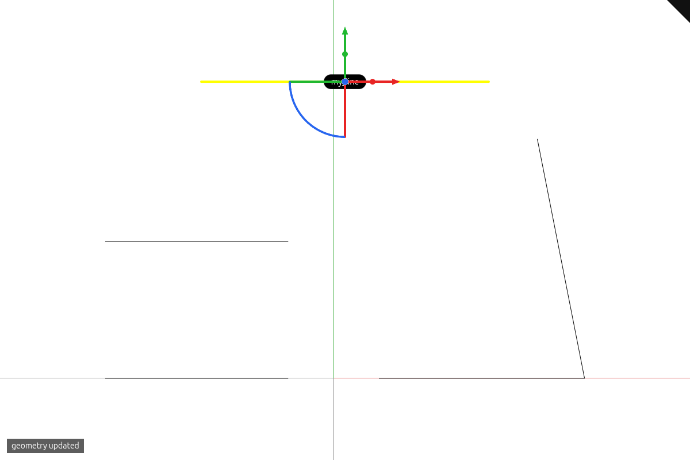

# Create, trim, extend and explode

## You are building

Type world coordinates, change exact kernel geometry, and keep each command as one undo step. No new shader is needed: the point and line lanes already draw these objects.



Actual maintained viewer output. [Capture setup and five browser rounds](extensions/README.md).

## Starting point

Start from a fresh checkpoint **21**, not from another extension lesson. The lessons can be implemented separately. Every code block below is complete; there are no omitted method bodies. Execute every edit within one step before its check.

Use the tools installed in [00 · Environment](00-environment.md). From the maintained `session_viewer` repository, create your learning workspace once:

```bash
export COURSE_REPO="$PWD"
bash "$COURSE_REPO/docs/serve.sh" build --quiet
python3 "$COURSE_REPO/docs/extensions.py" --prepare "$HOME/viewer-modeling"
cd "$HOME/viewer-modeling/session_viewer"
export REGEN_PROTO=0
cargo check -j4 --lib
```

The build prepares the frozen checkpoint cache. The initializer copies its viewer and kernel into a new folder; it does **not** install the feature. Expected: `Finished` with no compiler errors. Keep this terminal in the new `session_viewer` directory. If the destination exists, use a new folder name.

For **CURRENT → REPLACE WITH**, find the complete CURRENT block in the named file and replace it once. For **ADD BELOW**, keep the shown anchor and insert the new block directly after it. For **NEW FILE**, create the named path and paste its complete block. Apply blocks in page order; compile only at the check marker. All required code and answers are visible here.

## Step 1 · Build the document operations

Create the file below, register it, and add the document slot. Read the enum first, then Scene::model: validation precedes mutation. create_geometry owns the Created document. edit_geometry uses replace for trims and one remove/add transaction for explosion. The tests at the end are included, not left as an exercise. Nothing new appears on screen until step 2.

### `src/app/mod.rs`

**TYPE THIS**

**CURRENT**

```rust
pub mod manifest;
```

**ADD BELOW**

```rust
pub mod modeling;
```

### `src/app/modeling.rs`

**NEW FILE · TYPE THIS**

```rust
use crate::app::scene::FileDoc;
use crate::app::scene::Scene;
use session_rust::Geometry;
use session_rust::Line;
use session_rust::Point;
use session_rust::Polyline;
use session_rust::Session;
use session_rust::Xform;
use std::rc::Rc;

pub const MAX_POINTS: usize = 4096;

#[derive(Clone, Debug, PartialEq)]
pub enum Modeling {
    Point([f64; 3]),
    Line([f64; 3], [f64; 3]),
    Polyline(Vec<[f64; 3]>),
    Trim(f64, f64),
    Extend(f64, f64),
    Explode,
}

impl Scene {
    /// Commit a geometry command as one undoable document edit.
    pub fn model(&mut self, command: &Modeling) -> Result<(), String> {
        if !self.streamed.is_empty() || !self.sheets.is_empty() {
            return Err("geometry edits require a scene without streamed sources".into());
        }
        match command {
            Modeling::Point(p) => self.create_geometry(Geometry::Point(Rc::new(point(*p)?))),
            Modeling::Line(a, b) => {
                let line = Line::from_points(&point(*a)?, &point(*b)?);
                if line.length() <= 1e-12 {
                    return Err("line endpoints must differ".into());
                }
                self.create_geometry(Geometry::Line(Rc::new(line)))
            }
            Modeling::Polyline(points) => {
                if !(2..=MAX_POINTS).contains(&points.len()) {
                    return Err(format!("polyline needs 2–{MAX_POINTS} points"));
                }
                let points = points
                    .iter()
                    .map(|p| point(*p))
                    .collect::<Result<Vec<_>, _>>()?;
                self.create_geometry(Geometry::Polyline(Rc::new(Polyline::new(points))))
            }
            _ => self.edit_geometry(command),
        }
    }

    fn create_geometry(&mut self, geometry: Geometry) -> Result<(), String> {
        let index = self.created_doc;
        let doc = match index {
            Some(index) => index,
            None => {
                self.docs.push(FileDoc {
                    name: "Created".into(),
                    session: Rc::new(Session::new("Created")),
                    place: Xform::identity(),
                    point_px: 0.0,
                    display_only: false,
                });
                self.docs.len() - 1
            }
        };
        self.created_doc = Some(doc);
        let session = Rc::make_mut(&mut self.docs[doc].session);
        session.begin("create");
        match geometry {
            Geometry::Point(p) => {
                session.add_point((*p).clone(), None);
            }
            Geometry::Line(line) => {
                session.add_line((*line).clone(), None);
            }
            Geometry::Polyline(line) => {
                let added = session.add_polyline((*line).clone(), None);
                debug_assert!(added.is_some());
            }
            _ => unreachable!(),
        }
        session.commit();
        self.last_edited = Some(doc);
        Ok(())
    }

    fn edit_geometry(&mut self, command: &Modeling) -> Result<(), String> {
        let row = self.selected.ok_or("select one object first")?;
        let (doc, guid) = self.identity_of(row).ok_or("object no longer exists")?;
        let file = self.docs.get(doc).ok_or("this object has no document")?;
        if file.display_only {
            return Err("this document is display only".into());
        }
        let source = self.geometry(row).ok_or("source geometry is unavailable")?;
        if matches!(command, Modeling::Explode) {
            let Geometry::Polyline(line) = source else {
                return Err("explode currently accepts polylines".into());
            };
            if line.point_count() > MAX_POINTS {
                return Err(format!("explode is limited to {MAX_POINTS} points"));
            }
            if file
                .session
                .tree
                .get_node_by_name(&guid)
                .is_some_and(|node| !node.borrow().is_leaf())
            {
                return Err("explode requires an object without child geometry".into());
            }
            let points = line.get_points();
            let width = line.width;
            let dash = line.dash.clone();
            let color = line.linecolor.clone();
            let place = file.session.world_xform(&guid);
            let session = Rc::make_mut(&mut self.docs[doc].session);
            session.begin("explode");
            if !session.remove_object(&guid) {
                session.commit();
                return Err("object no longer exists".into());
            }
            for pair in points.windows(2) {
                let mut line = Line::from_points(&pair[0], &pair[1]);
                line.width = width;
                line.dash = dash.clone();
                line.linecolor = color.clone();
                let node = session.add_line(line, None);
                session.set_xform(&node.borrow().name, place.clone());
            }
            session.commit();
        } else {
            let next = edited(source, command)?;
            let session = Rc::make_mut(&mut self.docs[doc].session);
            session.begin("edit geometry");
            let replaced = session.replace(&guid, next);
            session.commit();
            if !replaced {
                return Err("object no longer exists".into());
            }
        }
        self.last_edited = Some(doc);
        Ok(())
    }
}

fn point(p: [f64; 3]) -> Result<Point, String> {
    if p.iter().any(|v| !v.is_finite() || v.abs() > 1e12) {
        return Err("coordinates must be finite and within ±1e12".into());
    }
    Ok(Point::new(p[0], p[1], p[2]))
}

fn edited(source: &Geometry, command: &Modeling) -> Result<Geometry, String> {
    let (a, b, trim) = match *command {
        Modeling::Trim(a, b) => (a, b, true),
        Modeling::Extend(a, b) => (a, b, false),
        _ => return Err("expected trim or extend".into()),
    };
    if !a.is_finite() || !b.is_finite() || a >= b || a.abs() > 1e6 || b.abs() > 1e6 {
        return Err("parameters must be finite, increasing, and within ±1e6".into());
    }
    if (trim && (a < 0.0 || b > 1.0)) || (!trim && (a > 0.0 || b < 1.0)) {
        return Err("trim keeps 0 ≤ a < b ≤ 1; extend needs a ≤ 0 and b ≥ 1".into());
    }
    match source {
        Geometry::Line(line) => {
            let mut next = Line::from_points(&line.point_at(a), &line.point_at(b));
            next.name = line.name.clone();
            next.linecolor = line.linecolor.clone();
            next.width = line.width;
            next.dash = line.dash.clone();
            Ok(Geometry::Line(Rc::new(next)))
        }
        Geometry::NurbsCurve(curve) => {
            if curve.m_cv_count > MAX_POINTS {
                return Err(format!("curve edits are limited to {MAX_POINTS} controls"));
            }
            let mut next = (**curve).clone();
            let (lo, hi) = next.domain();
            let a = lo + a * (hi - lo);
            let b = lo + b * (hi - lo);
            let ok = if trim {
                next.trim(a, b)
            } else {
                next.extend(a, b)
            };
            if !ok {
                return Err("kernel refused this curve interval".into());
            }
            Ok(Geometry::NurbsCurve(Rc::new(next)))
        }
        _ => Err("trim and extend currently accept lines and NURBS curves".into()),
    }
}

#[cfg(test)]
mod tests {
    use super::*;

    fn scene(geometry: Polyline) -> Scene {
        let mut session = Session::new("test");
        assert!(session.add_polyline(geometry, None).is_some());
        let mut scene = Scene::new();
        scene.add_file(FileDoc {
            name: "test".into(),
            session: Rc::new(session),
            place: Xform::identity(),
            point_px: 0.0,
            display_only: false,
        });
        scene.selected = Some(0);
        scene
    }

    #[test]
    fn creation_undo_redo_and_invalid_input() {
        let mut scene = Scene::new();
        assert!(scene.model(&Modeling::Point([f64::NAN, 0.0, 0.0])).is_err());
        assert!(scene.docs.is_empty());
        scene.model(&Modeling::Point([1.0, 2.0, 3.0])).unwrap();
        assert_eq!(scene.docs[0].session.lookup.len(), 1);
        assert!(scene.undo());
        assert!(scene.docs[0].session.lookup.is_empty());
        assert!(scene.redo());
        assert_eq!(scene.docs[0].session.lookup.len(), 1);
    }

    #[test]
    fn trim_and_extend_preserve_style_and_intervals() {
        let mut line = Line::new(0.0, 0.0, 0.0, 10.0, 0.0, 0.0);
        line.width = 3.0;
        let source = Geometry::Line(Rc::new(line));
        let Geometry::Line(trim) = edited(&source, &Modeling::Trim(0.2, 0.8)).unwrap() else {
            panic!()
        };
        assert_eq!(trim.start()[0], 2.0);
        assert_eq!(trim.end()[0], 8.0);
        assert_eq!(trim.width, 3.0);
        let Geometry::Line(extend) = edited(&source, &Modeling::Extend(-0.5, 1.5)).unwrap() else {
            panic!()
        };
        assert_eq!(extend.start()[0], -5.0);
        assert_eq!(extend.end()[0], 15.0);
        assert!(edited(&source, &Modeling::Trim(-0.1, 0.8)).is_err());
        assert!(edited(&source, &Modeling::Extend(0.1, 1.5)).is_err());
    }

    #[test]
    fn curve_trim_uses_normalized_domain() {
        let curve = session_rust::NurbsCurve::create(
            false,
            1,
            &[Point::new(0.0, 0.0, 0.0), Point::new(10.0, 0.0, 0.0)],
        );
        let source = Geometry::NurbsCurve(Rc::new(curve));
        let Geometry::NurbsCurve(curve) = edited(&source, &Modeling::Trim(0.2, 0.8)).unwrap()
        else {
            panic!()
        };
        assert!((curve.point_at_start()[0] - 2.0).abs() < 1e-9);
        assert!((curve.point_at_end()[0] - 8.0).abs() < 1e-9);
    }

    #[test]
    fn explode_is_one_transaction_and_preserves_placement() {
        let mut scene = scene(Polyline::new(vec![
            Point::new(0.0, 0.0, 0.0),
            Point::new(1.0, 0.0, 0.0),
            Point::new(1.0, 1.0, 0.0),
        ]));
        let (_, guid) = scene.identity_of(0).unwrap();
        Rc::make_mut(&mut scene.docs[0].session)
            .set_xform(&guid, Xform::translation(5.0, 0.0, 0.0));
        scene.model(&Modeling::Explode).unwrap();
        let session = &scene.docs[0].session;
        assert_eq!(session.lookup.len(), 2);
        for guid in session.lookup.keys() {
            assert_eq!(session.world_xform(guid).m[12], 5.0);
        }
        assert!(scene.undo());
        assert_eq!(scene.docs[0].session.lookup.len(), 1);
        assert!(matches!(
            scene.docs[0].session.lookup.get(guid.as_ref()),
            Some(Geometry::Polyline(_))
        ));
        assert!(scene.redo());
        assert_eq!(scene.docs[0].session.lookup.len(), 2);
    }
}
```

### `src/app/scene.rs`

**TYPE THIS**

**CURRENT**

```rust
    pub last_edited: Option<usize>,
```

**ADD BELOW**

```rust
    pub(crate) created_doc: Option<usize>,
```

**TYPE THIS**

**CURRENT**

```rust
            last_edited: None,
        }
    }

    /// Drop every document and its GPU rows, keeping the scene usable: a scene can be
    /// REPLACED without tearing down `State` (camera, surface and pipelines survive).
    pub fn clear(&mut self, gpu: &mut Gpu) {
        self.docs.clear();
```

**REPLACE WITH**

```rust
            last_edited: None,
            created_doc: None,
        }
    }

    /// Drop every document and its GPU rows, keeping the scene usable: a scene can be
    /// REPLACED without tearing down `State` (camera, surface and pipelines survive).
    pub fn clear(&mut self, gpu: &mut Gpu) {
        self.created_doc = None;
        self.last_edited = None;
        self.docs.clear();
```

### Check step 1

**Verified:** the complete step compiles for WebAssembly.

```bash
cargo check -j4 --lib
```

## Step 2 · Connect the command line to the operations

The parser owns the input syntax; State owns the action. Command loses Copy because a polyline contains a Vec. The Model arm commits source geometry and calls after_history, which clears stale row selection and uploads the rebuilt scene. All other verbs retain their existing actions.

### `src/app/command.rs`

**TYPE THIS**

**CURRENT**

```rust
//! The command line: one typed line becomes one named action.
//!
//! Parsing is here and doing is in `State`, so what a line MEANS can be tested without a
//! window, a device or a scene. A verb the viewer does not have is an error with the line
//! quoted back, never a silent no-op: a command line that ignores what you typed is worse
//! than one that refuses it.
//!
//! Every verb is an action the viewer already has. The command line is a second way to reach
//! them, not a second implementation of them.

use crate::app::coords;
use crate::app::gizmo::Axis;

/// What a line asked for.
#[derive(Clone, Copy, Debug, PartialEq)]
pub enum Command {
    /// Move the selection by a world offset, in millimetres.
    Move([f64; 3]),
    /// Turn the selection about one axis through its own centre, in degrees.
    Rotate { axis: Axis, degrees: f64 },
    /// Scale the selection about its own centre.
```

**REPLACE WITH**

```rust
use crate::app::coords;
use crate::app::gizmo::Axis;

/// What a line asked for.
#[derive(Clone, Debug, PartialEq)]
pub enum Command {
    Model(crate::app::modeling::Modeling),
    /// Move the selection by a world offset, in millimetres.
    Move([f64; 3]),
    /// Turn the selection about one axis through its own centre, in degrees.
    Rotate {
        axis: Axis,
        degrees: f64,
    },
    /// Scale the selection about its own centre.
```

**TYPE THIS**

**CURRENT**

```rust
pub fn parse(line: &str) -> Result<Command, String> {
```

**ADD BELOW**

```rust
    if line.len() > 65536 {
        return Err("command exceeds 64 KiB".into());
    }
```

**TYPE THIS**

**CURRENT**

```rust
    let rest: Vec<&str> = words.collect();
    match verb.as_str() {
        "move" | "m" => offset(&rest).map(Command::Move),
```

**REPLACE WITH**

```rust
    let rest: Vec<&str> = words.collect();
    let expected = match verb.as_str() {
        "scale" | "s" => Some(1),
        "rotate" | "rot" => Some(2),
        "delete" | "del" | "undo" | "redo" | "hide" | "show" | "fit" | "escape" | "esc" => Some(0),
        _ => None,
    };
    if expected.is_some_and(|count| rest.len() != count) {
        return Err(format!("wrong number of arguments for `{verb}`"));
    }
    match verb.as_str() {
        "point" | "line" | "polyline" | "trim" | "extend" | "explode" => {
            model(&verb, &rest).map(Command::Model)
        }
        "move" | "m" => offset(&rest).map(Command::Move),
```

**TYPE THIS**

**CURRENT**

```rust
        assert_eq!(parse(""), Err("nothing typed".into()));
        assert!(parse("scale 0").is_err(), "a zero scale collapses the object");
        assert!(parse("rotate 90").is_err(), "no axis");
        assert!(parse("rotate x").is_err(), "no angle");
        assert!(parse("move sideways").is_err());
    }
```

**REPLACE WITH**

```rust
        assert_eq!(parse(""), Err("nothing typed".into()));
        assert!(
            parse("scale 0").is_err(),
            "a zero scale collapses the object"
        );
        assert!(parse("rotate 90").is_err(), "no axis");
        assert!(parse("rotate x").is_err(), "no angle");
        assert!(parse("move sideways").is_err());
    }

    #[test]
    fn modeling_commands_validate_arity_and_coordinates() {
        use crate::app::modeling::Modeling;
        assert_eq!(
            parse("point 1,2,3"),
            Ok(Command::Model(Modeling::Point([1.0, 2.0, 3.0])))
        );
        assert_eq!(
            parse("trim 0.2 0.8"),
            Ok(Command::Model(Modeling::Trim(0.2, 0.8)))
        );
        assert_eq!(parse("explode"), Ok(Command::Model(Modeling::Explode)));
        for line in [
            "point @1,2,3",
            "line 0,0,0",
            "trim 0 1 extra",
            "explode extra",
            "scale 2 extra",
            "delete extra",
        ] {
            assert!(parse(line).is_err(), "{line}");
        }
        assert!(parse(&"x".repeat(65537)).is_err());
    }
```

**TYPE THIS**

**CURRENT**

```rust
        );
    }
}
```

**ADD BELOW**

```rust

fn model(verb: &str, words: &[&str]) -> Result<crate::app::modeling::Modeling, String> {
    use crate::app::modeling::Modeling;
    match verb {
        "explode" if words.is_empty() => Ok(Modeling::Explode),
        "trim" | "extend" if words.len() == 2 => {
            let a = number(words.first().copied(), "trim 0.2 0.8")?;
            let b = number(words.get(1).copied(), "trim 0.2 0.8")?;
            Ok(if verb == "trim" {
                Modeling::Trim(a, b)
            } else {
                Modeling::Extend(a, b)
            })
        }
        "point" | "line" | "polyline" => {
            let mut points = Vec::new();
            if words.len() > crate::app::modeling::MAX_POINTS {
                return Err("too many points".into());
            }
            for word in words {
                let Some(coords::Typed::Absolute { x, y, z }) = coords::parse(word) else {
                    return Err("use world coordinates x,y,z separated by spaces".into());
                };
                points.push([x, y, z.unwrap_or(0.0)]);
            }
            match (verb, points.len()) {
                ("point", 1) => Ok(Modeling::Point(points[0])),
                ("line", 2) => Ok(Modeling::Line(points[0], points[1])),
                ("polyline", 2..) => Ok(Modeling::Polyline(points)),
                _ => Err("point needs one coordinate; line two; polyline at least two".into()),
            }
        }
        _ => Err("try trim 0.2 0.8, extend -0.2 1.2, or explode".into()),
    }
}
```

### `src/state/edit.rs`

**TYPE THIS**

**CURRENT**

```rust
    pub fn run_command(&mut self, line: &str) -> Result<String, String> {
        let command = crate::app::command::parse(line)?;
        let needs_selection = matches!(
```

**REPLACE WITH**

```rust
    pub fn run_command(&mut self, line: &str) -> Result<String, String> {
        self.cancel_gesture();
        let command = crate::app::command::parse(line)?;
        if matches!(command, Command::Delete | Command::Undo | Command::Redo)
            && (!self.scene.streamed.is_empty() || !self.scene.sheets.is_empty())
        {
            return Err("this command requires a scene without streamed sources".into());
        }
        let needs_selection = matches!(
```

**TYPE THIS**

**CURRENT**

```rust
        match command {
```

**ADD BELOW**

```rust
            Command::Model(command) => {
                self.scene.model(&command)?;
                self.after_history();
                Ok("geometry updated".into())
            }
```

**TYPE THIS**

**CURRENT**

```rust
            Command::Delete => {
                self.delete_selected();
                Ok("deleted".into())
            }
            Command::Undo => {
                self.undo();
                Ok("undone".into())
            }
            Command::Redo => {
                self.redo();
                Ok("redone".into())
```

**REPLACE WITH**

```rust
            Command::Delete => {
                let row = self.scene.selected.ok_or("nothing is selected")?;
                if !self.scene.delete_row(row) {
                    return Err("this object cannot be deleted".into());
                }
                self.after_history();
                Ok("deleted".into())
            }
            Command::Undo => {
                if !self.scene.undo() {
                    return Err("nothing to undo".into());
                }
                self.after_history();
                Ok("undone".into())
            }
            Command::Redo => {
                if !self.scene.redo() {
                    return Err("nothing to redo".into());
                }
                self.after_history();
                Ok("redone".into())
```

### Check step 2

**Verified:** the complete step compiles for WebAssembly.

```bash
cargo check -j4 --lib
```

## Check

```bash
cargo xtest -j4 --lib app::modeling
trunk serve --port 8780
```

Open <http://localhost:8780/?data=off&inspect=1>. Stop the server with **Ctrl+C**.

### Reproduce the screenshots

The screenshots use the small [nested fixture](extensions/nested.pb) and [manifest](extensions/nested.yaml), not private project files. Save both into your workspace:

```bash
cp "$COURSE_REPO/docs/extensions/nested.pb" assets/extension-nested.pb
cp "$COURSE_REPO/docs/extensions/nested.yaml" assets/extension-nested.yaml
```

Open <http://localhost:8780/?scene=extension-nested.yaml&data=off&inspect=1>.

## What changed

Creation uses world coordinates. Trim/extend accept lines and NURBS curves with normalized parameters, not cutting objects. Explode accepts polylines only. Commands reject streamed scenes that cannot survive a geometry rebuild.

## Try

Open `:` and enter `line 0,0,0 100,0,0`. Press F, select the line, then enter `trim 0.2 0.8`. Undo; enter `extend -0.2 1.2`. Create `polyline 0,0,0 100,0,0 100,100,0`, select it and enter `explode`. Undo restores one polyline.

## Questions and answers

**What goes to the GPU?** Modeling rebuilds existing geometry lanes; panels change object flags; controls upload a small preview. The solid gumball owns a fixed mesh, an unlit shader and a bounded antialiasing tile.

**Why clear row selection after rebuilding?** Row numbers are upload addresses, not permanent identities. A rebuild can assign the same number to a different object.

**Where is the exact patch?** [step 1](extensions/modeling-1.patch), [step 2](extensions/modeling-2.patch). The patch and these visible instructions are generated from the same changes.
