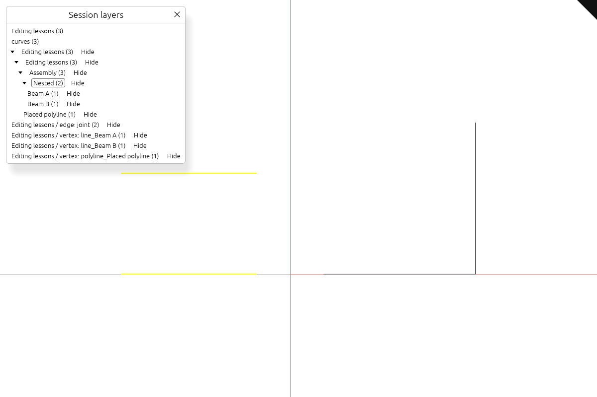

# Build the nested session and graph panel

## You are building

Browse nested groups, select their visible objects, and hide or show their descendants. Graph attribute rows control vertices or both endpoints of matching edges. The panel is DOM; only highlights and visibility flags go to wgpu.



Actual maintained viewer output. [Capture setup and five browser rounds](extensions/README.md).

## Starting point

Start from a fresh checkpoint **21**, not from another extension lesson. The lessons can be implemented separately. Every code block below is complete; there are no omitted method bodies. Execute every edit within one step before its check.

Use the tools installed in [00 · Environment](00-environment.md). From the maintained `session_viewer` repository, create your learning workspace once:

```bash
export COURSE_REPO="$PWD"
bash "$COURSE_REPO/docs/serve.sh" build --quiet
python3 "$COURSE_REPO/docs/extensions.py" --prepare "$HOME/viewer-panels"
cd "$HOME/viewer-panels/session_viewer"
export REGEN_PROTO=0
cargo check -j4 --lib
```

The build prepares the frozen checkpoint cache. The initializer copies its viewer and kernel into a new folder; it does **not** install the feature. Expected: `Finished` with no compiler errors. Keep this terminal in the new `session_viewer` directory. If the destination exists, use a new folder name.

For **CURRENT → REPLACE WITH**, find the complete CURRENT block in the named file and replace it once. For **ADD BELOW**, keep the shown anchor and insert the new block directly after it. For **NEW FILE**, create the named path and paste its complete block. Apply blocks in page order; compile only at the check marker. All required code and answers are visible here.

## Step 1 · Index source identity and subtree ranges

Add the pure index and its revision counter. A node points into one shared row vector, so each parent does not copy its descendants. The stack closes ranges on exit; the visited set stops cycles. The graph maps borrow GUID strings during lookup. This step compiles and tests without a panel or device.

### `src/app/hierarchy.rs`

**NEW FILE · TYPE THIS**

```rust
use crate::app::scene::Scene;
use session_rust::Session;
use std::collections::BTreeMap;
use std::collections::HashMap;
use std::collections::HashSet;
use std::ops::Range;
use std::rc::Rc;

const MAX_NODES: usize = 200_000;
const MAX_ROWS: usize = 1_000_000;
pub const PAGE_SIZE: usize = 128;
type Lookup = HashMap<usize, HashMap<Rc<str>, u32>>;

pub struct Node {
    pub label: String,
    pub depth: usize,
    pub end: usize,
    pub rows: Range<usize>,
}

#[derive(Default)]
pub struct Hierarchy {
    pub nodes: Vec<Node>,
    pub rows: Vec<u32>,
    pub open: HashSet<usize>,
    pub page: usize,
    pub selected: Vec<u32>,
    pub truncated: bool,
    revision: Option<u64>,
}

impl Hierarchy {
    pub fn refresh(&mut self, scene: &Scene) {
        if self.revision != Some(scene.row_revision) {
            self.rebuild(scene);
        }
    }

    /// Index tree subtrees and graph attributes without copying geometry.
    pub fn rebuild(&mut self, scene: &Scene) {
        self.revision = Some(scene.row_revision);
        self.nodes.clear();
        self.rows.clear();
        self.truncated = scene.object_count() > MAX_NODES;
        if self.truncated {
            return;
        }
        let mut lookup = Lookup::new();
        for row in 0..scene.object_count() as u32 {
            if let Some(identity) = scene.identity_of(row) {
                lookup
                    .entry(identity.0)
                    .or_default()
                    .insert(identity.1, row);
            }
        }
        for (doc, file) in scene.docs.iter().enumerate() {
            let start = self.nodes.len();
            let rows = self.rows.len();
            if !self.tree(scene, doc, &lookup)
                || !self.graph(&file.session, doc, &file.name, &lookup)
            {
                self.nodes.truncate(start);
                self.rows.truncate(rows);
                self.truncated = true;
                break;
            }
        }
        self.open.retain(|index| *index < self.nodes.len());
    }

    fn tree(&mut self, scene: &Scene, doc: usize, lookup: &Lookup) -> bool {
        let file = &scene.docs[doc];
        let start = self.nodes.len();
        if !self.push(&file.name, 0) {
            return false;
        }
        let mut seen = HashSet::new();
        let mut stack = Vec::new();
        if let Some(root) = file.session.tree.root() {
            stack.push((root, 1, None));
        }
        for _ in 0..MAX_NODES * 2 {
            let Some((node, depth, exit)) = stack.pop() else {
                break;
            };
            if let Some(index) = exit {
                self.finish(index);
                continue;
            }
            if !seen.insert(Rc::as_ptr(&node)) {
                continue;
            }
            let borrowed = node.borrow();
            let row = row_of(lookup, doc, &borrowed.name);
            let label = row.map(|r| scene.object_name(r)).unwrap_or(&borrowed.name);
            let index = self.nodes.len();
            if !self.push(label, depth) {
                return false;
            }
            if let Some(row) = row {
                self.rows.push(row);
            }
            stack.push((Rc::clone(&node), depth, Some(index)));
            let children = borrowed.children();
            if stack.len() + children.len() > MAX_NODES {
                return false;
            }
            for child in children.into_iter().rev() {
                stack.push((child, depth + 1, None));
            }
        }
        if !stack.is_empty() {
            return false;
        }
        if self.rows.len() == self.nodes[start].rows.start {
            for row in 0..scene.object_count() as u32 {
                if scene
                    .identity_of(row)
                    .is_some_and(|(owner, _)| owner == doc)
                {
                    self.rows.push(row);
                }
            }
        }
        self.finish(start);
        self.rows.len() <= MAX_ROWS
    }

    fn graph(&mut self, session: &Session, doc: usize, name: &str, lookup: &Lookup) -> bool {
        let vertices = session.graph.number_of_vertices();
        let edges: usize = session.graph.edges.values().map(|edges| edges.len()).sum();
        let remaining = MAX_ROWS.saturating_sub(self.rows.len());
        if vertices > MAX_NODES || vertices > remaining || edges > remaining - vertices {
            return false;
        }
        let mut groups: BTreeMap<String, Vec<u32>> = BTreeMap::new();
        for vertex in session.graph.get_vertices() {
            if let Some(row) = row_of(lookup, doc, &vertex.name) {
                groups
                    .entry(format!("vertex: {}", vertex.attribute))
                    .or_default()
                    .push(row);
            }
        }
        for (from, edges) in &session.graph.edges {
            for (to, edge) in edges {
                if from > to {
                    continue;
                }
                let rows = groups
                    .entry(format!("edge: {}", edge.attribute))
                    .or_default();
                for guid in [from, to] {
                    if let Some(row) = row_of(lookup, doc, guid) {
                        rows.push(row);
                    }
                    if from == to {
                        break;
                    }
                }
            }
        }
        for (label, mut rows) in groups {
            rows.sort_unstable();
            rows.dedup();
            let index = self.nodes.len();
            if !self.push(&format!("{name} / {label}"), 0) {
                return false;
            }
            self.rows.extend(rows);
            self.finish(index);
        }
        true
    }

    fn push(&mut self, label: &str, depth: usize) -> bool {
        if self.nodes.len() >= MAX_NODES {
            return false;
        }
        let start = self.rows.len();
        let label = label.chars().take(160).collect();
        self.nodes.push(Node {
            label,
            depth,
            end: 0,
            rows: start..start,
        });
        true
    }

    fn finish(&mut self, index: usize) {
        self.nodes[index].end = self.nodes.len();
        self.nodes[index].rows.end = self.rows.len();
    }

    pub fn visible(&self) -> Vec<usize> {
        let mut result = Vec::new();
        let mut index = 0;
        for _ in 0..self.nodes.len() {
            let Some(node) = self.nodes.get(index) else {
                break;
            };
            result.push(index);
            index = if self.open.contains(&index) {
                index + 1
            } else {
                node.end
            };
        }
        result
    }

    pub fn targets(&self, index: usize) -> Vec<u32> {
        let Some(node) = self.nodes.get(index) else {
            return Vec::new();
        };
        let mut rows = self.rows[node.rows.clone()].to_vec();
        rows.sort_unstable();
        rows.dedup();
        rows
    }
}

fn row_of(lookup: &Lookup, doc: usize, guid: &str) -> Option<u32> {
    lookup.get(&doc)?.get(guid).copied()
}

#[cfg(test)]
mod tests {
    use super::*;
    use crate::app::scene::FileDoc;
    use session_rust::Point;
    use session_rust::Session;
    use session_rust::Xform;

    #[test]
    fn graph_refuses_vertex_overflow_before_allocating_groups() {
        let mut session = Session::new("budget");
        session.add_point(Point::new(0.0, 0.0, 0.0), None);
        session.add_point(Point::new(1.0, 0.0, 0.0), None);
        let mut index = Hierarchy::default();
        index.rows.resize(MAX_ROWS - 1, 0);
        assert!(!index.graph(&session, 0, "budget", &Lookup::new()));
        assert_eq!(index.rows.len(), MAX_ROWS - 1);
        assert!(index.nodes.is_empty());
    }

    #[test]
    fn nested_groups_and_graph_endpoints_are_document_scoped() {
        let mut session = Session::new("test");
        let parent = session.add_group("parent");
        let child = session_rust::TreeNode::new("child");
        session.add(&child, Some(&parent));
        let a = session.add_point(Point::new(0.0, 0.0, 0.0), Some(&child));
        let b = session.add_point(Point::new(1.0, 0.0, 0.0), Some(&parent));
        session.add_edge(&a.borrow().name, &b.borrow().name, "joint");
        let shared = Rc::new(session);
        let mut scene = Scene::new();
        for name in ["first", "second"] {
            scene.add_file(FileDoc {
                name: name.into(),
                session: Rc::clone(&shared),
                place: Xform::identity(),
                point_px: 0.0,
                display_only: false,
            });
        }
        let mut index = Hierarchy::default();
        index.rebuild(&scene);
        let parent = index
            .nodes
            .iter()
            .position(|node| node.label == "parent")
            .unwrap();
        let child = index
            .nodes
            .iter()
            .position(|node| node.label == "child")
            .unwrap();
        assert_eq!(index.targets(parent), vec![0, 1]);
        assert_eq!(index.targets(child), vec![0]);
        let edge = index
            .nodes
            .iter()
            .position(|node| node.label == "first / edge: joint")
            .unwrap();
        assert_eq!(index.targets(edge), vec![0, 1]);
        assert!(!index.visible().contains(&child));
        let count = index.rows.len();
        index.rebuild(&scene);
        assert_eq!(index.rows.len(), count);
        scene = Scene::new();
        index.rebuild(&scene);
        assert!(index.rows.is_empty());
        assert!(index.nodes.is_empty());
    }
}
```

### `src/app/mod.rs`

**TYPE THIS**

**CURRENT**

```rust
pub mod gizmo;
```

**ADD BELOW**

```rust
pub mod hierarchy;
```

### `src/app/scene.rs`

**TYPE THIS**

**CURRENT**

```rust
    pub last_edited: Option<usize>,
```

**ADD BELOW**

```rust
    pub(crate) row_revision: u64,
```

**TYPE THIS**

**CURRENT**

```rust
            last_edited: None,
```

**ADD BELOW**

```rust
            row_revision: 0,
```

**TYPE THIS**

**CURRENT**

```rust
    fn reset_rows(&mut self) {
```

**ADD BELOW**

```rust
        self.row_revision = self.row_revision.wrapping_add(1);
```

**TYPE THIS**

**CURRENT**

```rust
    pub(super) fn push_row(&mut self, owner: usize, guid: &str, place: Mat4, flags: u32) -> u32 {
```

**ADD BELOW**

```rust
        self.row_revision = self.row_revision.wrapping_add(1);
```

**TYPE THIS**

**CURRENT**

```rust
    pub fn add_file(&mut self, doc: FileDoc) {
```

**ADD BELOW**

```rust
        self.row_revision = self.row_revision.wrapping_add(1);
```

### Check step 1

**Verified:** the complete step compiles for WebAssembly.

```bash
cargo check -j4 --lib
```

## Step 2 · Connect selection, visibility and cleanup

The panel action converts a button key into a row range. The shared visibility writer changes Scene.hidden and only changed GPU flags. select clears old group highlights; clear drops the index; after_history discards expansion state before rows change. Those cleanup paths are part of the implementation. The panel rows are now drawn, but their new buttons become active in step 3.

### `src/state.rs`

**TYPE THIS**

**CURRENT**

```rust
pub mod edit;
```

**ADD BELOW**

```rust
mod panel;
```

**TYPE THIS**

**CURRENT**

```rust
    pub selection: SelectionMode,
```

**ADD BELOW**

```rust
    hierarchy: crate::app::hierarchy::Hierarchy,
```

**TYPE THIS**

**CURRENT**

```rust
            selection: SelectionMode::Object,
```

**ADD BELOW**

```rust
            hierarchy: Default::default(),
```

**TYPE THIS**

**CURRENT**

```rust
    pub fn clear(&mut self) {
```

**ADD BELOW**

```rust
        self.cancel_gesture();
        self.hierarchy = Default::default();
```

**TYPE THIS**

**CURRENT**

```rust
    pub fn select(&mut self, row: Option<u32>) {
```

**ADD BELOW**

```rust
        self.cancel_gesture();
        for old in self.hierarchy.selected.drain(..) {
            self.gpu.set_selected(old, false);
        }
```

**TYPE THIS**

**CURRENT**

```rust
    pub fn hide_selected(&mut self) {
```

**ADD BELOW**

```rust
        if !self.hierarchy.selected.is_empty() {
            let rows = std::mem::take(&mut self.hierarchy.selected);
            for row in &rows {
                self.gpu.set_selected(*row, false);
            }
            self.set_rows_hidden(&rows, true);
            return;
        }
```

### `src/state/edit.rs`

**TYPE THIS**

**CURRENT**

```rust
        if !self.scene.delete_row(row) {
            return;
        }
        self.select(None);
        self.scene.rebuild(&mut self.gpu);
        self.place_gizmo(None);
        self.refresh_layers();
        self.update_label();
        self.touch();
    }
```

**REPLACE WITH**

```rust
        if !self.scene.delete_row(row) {
            self.status("This object cannot be deleted; streamed scenes cannot be rebuilt");
            return;
        }
        self.after_history();
    }
```

**TYPE THIS**

**CURRENT**

```rust
    fn after_history(&mut self) {
```

**ADD BELOW**

```rust
        self.hierarchy.open.clear();
        self.hierarchy.page = 0;
```

**TYPE THIS**

**CURRENT**

```rust
        }
        let hidden: Vec<bool> = rows
            .iter()
            .map(|&row| {
                self.scene
                    .identity_of(row)
                    .is_some_and(|id| self.scene.hidden.contains(&id))
            })
            .collect();
        let hide = !hidden.iter().all(|&h| h);
        for (&row, was) in rows.iter().zip(&hidden) {
            if *was == hide {
                continue;
            }
            let Some(identity) = self.scene.identity_of(row) else {
                continue;
            };
            if hide {
                self.scene.hidden.insert(identity);
            } else {
                self.scene.hidden.remove(&identity);
            }
            self.gpu.set_hidden(row, hide);
        }
        if self.scene.selected.is_some_and(|row| rows.contains(&row)) && hide {
            self.select(None);
        }
        self.refresh_layers();
        self.update_label();
        self.touch();
    }
```

**REPLACE WITH**

```rust
        }
        let hide = rows.iter().any(|&row| {
            self.scene
                .identity_of(row)
                .is_some_and(|id| !self.scene.hidden.contains(&id))
        });
        self.set_rows_hidden(&rows, hide);
    }
```

**TYPE THIS**

**CURRENT**

```rust
        }
        let rows: Vec<crate::app::feedback::LayerRow> = layers::rows(&self.scene)
            .into_iter()
```

**REPLACE WITH**

```rust
        }
        self.hierarchy.refresh(&self.scene);
        let mut rows: Vec<crate::app::feedback::LayerRow> = layers::rows(&self.scene)
            .into_iter()
```

**TYPE THIS**

**CURRENT**

```rust
            .collect();
```

**ADD BELOW**

```rust
        self.hierarchy_labels(&mut rows);
```

### `src/state/panel.rs`

**NEW FILE · TYPE THIS**

```rust
use crate::app::layers::Layer;
use crate::state::State;

impl State {
    pub fn selected_group_count(&self) -> usize {
        self.hierarchy.selected.len()
    }

    pub fn panel_action(&mut self, key: &str) {
        if let Some(layer) = Layer::from_key(key) {
            self.toggle_layer(layer);
            return;
        }
        let Some((action, index)) = key.split_once('/') else {
            return;
        };
        let Ok(index) = index.parse::<usize>() else {
            return;
        };
        if action == "page" {
            self.hierarchy.page = index;
        } else if index < self.hierarchy.nodes.len() {
            match action {
                "open" => {
                    if !self.hierarchy.open.remove(&index) {
                        self.hierarchy.open.insert(index);
                    }
                }
                "select" => {
                    let rows = self.hierarchy.targets(index);
                    self.select(None);
                    for row in rows {
                        if self
                            .scene
                            .identity_of(row)
                            .is_some_and(|id| !self.scene.hidden.contains(&id))
                        {
                            self.gpu.set_selected(row, true);
                            self.hierarchy.selected.push(row);
                        }
                    }
                    if self.hierarchy.selected.len() == 1 {
                        let row = self.hierarchy.selected[0];
                        self.select(Some(row));
                    }
                }
                "hide" => {
                    let rows = self.hierarchy.targets(index);
                    let hide = rows.iter().any(|row| {
                        self.scene
                            .identity_of(*row)
                            .is_some_and(|id| !self.scene.hidden.contains(&id))
                    });
                    self.set_rows_hidden(&rows, hide);
                    return;
                }
                _ => return,
            }
        }
        self.refresh_layers();
        self.touch();
    }

    /// Apply visibility to sorted object rows while preserving unrelated selection.
    pub(super) fn set_rows_hidden(&mut self, rows: &[u32], hide: bool) {
        if hide
            && (self
                .scene
                .selected
                .is_some_and(|row| rows.binary_search(&row).is_ok())
                || self
                    .hierarchy
                    .selected
                    .iter()
                    .any(|row| rows.binary_search(row).is_ok()))
        {
            self.select(None);
        }
        for row in rows {
            let Some(id) = self.scene.identity_of(*row) else {
                continue;
            };
            let changed = if hide {
                self.scene.hidden.insert(id)
            } else {
                self.scene.hidden.remove(&id)
            };
            if changed {
                self.gpu.set_hidden(*row, hide);
            }
        }
        self.refresh_layers();
        self.update_label();
        self.touch();
    }

    pub(super) fn hierarchy_labels(&mut self, rows: &mut Vec<crate::app::feedback::LayerRow>) {
        use crate::app::feedback::LayerRow;
        use crate::app::hierarchy::PAGE_SIZE;
        let visible = self.hierarchy.visible();
        self.hierarchy.page = self
            .hierarchy
            .page
            .min(visible.len().saturating_sub(1) / PAGE_SIZE);
        let first = self.hierarchy.page * PAGE_SIZE;
        for &index in visible.iter().skip(first).take(PAGE_SIZE) {
            let node = &self.hierarchy.nodes[index];
            let count = node.rows.len();
            let hidden = self.hierarchy.rows[node.rows.clone()].iter().all(|row| {
                self.scene
                    .identity_of(*row)
                    .is_some_and(|id| self.scene.hidden.contains(&id))
            });
            let indent = "  ".repeat(node.depth.min(16));
            if node.end > index + 1 {
                let mark = if self.hierarchy.open.contains(&index) {
                    "▾"
                } else {
                    "▸"
                };
                rows.push(LayerRow {
                    key: format!("open/{index}"),
                    label: format!("{indent}{mark} {}", node.label),
                    count,
                    hidden,
                });
            }
            rows.push(LayerRow {
                key: format!("select/{index}"),
                label: format!("{indent}Select {}", node.label),
                count,
                hidden,
            });
            rows.push(LayerRow {
                key: format!("hide/{index}"),
                label: format!(
                    "{indent}{} {}",
                    if hidden { "Show" } else { "Hide" },
                    node.label
                ),
                count,
                hidden,
            });
        }
        for (label, page) in [
            ("Previous", self.hierarchy.page.checked_sub(1)),
            (
                "Next",
                (first + PAGE_SIZE < visible.len()).then_some(self.hierarchy.page + 1),
            ),
        ] {
            if let Some(page) = page {
                rows.push(LayerRow {
                    key: format!("page/{page}"),
                    label: label.into(),
                    count: visible.len(),
                    hidden: false,
                });
            }
        }
        if self.hierarchy.truncated {
            rows.push(LayerRow {
                key: String::new(),
                label: "Tree exceeds panel capacity".into(),
                count: 0,
                hidden: false,
            });
        }
    }
}
```

### Check step 2

**Verified:** the complete step compiles for WebAssembly.

```bash
cargo check -j4 --lib
```

## Step 3 · Wire the buttons and bound the visible page

Reuse the existing delegated listener: change its message handler, not the listener count. textContent keeps file names as text; preformatted whitespace preserves indentation. The index displays 128 entries per page. Count document/type buckets in one scene walk. The inspection fields make selection and hiding observable in browser checks.

### `index.html`

**TYPE THIS**

**CURRENT**

```html
  <div id="viewer-layers" hidden role="group" aria-label="Layers"
       style="position:fixed;top:12px;left:12px;min-width:180px;max-height:70vh;overflow:auto;color:#fff;background:#222d;font:13px/1.7 system-ui;padding:6px 0;border-radius:4px;outline:1px solid #555"></div>
  <!-- The command line. Hidden until the colon key opens it, and the canvas takes the keyboard
```

**REPLACE WITH**

```html
  <div id="viewer-layers" hidden role="group" aria-label="Layers"
       style="position:fixed;top:12px;left:12px;width:min(320px,80vw);max-height:70vh;overflow:auto;color:#fff;background:#222d;font:13px/1.7 system-ui;padding:6px 0;border-radius:4px;outline:1px solid #555"></div>
  <!-- The command line. Hidden until the colon key opens it, and the canvas takes the keyboard
```

### `src/app/feedback.rs`

**TYPE THIS**

**CURRENT**

```rust
            "style",
            "display:block;width:100%;text-align:left;border:0;background:none;color:inherit;font:inherit;padding:2px 10px;cursor:pointer;white-space:nowrap;opacity:1",
        );
        if row.hidden {
            let _ = line.set_attribute(
                "style",
                "display:block;width:100%;text-align:left;border:0;background:none;color:inherit;font:inherit;padding:2px 10px;cursor:pointer;white-space:nowrap;opacity:0.45",
            );
```

**REPLACE WITH**

```rust
            "style",
            "display:block;width:100%;text-align:left;border:0;background:none;color:inherit;font:inherit;padding:2px 10px;cursor:pointer;white-space:pre;overflow:hidden;text-overflow:ellipsis;opacity:1",
        );
        if row.hidden {
            let _ = line.set_attribute(
                "style",
                "display:block;width:100%;text-align:left;border:0;background:none;color:inherit;font:inherit;padding:2px 10px;cursor:pointer;white-space:pre;overflow:hidden;text-overflow:ellipsis;opacity:0.45",
            );
```

### `src/app/inspection.rs`

**TYPE THIS**

**CURRENT**

```rust
        "selected": parent,
```

**ADD BELOW**

```rust
        "selected_group_count": state.selected_group_count(),
        "hidden_count": state.scene.hidden.len(),
```

### `src/app/layers.rs`

**TYPE THIS**

**CURRENT**

```rust

/// The rows a panel would show: the documents in load order, then the kinds present.
pub fn rows(scene: &Scene) -> Vec<Row> {
    let mut out = Vec::new();
    for (index, doc) in scene.docs.iter().enumerate() {
        let rows = of_layer(scene, Layer::Document(index));
        if rows.is_empty() {
            continue;
        }
        out.push(Row {
            layer: Layer::Document(index),
            label: doc.name.clone(),
            count: rows.len(),
            hidden: all_hidden(scene, &rows),
        });
    }
    let mut kinds: Vec<Kind> = Vec::new();
    for row in 0..scene.object_count() as u32 {
        if let Some(geometry) = scene.geometry(row) {
            let kind = Kind::of(geometry);
            if !kinds.contains(&kind) {
                kinds.push(kind);
            }
        }
    }
    kinds.sort();
    for kind in kinds {
        let rows = of_layer(scene, Layer::Kind(kind));
        if rows.is_empty() {
            continue;
        }
        out.push(Row {
            layer: Layer::Kind(kind),
            label: kind.label().to_string(),
            count: rows.len(),
            hidden: all_hidden(scene, &rows),
        });
    }
```

**REPLACE WITH**

```rust

/// Count document and type buckets in one scene walk.
pub fn rows(scene: &Scene) -> Vec<Row> {
    let mut documents = vec![(0, 0); scene.docs.len()];
    let mut kinds = [(0, 0); 6];
    for row in 0..scene.object_count() as u32 {
        let Some(identity) = scene.identity_of(row) else {
            continue;
        };
        let hidden = usize::from(scene.hidden.contains(&identity));
        if let Some(count) = documents.get_mut(identity.0) {
            count.0 += 1;
            count.1 += hidden;
        }
        if let Some(geometry) = scene.geometry(row) {
            let count = &mut kinds[Kind::of(geometry) as usize];
            count.0 += 1;
            count.1 += hidden;
        }
    }
    let mut out = Vec::new();
    for (index, &(count, hidden)) in documents.iter().enumerate() {
        if count > 0 {
            out.push(Row {
                layer: Layer::Document(index),
                label: scene.docs[index].name.clone(),
                count,
                hidden: hidden == count,
            });
        }
    }
    for kind in [
        Kind::Solids,
        Kind::Surfaces,
        Kind::Meshes,
        Kind::Curves,
        Kind::Points,
        Kind::Clouds,
    ] {
        let (count, hidden) = kinds[kind as usize];
        if count > 0 {
            out.push(Row {
                layer: Layer::Kind(kind),
                label: kind.label().into(),
                count,
                hidden: hidden == count,
            });
        }
    }
```

**TYPE THIS**

**CURRENT**

```rust
    rows
}

fn all_hidden(scene: &Scene, rows: &[u32]) -> bool {
    !rows.is_empty()
        && rows.iter().all(|&row| {
            scene
                .identity_of(row)
                .is_some_and(|identity| scene.hidden.contains(&identity))
        })
}
```

**REPLACE WITH**

```rust
    rows
}
```

**TYPE THIS**

**CURRENT**

```rust
    /// A layer is a filter over rows that already exist, so it can name rows from more than
```

**ADD ABOVE**

```rust
    #[test]
    fn bucket_counts_match_membership_with_mixed_visibility() {
        let mut scene = scene_with_two_files();
        scene.hidden.insert(scene.identity_of(0).unwrap());
        scene.hidden.insert(scene.identity_of(2).unwrap());
        for row in rows(&scene) {
            let members = of_layer(&scene, row.layer);
            assert_eq!(row.count, members.len());
            let hidden = members
                .iter()
                .all(|row| scene.hidden.contains(&scene.identity_of(*row).unwrap()));
            assert_eq!(row.hidden, hidden);
        }
    }
```

**TYPE THIS**

**CURRENT**

```rust
    fn a_row_key_survives_the_round_trip() {
        for layer in [Layer::Document(0), Layer::Document(17), Layer::Kind(Kind::Clouds)] {
            assert_eq!(Layer::from_key(&layer.key()), Some(layer));
```

**REPLACE WITH**

```rust
    fn a_row_key_survives_the_round_trip() {
        for layer in [
            Layer::Document(0),
            Layer::Document(17),
            Layer::Kind(Kind::Clouds),
        ] {
            assert_eq!(Layer::from_key(&layer.key()), Some(layer));
```

### `src/lib.rs`

**TYPE THIS**

**CURRENT**

```rust
            Msg::ToggleLayer(key) => {
                if let Some(layer) = app::layers::Layer::from_key(&key) {
                    state.toggle_layer(layer);
                }
            }
```

**REPLACE WITH**

```rust
            Msg::ToggleLayer(key) => {
                state.panel_action(&key);
            }
```

### Check step 3

**Verified:** the complete step compiles for WebAssembly.

```bash
cargo check -j4 --lib
```

## Check

```bash
cargo xtest -j4 --lib app::hierarchy
trunk serve --port 8780
```

Open <http://localhost:8780/?data=off&inspect=1>. Stop the server with **Ctrl+C**.

### Reproduce the screenshots

The screenshots use the small [nested fixture](extensions/nested.pb) and [manifest](extensions/nested.yaml), not private project files. Save both into your workspace:

```bash
cp "$COURSE_REPO/docs/extensions/nested.pb" assets/extension-nested.pb
cp "$COURSE_REPO/docs/extensions/nested.yaml" assets/extension-nested.yaml
```

Open <http://localhost:8780/?scene=extension-nested.yaml&data=off&inspect=1>.

## What changed

Group selection supports highlighting and hiding; transform/delete/F10 remain single-object operations. Visibility is one shared hide set, not intersecting persistent filters. Tree/graph editing and reparenting are not part of this lesson.

## Try

Load the supplied nested fixture below. Press L. Open the document, Assembly and Nested group. Select Nested: both member lines highlight. Hide Nested: both disappear. Show it again. Select an edge-attribute row: both endpoint objects highlight. Select a leaf to recover single-object gumball editing.

## Questions and answers

**What goes to the GPU?** Modeling rebuilds existing geometry lanes; panels change object flags; controls upload a small preview. The solid gumball owns a fixed mesh, an unlit shader and a bounded antialiasing tile.

**Why clear row selection after rebuilding?** Row numbers are upload addresses, not permanent identities. A rebuild can assign the same number to a different object.

**Where is the exact patch?** [step 1](extensions/panels-1.patch), [step 2](extensions/panels-2.patch), [step 3](extensions/panels-3.patch). The patch and these visible instructions are generated from the same changes.
