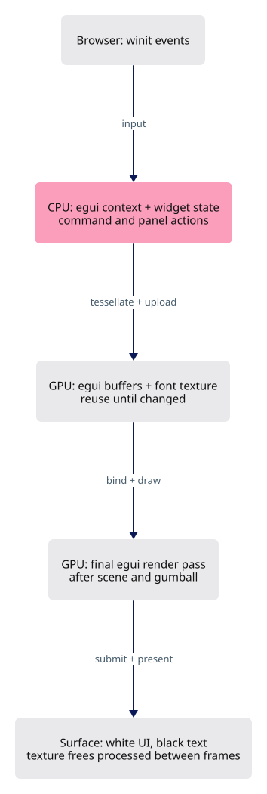
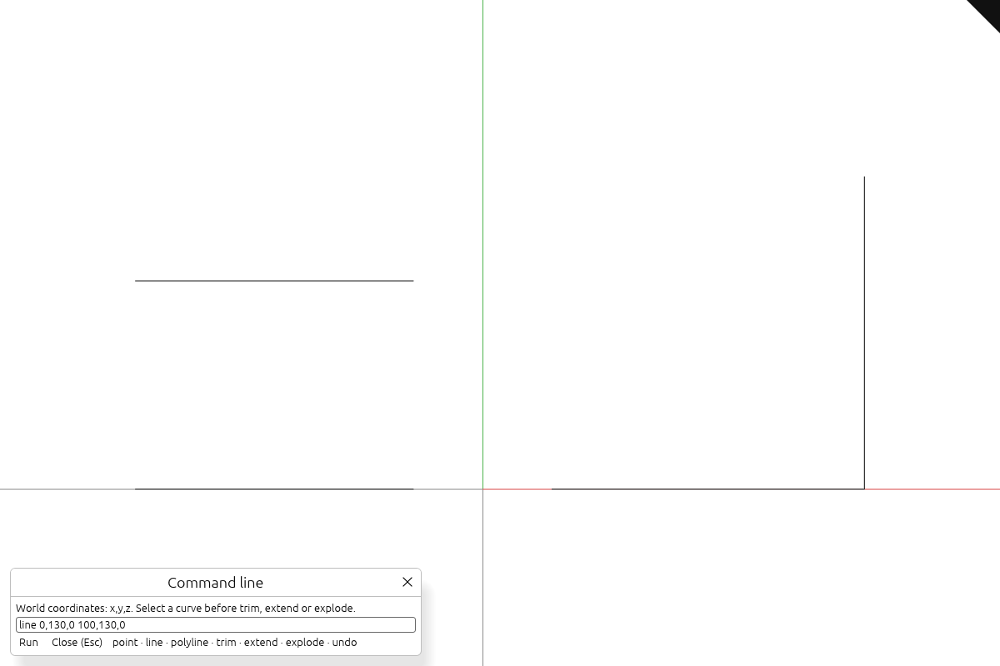

# Build the egui panel and command interface

## You are building

Use the same egui 0.34 framework as the archived viewer. egui-winit translates input; egui builds widgets; egui-wgpu uploads fonts and draws the interface after the scene. The archive is a framework reference, not copied implementation.





Actual maintained viewer output. [Capture setup and five browser rounds](extensions/README.md).

## Starting point

Start from a fresh checkpoint **21**, not from another extension lesson. The lessons can be implemented separately. Every code block below is complete; there are no omitted method bodies. Execute every edit within one step before its check.

Use the tools installed in [00 · Environment](00-environment.md). From the maintained `session_viewer` repository, create your learning workspace once:

```bash
export COURSE_REPO="$PWD"
bash "$COURSE_REPO/docs/serve.sh" build --quiet
python3 "$COURSE_REPO/docs/extensions.py" --prepare "$HOME/viewer-ui"
cd "$HOME/viewer-ui/session_viewer"
export REGEN_PROTO=0
cargo check -j4 --lib
```

The build prepares the frozen checkpoint cache. The initializer copies its viewer and kernel into a new folder; it does **not** install the feature. Expected: `Finished` with no compiler errors. Keep this terminal in the new `session_viewer` directory. If the destination exists, use a new folder name.

For **CURRENT → REPLACE WITH**, find the complete CURRENT block in the named file and replace it once. For **ADD BELOW**, keep the shown anchor and insert the new block directly after it. For **NEW FILE**, create the named path and paste its complete block. Apply blocks in page order; compile only at the check marker. All required code and answers are visible here.

## Step 1 · Connect input, UI actions and the final render pass

Create the two UI modules. Select the Light theme before customizing its white backgrounds and black text; otherwise the initial system-theme event can switch to an uncustomized style. The app module owns widget state and collects actions; it applies them after egui finishes building the frame. The GPU module owns tessellated shapes and font textures, updates buffers, and renders a final single-sample overlay. Texture frees happen after the previous frame; Drop frees the remaining font textures. The 2048-character input and eight-entry history bound retained command text. Replace DOM controls with feedback data, then route winit events to egui before the scene. Consumed mouse releases cancel active gestures. request_frame redraws the interface without cancelling scene queries. The small panel_action adapter supports checkpoint 21 flat layers; the nested-panel extension supplies its richer dispatcher in the maintained viewer.

### `Cargo.lock`

**COPY**

**CURRENT**

```toml
checksum = "366ffbaa4442f4684d91e2cd7c5ea7c4ed8add41959a31447066e279e432b618"
```

**ADD BELOW**

```toml

[[package]]
name = "accesskit"
version = "0.24.1"
source = "registry+https://github.com/rust-lang/crates.io-index"
checksum = "d3b7f7f85a7e5f68090000ed7622545829afd484d210358702ae4cb97dd0c320"
dependencies = [
 "uuid",
]
```

**COPY**

**CURRENT**

```toml
 "unicode-width",
```

**ADD BELOW**

```toml
]

[[package]]
name = "color"
version = "0.3.3"
source = "registry+https://github.com/rust-lang/crates.io-index"
checksum = "2ec7c5eb7a16992b1904d76c517d170ab353b0e0b3d5a0c81a8a0cd1037893cf"
dependencies = [
 "bytemuck",
```

**COPY**

**CURRENT**

```toml
[[package]]
name = "either"
version = "1.18.0"
source = "registry+https://github.com/rust-lang/crates.io-index"
checksum = "252afb9ae5eaa683babdc6a068b3f5726eb19e05070c731f9b2a23a7c3e8ed34"

[[package]]
name = "equivalent"
```

**REPLACE WITH**

```toml
[[package]]
name = "ecolor"
version = "0.34.3"
source = "registry+https://github.com/rust-lang/crates.io-index"
checksum = "a05fbfa222ffb51989d5ccf33e5f7aebfcf96c5023413856b0c3618a7f79896e"
dependencies = [
 "bytemuck",
 "emath",
]

[[package]]
name = "egui"
version = "0.34.3"
source = "registry+https://github.com/rust-lang/crates.io-index"
checksum = "42112be0ae157289312b92b3dfaf20e911b5a3c4c65d4aab0e7c47fbc0ce16e3"
dependencies = [
 "accesskit",
 "ahash",
 "bitflags 2.13.1",
 "emath",
 "epaint",
 "log",
 "nohash-hasher",
 "profiling",
 "smallvec",
 "unicode-segmentation",
]

[[package]]
name = "egui-wgpu"
version = "0.34.3"
source = "registry+https://github.com/rust-lang/crates.io-index"
checksum = "9f0c0559ac5598a1b887a6206dccbab7e3e6246c57cb00ae287262bd44776c9c"
dependencies = [
 "ahash",
 "bytemuck",
 "document-features",
 "epaint",
 "log",
 "profiling",
 "thiserror 2.0.20",
 "type-map",
 "web-time",
 "wgpu",
]

[[package]]
name = "egui-winit"
version = "0.34.3"
source = "registry+https://github.com/rust-lang/crates.io-index"
checksum = "967c5b323625d46d46a59b5daba3fef742248d27693cc18972458619858c4239"
dependencies = [
 "egui",
 "log",
 "objc2 0.6.4",
 "objc2-foundation 0.3.2",
 "objc2-ui-kit 0.3.2",
 "profiling",
 "raw-window-handle",
 "web-time",
 "winit",
]

[[package]]
name = "either"
version = "1.18.0"
source = "registry+https://github.com/rust-lang/crates.io-index"
checksum = "252afb9ae5eaa683babdc6a068b3f5726eb19e05070c731f9b2a23a7c3e8ed34"

[[package]]
name = "emath"
version = "0.34.3"
source = "registry+https://github.com/rust-lang/crates.io-index"
checksum = "b53f0d33a479321da6b0caa71366c9f67e8a2c149762d90bdc0d16e601ee8ecb"
dependencies = [
 "bytemuck",
]

[[package]]
name = "epaint"
version = "0.34.3"
source = "registry+https://github.com/rust-lang/crates.io-index"
checksum = "6675898a291ec212fc3df04f537d177fce8496120244590e6359dcaa4c25da79"
dependencies = [
 "ahash",
 "bytemuck",
 "ecolor",
 "emath",
 "epaint_default_fonts",
 "font-types 0.11.3",
 "log",
 "nohash-hasher",
 "parking_lot",
 "profiling",
 "self_cell",
 "skrifa 0.40.0",
 "smallvec",
 "vello_cpu",
]

[[package]]
name = "epaint_default_fonts"
version = "0.34.3"
source = "registry+https://github.com/rust-lang/crates.io-index"
checksum = "f8970033a4282a7bcf899b38b5ed3a58b732fe093d03785d58648515d8d309da"

[[package]]
name = "equivalent"
```

**COPY**

**CURRENT**

```toml
checksum = "da7c62ceae207dd37ea5b845da6a0696c799f85e97da1ab5b7910be3c1c80223"
```

**ADD BELOW**

```toml

[[package]]
name = "fearless_simd"
version = "0.3.0"
source = "registry+https://github.com/rust-lang/crates.io-index"
checksum = "8fb2907d1f08b2b316b9223ced5b0e89d87028ba8deae9764741dba8ff7f3903"
dependencies = [
 "bytemuck",
]
```

**COPY**

**CURRENT**

```toml
checksum = "e2db585e1d738fc771bf08a151420d3ed193d9d895a36df7f6f8a9456b911ddc"
```

**ADD BELOW**

```toml

[[package]]
name = "kurbo"
version = "0.13.1"
source = "registry+https://github.com/rust-lang/crates.io-index"
checksum = "4b60dfc32f652b926df6192e55525b16d186c69d47876c3ead4da5cc9f8450e2"
dependencies = [
 "arrayvec",
 "euclid",
 "polycool",
 "smallvec",
]
```

**COPY**

**CURRENT**

```toml
name = "num-traits"
```

**ADD ABOVE**

```toml
name = "nohash-hasher"
version = "0.2.0"
source = "registry+https://github.com/rust-lang/crates.io-index"
checksum = "2bf50223579dc7cdcfb3bfcacf7069ff68243f8c363f62ffa99cf000a6b9c451"

[[package]]
```

**COPY**

**CURRENT**

```toml
name = "objc2-uniform-type-identifiers"
```

**ADD ABOVE**

```toml
name = "objc2-ui-kit"
version = "0.3.2"
source = "registry+https://github.com/rust-lang/crates.io-index"
checksum = "d87d638e33c06f577498cbcc50491496a3ed4246998a7fbba7ccb98b1e7eab22"
dependencies = [
 "bitflags 2.13.1",
 "objc2 0.6.4",
 "objc2-core-foundation",
 "objc2-foundation 0.3.2",
]

[[package]]
```

**COPY**

**CURRENT**

```toml
 "smallvec",
 "windows-link",
```

**ADD BELOW**

```toml
]

[[package]]
name = "peniko"
version = "0.6.1"
source = "registry+https://github.com/rust-lang/crates.io-index"
checksum = "839c8299360d2e998bdb106dc0a6cd71dcc5f4df51df1b620361bf50e283cca6"
dependencies = [
 "bytemuck",
 "color",
 "kurbo",
 "linebender_resource_handle",
 "smallvec",
```

**COPY**

**CURRENT**

```toml
checksum = "2f3a9f18d041e6d0e102a0a46750538147e5e8992d3b4873aaafee2520b00ce3"
```

**ADD BELOW**

```toml

[[package]]
name = "polycool"
version = "0.4.0"
source = "registry+https://github.com/rust-lang/crates.io-index"
checksum = "50596ddc09eb5ad5f75cacd40209568e66df71baf86e1499a0e99c4cff12a5a6"
dependencies = [
 "arrayvec",
]
```

**COPY**

**CURRENT**

```toml
 "console_log",
```

**ADD BELOW**

```toml
 "egui",
 "egui-wgpu",
 "egui-winit",
```

**COPY**

**CURRENT**

```toml
name = "unicode-bidi"
```

**ADD ABOVE**

```toml
name = "type-map"
version = "0.5.1"
source = "registry+https://github.com/rust-lang/crates.io-index"
checksum = "cb30dbbd9036155e74adad6812e9898d03ec374946234fbcebd5dfc7b9187b90"
dependencies = [
 "rustc-hash 2.1.3",
]

[[package]]
```

**COPY**

**CURRENT**

```toml
 "serde_core",
 "wasm-bindgen",
```

**ADD BELOW**

```toml
]

[[package]]
name = "vello_common"
version = "0.0.6"
source = "registry+https://github.com/rust-lang/crates.io-index"
checksum = "1bd1a4c633ce09e7d713df1a6e036644a125e15e0c169cfb5180ddf5836ca04b"
dependencies = [
 "bytemuck",
 "fearless_simd",
 "hashbrown 0.16.1",
 "log",
 "peniko",
 "skrifa 0.40.0",
 "smallvec",
]

[[package]]
name = "vello_cpu"
version = "0.0.6"
source = "registry+https://github.com/rust-lang/crates.io-index"
checksum = "0162bfe48aabf6a9fdcd401b628c7d9f260c2cbabb343c70a65feba6f7849edc"
dependencies = [
 "bytemuck",
 "hashbrown 0.16.1",
 "vello_common",
```

**COPY**

**CURRENT**

```toml
 "objc2-foundation 0.2.2",
 "objc2-ui-kit",
 "orbclient",
```

**REPLACE WITH**

```toml
 "objc2-foundation 0.2.2",
 "objc2-ui-kit 0.2.2",
 "orbclient",
```

### `Cargo.toml`

**TYPE THIS**

**CURRENT**

```toml
wgpu = "29.0"
```

**ADD BELOW**

```toml
egui = { version = "=0.34.3", default-features = false, features = ["default_fonts"] }
egui-wgpu = { version = "=0.34.3", default-features = false }
egui-winit = { version = "=0.34.3", default-features = false }
```

**TYPE THIS**

**CURRENT**

```toml
    "HtmlElement",
    "HtmlInputElement",
    "KeyboardEvent",
    "EventTarget",
```

**REPLACE WITH**

```toml
    "HtmlElement",
    "EventTarget",
```

### `index.html`

**TYPE THIS**

**CURRENT**

```html
    #viewer-docs:hover, #viewer-docs:focus-visible { border-top-width:52px; border-left-width:52px; outline:none; }
```

**ADD BELOW**

```html
    #viewer-status:empty { display: none; }
```

**TYPE THIS**

**CURRENT**

```html
  <div id="viewer-status" role="status" aria-live="polite" style="position:fixed;bottom:12px;left:12px;color:#fff;background:#222b;font:14px system-ui;padding:4px 8px;pointer-events:none"></div>
  <!-- The layers panel: one element, filled from Rust with textContent, never innerHTML.
       `L` opens and closes it; a click on a row hides or shows that layer. -->
  <div id="viewer-layers" hidden role="group" aria-label="Layers"
       style="position:fixed;top:12px;left:12px;min-width:180px;max-height:70vh;overflow:auto;color:#fff;background:#222d;font:13px/1.7 system-ui;padding:6px 0;border-radius:4px;outline:1px solid #555"></div>
  <!-- The command line. Hidden until the colon key opens it, and the canvas takes the keyboard
       back the moment it closes, so typing `z` in here is a letter and not an undo. -->
  <input id="viewer-command" type="text" spellcheck="false" autocomplete="off" hidden
         aria-label="Command line"
         style="position:fixed;bottom:44px;left:12px;width:min(420px,60vw);color:#fff;background:#222d;border:0;border-radius:4px;font:14px/1.6 ui-monospace,monospace;padding:4px 8px;outline:1px solid #555">
  <link data-trunk rel="copy-dir" href="assets/text" data-target-path="text"/>
```

**REPLACE WITH**

```html
  <div id="viewer-status" role="status" aria-live="polite" style="position:fixed;bottom:12px;left:12px;color:#fff;background:#222b;font:14px system-ui;padding:4px 8px;pointer-events:none"></div>
  <link data-trunk rel="copy-dir" href="assets/text" data-target-path="text"/>
```

### `src/app/feedback.rs`

**TYPE THIS**

**CURRENT**

```rust
    log::info!("{message}");
```

**ADD ABOVE**

```rust
    #[cfg(target_arch = "wasm32")]
    super::ui::MODEL.with_borrow_mut(|model| model.status = message.chars().take(256).collect());
```

**TYPE THIS**

**CURRENT**

```rust

/// Open or close the command line. Opening focuses it; closing hands the keyboard back to the
/// canvas, or a letter typed next would reach the viewer's key bindings instead of the box.
#[cfg(target_arch = "wasm32")]
pub fn command_line(open: bool) -> Option<web_sys::HtmlInputElement> {
    use wasm_bindgen::JsCast;
    let document = web_sys::window()?.document()?;
    let input: web_sys::HtmlInputElement = document
        .get_element_by_id("viewer-command")?
        .dyn_into()
        .ok()?;
    if open {
        input.set_hidden(false);
        input.set_value("");
        let _ = input.focus();
    } else {
        input.set_hidden(true);
        if let Some(canvas) = document.get_element_by_id("canvas")
            && let Ok(canvas) = canvas.dyn_into::<web_sys::HtmlElement>()
        {
            let _ = canvas.focus();
        }
    }
    Some(input)
}
```

**REPLACE WITH**

```rust

#[cfg(target_arch = "wasm32")]
pub fn command_line(open: bool) {
    super::ui::MODEL.with_borrow_mut(|model| {
        model.command_open = open;
        model.focus_command = open;
        if open {
            model.command.clear();
        }
    });
}
```

**TYPE THIS**

**CURRENT**

```rust

/// The command line, when it is open.
#[cfg(target_arch = "wasm32")]
pub fn command_text() -> Option<String> {
    use wasm_bindgen::JsCast;
    let input: web_sys::HtmlInputElement = web_sys::window()?
        .document()?
        .get_element_by_id("viewer-command")?
        .dyn_into()
        .ok()?;
    (!input.hidden()).then(|| input.value())
}

/// Native builds have no command box; the callers stay free of `cfg`.
#[cfg(not(target_arch = "wasm32"))]
pub fn command_line(_open: bool) {}

/// One row of the layers panel, as the panel needs it.
pub struct LayerRow {
```

**REPLACE WITH**

```rust

/// Native builds have no command box; the callers stay free of `cfg`.
#[cfg(not(target_arch = "wasm32"))]
pub fn command_line(_open: bool) {}

/// One row of the layers panel, as the panel needs it.
#[derive(Clone)]
pub struct LayerRow {
```

**TYPE THIS**

**CURRENT**

```rust

/// Fill the layers panel, or empty it. Every label goes in with `textContent`, so a document
/// named after a tag cannot become markup.
#[cfg(target_arch = "wasm32")]
pub fn layers_panel(rows: &[LayerRow]) {
    let Some(document) = web_sys::window().and_then(|w| w.document()) else {
        return;
    };
    let Some(panel) = document.get_element_by_id("viewer-layers") else {
        return;
    };
    panel.set_text_content(None);
    for row in rows {
        // A button, not a div: the panel is the viewer's only set of discrete controls, and a
        // div is neither reachable by keyboard nor announced as something that can be pressed.
        let Ok(line) = document.create_element("button") else {
            continue;
        };
        let _ = line.set_attribute("type", "button");
        let _ = line.set_attribute("aria-pressed", if row.hidden { "true" } else { "false" });
        let _ = line.set_attribute("data-layer", &row.key);
        let _ = line.set_attribute(
            "style",
            "display:block;width:100%;text-align:left;border:0;background:none;color:inherit;font:inherit;padding:2px 10px;cursor:pointer;white-space:nowrap;opacity:1",
        );
        if row.hidden {
            let _ = line.set_attribute(
                "style",
                "display:block;width:100%;text-align:left;border:0;background:none;color:inherit;font:inherit;padding:2px 10px;cursor:pointer;white-space:nowrap;opacity:0.45",
            );
        }
        let mark = if row.hidden { "·" } else { "•" };
        line.set_text_content(Some(&format!("{mark} {} ({})", row.label, row.count)));
        let _ = panel.append_child(&line);
    }
}

/// Show or hide the panel; returns it so a caller can attach its one listener.
#[cfg(target_arch = "wasm32")]
pub fn layers_visible(open: bool) -> Option<web_sys::Element> {
    let panel = web_sys::window()?
        .document()?
        .get_element_by_id("viewer-layers")?;
    let _ = if open {
        panel.remove_attribute("hidden")
    } else {
        panel.set_attribute("hidden", "")
    };
    Some(panel)
}

/// Whether the panel is open, so a refresh can skip the work while it is not.
#[cfg(target_arch = "wasm32")]
pub fn layers_open() -> bool {
    web_sys::window()
        .and_then(|w| w.document())
        .and_then(|d| d.get_element_by_id("viewer-layers"))
        .is_some_and(|panel| !panel.has_attribute("hidden"))
}
```

**REPLACE WITH**

```rust

#[cfg(target_arch = "wasm32")]
pub fn layers_panel(rows: &[LayerRow]) {
    super::ui::MODEL.with_borrow_mut(|model| model.rows = rows.to_vec());
}

#[cfg(target_arch = "wasm32")]
pub fn layers_visible(open: bool) {
    super::ui::MODEL.with_borrow_mut(|model| {
        model.layers_open = open;
        if !open {
            model.rows.clear();
        }
    });
}

#[cfg(target_arch = "wasm32")]
pub fn layers_open() -> bool {
    super::ui::MODEL.with_borrow(|model| model.layers_open)
}
```

### `src/app/input.rs`

**TYPE THIS**

**CURRENT**

```rust

/// The command box's own key listener: winit never sees these, because the box has the focus
/// while it is open, which is exactly what lets a `z` typed in it be a letter.
#[cfg(target_arch = "wasm32")]
pub struct CommandKeys {
    input: web_sys::HtmlInputElement,
    callback: wasm_bindgen::closure::Closure<dyn FnMut(web_sys::KeyboardEvent)>,
    blur: wasm_bindgen::closure::Closure<dyn FnMut(web_sys::Event)>,
}

#[cfg(target_arch = "wasm32")]
impl CommandKeys {
    /// Install once. Enter sends the line and closes the box; Escape closes it and throws the
    /// line away. Nothing else is intercepted, so the box behaves like a text field.
    pub fn new(
        input: web_sys::HtmlInputElement,
        proxy: winit::event_loop::EventLoopProxy<crate::Msg>,
    ) -> Result<Self, wasm_bindgen::JsValue> {
        use wasm_bindgen::JsCast;
        let box_ = input.clone();
        let callback = wasm_bindgen::closure::Closure::<dyn FnMut(web_sys::KeyboardEvent)>::new(
            move |event: web_sys::KeyboardEvent| match event.key().as_str() {
                "Enter" => {
                    let line = box_.value();
                    crate::app::feedback::command_line(false);
                    if !line.trim().is_empty() {
                        let _ = proxy.send_event(crate::Msg::Command(line));
                    }
                }
                "Escape" => {
                    crate::app::feedback::command_line(false);
                }
                _ => {}
            },
        );
        input.add_event_listener_with_callback("keydown", callback.as_ref().unchecked_ref())?;
        // Clicking away closes it. Otherwise the box keeps the keyboard with no key that
        // reaches it, and the viewer answers nothing until the canvas is clicked.
        let shut = input.clone();
        let blur = wasm_bindgen::closure::Closure::<dyn FnMut(web_sys::Event)>::new(
            move |_: web_sys::Event| {
                if !shut.hidden() {
                    crate::app::feedback::command_line(false);
                }
            },
        );
        input.add_event_listener_with_callback("blur", blur.as_ref().unchecked_ref())?;
        Ok(Self {
            input,
            callback,
            blur,
        })
    }
}

#[cfg(target_arch = "wasm32")]
impl Drop for CommandKeys {
    fn drop(&mut self) {
        use wasm_bindgen::JsCast;
        let _ = self
            .input
            .remove_event_listener_with_callback("keydown", self.callback.as_ref().unchecked_ref());
        let _ = self
            .input
            .remove_event_listener_with_callback("blur", self.blur.as_ref().unchecked_ref());
    }
}

/// The layers panel's one click listener. One listener for the whole panel, not one a row:
/// the rows are rebuilt on every scene change, and a closure a row would have to be dropped
/// with it.
#[cfg(target_arch = "wasm32")]
pub struct LayerClicks {
    panel: web_sys::Element,
    callback: wasm_bindgen::closure::Closure<dyn FnMut(web_sys::Event)>,
}

#[cfg(target_arch = "wasm32")]
impl LayerClicks {
    pub fn new(
        panel: web_sys::Element,
        proxy: winit::event_loop::EventLoopProxy<crate::Msg>,
    ) -> Result<Self, wasm_bindgen::JsValue> {
        use wasm_bindgen::JsCast;
        let callback =
            wasm_bindgen::closure::Closure::<dyn FnMut(web_sys::Event)>::new(move |event: web_sys::Event| {
                let Some(target) = event.target() else { return };
                let Ok(element) = target.dyn_into::<web_sys::Element>() else {
                    return;
                };
                let Some(key) = element.get_attribute("data-layer") else {
                    return;
                };
                // A click in the panel takes the focus off the canvas, and every key binding
                // with it - including the `L` that closes the panel being clicked.
                crate::app::feedback::focus_canvas();
                let _ = proxy.send_event(crate::Msg::ToggleLayer(key));
            });
        panel.add_event_listener_with_callback("click", callback.as_ref().unchecked_ref())?;
        Ok(Self { panel, callback })
    }
}

#[cfg(target_arch = "wasm32")]
impl Drop for LayerClicks {
    fn drop(&mut self) {
        use wasm_bindgen::JsCast;
        let _ = self
            .panel
            .remove_event_listener_with_callback("click", self.callback.as_ref().unchecked_ref());
    }
}

/// Pointer cancellation goes through the same event-loop owner as every other input change.
```

**REPLACE WITH**

```rust

/// Pointer cancellation goes through the same event-loop owner as every other input change.
```

### `src/app/mod.rs`

**TYPE THIS**

**CURRENT**

```rust
pub mod touch;
```

**ADD BELOW**

```rust
#[cfg(target_arch = "wasm32")]
pub mod ui;
```

### `src/app/ui.rs`

**NEW FILE · TYPE THIS**

```rust
use crate::State;
use crate::app::feedback::LayerRow;
use std::cell::RefCell;
use std::collections::VecDeque;
use winit::window::Window;

#[derive(Default)]
pub struct Model {
    pub layers_open: bool,
    pub rows: Vec<LayerRow>,
    pub command_open: bool,
    pub command: String,
    pub focus_command: bool,
    pub status: String,
    history: VecDeque<String>,
}

thread_local! { pub static MODEL: RefCell<Model> = RefCell::default(); }

#[derive(serde::Serialize)]
pub struct Control {
    key: String,
    label: String,
    rect: [f32; 4],
}

pub struct Ui {
    context: egui::Context,
    input: egui_winit::State,
    controls: Option<Vec<Control>>,
}

impl Ui {
    pub fn new(window: &Window) -> Self {
        let context = egui::Context::default();
        context.set_theme(egui::Theme::Light);
        context.set_visuals(visuals());
        let input = egui_winit::State::new(
            context.clone(),
            egui::ViewportId::ROOT,
            window,
            Some(window.scale_factor() as f32),
            window.theme(),
            Some(4096),
        );
        Self {
            context,
            input,
            controls: (super::route::query("inspect").as_deref() == Some("1")).then(Vec::new),
        }
    }

    pub fn event(&mut self, window: &Window, event: &winit::event::WindowEvent) -> (bool, bool) {
        let response = self.input.on_window_event(window, event);
        let escape = matches!(event, winit::event::WindowEvent::KeyboardInput { event, .. }
            if event.logical_key == winit::keyboard::Key::Named(winit::keyboard::NamedKey::Escape))
            && MODEL.with_borrow(|model| model.command_open);
        (response.consumed || escape, response.repaint || escape)
    }

    pub fn frame(&mut self, state: &mut State) -> bool {
        let input = self.input.take_egui_input(&state.window);
        if let Some(controls) = self.controls.as_mut() {
            controls.clear();
        }
        let mut action = None;
        let mut command = None;
        let mut output = self.context.run_ui(input, |root| {
            let context = root.ctx();
            MODEL.with_borrow_mut(|model| {
                layers(context, model, &mut self.controls, &mut action);
                commands(context, model, &mut self.controls, &mut command);
            });
        });
        self.input
            .handle_platform_output(&state.window, std::mem::take(&mut output.platform_output));
        let changed = action.is_some() || command.is_some();
        if let Some(key) = action {
            state.panel_action(&key);
        }
        if let Some(text) = command {
            let message = state.run_command(&text).unwrap_or_else(|error| error);
            crate::app::feedback::status(&message);
            MODEL.with_borrow_mut(|model| {
                if model.history.len() == 8 {
                    model.history.pop_front();
                }
                model.history.push_back(format!("> {text}\n{message}"));
            });
            state.touch();
        }
        self.publish();
        let repaint = changed || self.context.has_requested_repaint();
        output.pixels_per_point *=
            state.gpu.config.width as f32 / state.window.inner_size().width.max(1) as f32;
        if let Some(ui) = state.gpu.ui.as_mut() {
            ui.prepare(
                &state.gpu.ctx,
                &self.context,
                output,
                [state.gpu.config.width, state.gpu.config.height],
            );
        }
        repaint
    }
    fn publish(&self) {
        if self.controls.is_some()
            && let Some(canvas) = web_sys::window()
                .and_then(|window| window.document())
                .and_then(|document| document.get_element_by_id("canvas"))
        {
            let snapshot = MODEL.with_borrow(|model| serde_json::json!({"framework": "egui 0.34.3", "controls": self.controls, "command_open": model.command_open, "layers_open": model.layers_open, "command": model.command, "history": model.history}));
            let _ = canvas.set_attribute("data-viewer-ui", &snapshot.to_string());
        }
        if let Some(status) = web_sys::window()
            .and_then(|w| w.document())
            .and_then(|d| d.get_element_by_id("viewer-status"))
        {
            let hidden = MODEL.with_borrow(|model| model.command_open);
            if hidden {
                let _ = status.set_attribute("hidden", "");
            } else {
                let _ = status.remove_attribute("hidden");
            }
        }
    }
}

fn visuals() -> egui::Visuals {
    let mut visuals = egui::Visuals::light();
    visuals.override_text_color = Some(egui::Color32::BLACK);
    visuals.window_fill = egui::Color32::WHITE;
    visuals.panel_fill = egui::Color32::WHITE;
    visuals.extreme_bg_color = egui::Color32::WHITE;
    visuals.selection.bg_fill = egui::Color32::BLACK;
    visuals.selection.stroke = egui::Stroke::new(1.0_f32, egui::Color32::WHITE);
    visuals.indent_has_left_vline = false;
    for widget in [
        &mut visuals.widgets.noninteractive,
        &mut visuals.widgets.inactive,
        &mut visuals.widgets.hovered,
        &mut visuals.widgets.active,
        &mut visuals.widgets.open,
    ] {
        widget.bg_fill = egui::Color32::WHITE;
        widget.weak_bg_fill = egui::Color32::WHITE;
        widget.fg_stroke.color = egui::Color32::BLACK;
    }
    visuals
}

fn record(controls: &mut Option<Vec<Control>>, key: &str, label: &str, response: &egui::Response) {
    let Some(controls) = controls.as_mut() else {
        return;
    };
    let r = response.rect;
    controls.push(Control {
        key: key.to_string(),
        label: label.to_string(),
        rect: [r.min.x, r.min.y, r.max.x, r.max.y],
    });
}

fn layers(
    context: &egui::Context,
    model: &mut Model,
    controls: &mut Option<Vec<Control>>,
    action: &mut Option<String>,
) {
    if !model.layers_open {
        return;
    }
    egui::Window::new("Session layers")
        .default_pos([12.0, 12.0])
        .default_width(310.0)
        .resizable(false)
        .collapsible(false)
        .open(&mut model.layers_open)
        .show(context, |ui| {
            egui::ScrollArea::vertical()
                .max_height(context.content_rect().height() * 0.65)
                .show(ui, |ui| {
                    let mut at = 0;
                    while at < model.rows.len() {
                        let start = at;
                        let id = model.rows[at].key.split_once('/').map(|(_, id)| id);
                        at += 1;
                        if id.is_some() {
                            while at < model.rows.len()
                                && model.rows[at].key.split_once('/').map(|(_, id)| id) == id
                            {
                                at += 1;
                            }
                        }
                        ui.horizontal(|ui| {
                            let first = &model.rows[start];
                            let indent = first.label.len() - first.label.trim_start().len();
                            ui.add_space(indent as f32 * 4.0);
                            for row in &model.rows[start..at] {
                                let response = layer_button(ui, row);
                                record(controls, &row.key, &row.label, &response);
                                if response.clicked() {
                                    *action = Some(row.key.clone());
                                }
                            }
                        });
                    }
                });
        });
}

fn layer_button(ui: &mut egui::Ui, row: &LayerRow) -> egui::Response {
    let label = row.label.trim_start();
    if row.key.starts_with("open/") {
        let (rect, response) = ui.allocate_exact_size(egui::vec2(12.0, 18.0), egui::Sense::click());
        let c = rect.center();
        let points = if label.starts_with('▾') {
            vec![
                c + egui::vec2(-4.0, -2.0),
                c + egui::vec2(4.0, -2.0),
                c + egui::vec2(0.0, 3.0),
            ]
        } else {
            vec![
                c + egui::vec2(-2.0, -4.0),
                c + egui::vec2(-2.0, 4.0),
                c + egui::vec2(3.0, 0.0),
            ]
        };
        ui.painter().add(egui::Shape::convex_polygon(
            points,
            egui::Color32::BLACK,
            egui::Stroke::NONE,
        ));
        return response;
    }
    let label: String = label.chars().take(160).collect();
    let text = if row.key.starts_with("hide/") {
        if row.hidden {
            "Show".to_string()
        } else {
            "Hide".to_string()
        }
    } else {
        format!("{} ({})", label.trim_start_matches("Select "), row.count)
    };
    ui.button(text).on_hover_text(label)
}

fn commands(
    context: &egui::Context,
    model: &mut Model,
    controls: &mut Option<Vec<Control>>,
    command: &mut Option<String>,
) {
    if !model.command_open {
        return;
    }
    let mut open = model.command_open;
    egui::Window::new("Command line")
        .anchor(egui::Align2::LEFT_BOTTOM, [12.0, -12.0])
        .default_width(480.0)
        .resizable(false)
        .collapsible(false)
        .open(&mut open)
        .show(context, |ui| {
            for text in &model.history {
                ui.label(text);
            }
            ui.label("World coordinates: x,y,z. Select a curve before trim, extend or explode.");
            let response = ui.add(
                egui::TextEdit::singleline(&mut model.command)
                    .char_limit(2048)
                    .hint_text(
                        egui::RichText::new("line 0,0,0 100,0,0").color(egui::Color32::BLACK),
                    )
                    .desired_width(f32::INFINITY),
            );
            record(controls, "command/input", "Command", &response);
            if model.focus_command {
                response.request_focus();
                model.focus_command = false;
            }
            let enter =
                response.lost_focus() && ui.input(|input| input.key_pressed(egui::Key::Enter));
            ui.horizontal(|ui| {
                let run = ui.button("Run");
                record(controls, "command/run", "Run", &run);
                if (enter || run.clicked()) && !model.command.trim().is_empty() {
                    *command = Some(std::mem::take(&mut model.command));
                }
                let close = ui.button("Close (Esc)");
                record(controls, "command/close", "Close", &close);
                if close.clicked() || ui.input(|input| input.key_pressed(egui::Key::Escape)) {
                    model.command_open = false;
                }
                ui.label("point · line · polyline · trim · extend · explode · undo");
            });
            if !model.status.is_empty() {
                ui.label(&model.status);
            }
        });
    model.command_open &= open;
}

impl crate::State {
    pub fn panel_action(&mut self, key: &str) {
        if let Some(layer) = crate::app::layers::Layer::from_key(key) {
            self.toggle_layer(layer);
        }
    }
}
```

### `src/engine/gpu/mod.rs`

**TYPE THIS**

**CURRENT**

```rust
mod triangle_tiles;
```

**ADD BELOW**

```rust
pub mod ui;
```

**TYPE THIS**

**CURRENT**

```rust
    pub glyphs: GlyphLane,
```

**ADD BELOW**

```rust
    pub ui: Option<ui::Ui>,
```

**TYPE THIS**

**CURRENT**

```rust
            glyphs,
```

**ADD BELOW**

```rust
            ui: None,
```

**TYPE THIS**

**CURRENT**

```rust
    /// the borrow of the device, so the widget's drawing is one call rather than four.
    pub fn set_widget_rows(
        &mut self,
        segments: &segments::SegRows,
        glyphs: &glyphs::GlyphRows,
    ) {
        self.gizmo_arms.reset();
```

**REPLACE WITH**

```rust
    /// the borrow of the device, so the widget's drawing is one call rather than four.
    pub fn set_widget_rows(&mut self, segments: &segments::SegRows, glyphs: &glyphs::GlyphRows) {
        self.gizmo_arms.reset();
```

### `src/engine/gpu/render.rs`

**TYPE THIS**

**CURRENT**

```rust
        (draws, self.objects.len())
```

**ADD ABOVE**

```rust
        if let Some(ui) = self.ui.as_ref() {
            ui.draw(encoder, view);
        }
```

### `src/engine/gpu/ui.rs`

**NEW FILE · TYPE THIS**

```rust
use super::buffers::GpuCtx;

pub struct Ui {
    renderer: egui_wgpu::Renderer,
    jobs: Vec<egui::ClippedPrimitive>,
    screen: egui_wgpu::ScreenDescriptor,
    free: Vec<egui::TextureId>,
    textures: std::collections::HashSet<egui::TextureId>,
}

impl Ui {
    pub fn new(ctx: &GpuCtx, format: wgpu::TextureFormat) -> Self {
        Self {
            renderer: egui_wgpu::Renderer::new(
                &ctx.device,
                format,
                egui_wgpu::RendererOptions::default(),
            ),
            jobs: Vec::new(),
            screen: egui_wgpu::ScreenDescriptor {
                size_in_pixels: [1, 1],
                pixels_per_point: 1.0,
            },
            free: Vec::new(),
            textures: Default::default(),
        }
    }

    pub fn prepare(
        &mut self,
        ctx: &GpuCtx,
        context: &egui::Context,
        output: egui::FullOutput,
        size: [u32; 2],
    ) {
        for id in self.free.drain(..) {
            self.renderer.free_texture(&id);
            self.textures.remove(&id);
        }
        for (id, delta) in &output.textures_delta.set {
            self.textures.insert(*id);
            self.renderer
                .update_texture(&ctx.device, &ctx.queue, *id, delta);
        }
        self.free = output.textures_delta.free;
        self.jobs = context.tessellate(output.shapes, output.pixels_per_point);
        if self.jobs.is_empty() {
            return;
        }
        self.screen = egui_wgpu::ScreenDescriptor {
            size_in_pixels: size,
            pixels_per_point: output.pixels_per_point,
        };
        let mut encoder = ctx
            .device
            .create_command_encoder(&wgpu::CommandEncoderDescriptor {
                label: Some("egui upload"),
            });
        let mut buffers = self.renderer.update_buffers(
            &ctx.device,
            &ctx.queue,
            &mut encoder,
            &self.jobs,
            &self.screen,
        );
        buffers.push(encoder.finish());
        ctx.queue.submit(buffers);
    }

    pub fn draw(&self, encoder: &mut wgpu::CommandEncoder, view: &wgpu::TextureView) {
        if self.jobs.is_empty() {
            return;
        }
        let pass = encoder.begin_render_pass(&wgpu::RenderPassDescriptor {
            label: Some("egui"),
            color_attachments: &[Some(wgpu::RenderPassColorAttachment {
                view,
                resolve_target: None,
                depth_slice: None,
                ops: wgpu::Operations {
                    load: wgpu::LoadOp::Load,
                    store: wgpu::StoreOp::Store,
                },
            })],
            ..Default::default()
        });
        self.renderer
            .render(&mut pass.forget_lifetime(), &self.jobs, &self.screen);
    }
}

impl Drop for Ui {
    fn drop(&mut self) {
        for id in &self.textures {
            self.renderer.free_texture(id);
        }
    }
}
```

### `src/lib.rs`

**TYPE THIS**

**CURRENT**

```rust
    CancelPointer,
    /// A line typed into the command box, sent when Enter was pressed in it.
    Command(String),
    /// A layers-panel row was clicked, carrying its key.
    ToggleLayer(String),
}
```

**REPLACE WITH**

```rust
    CancelPointer,
}
```

**TYPE THIS**

**CURRENT**

```rust
    pointer_cancellation: Option<app::input::PointerCancellation>,
    command_keys: Option<app::input::CommandKeys>,
    layer_clicks: Option<app::input::LayerClicks>,
}
```

**REPLACE WITH**

```rust
    pointer_cancellation: Option<app::input::PointerCancellation>,
    ui: Option<app::ui::Ui>,
}
```

**TYPE THIS**

**CURRENT**

```rust
            pointer_cancellation: None,
            command_keys: None,
            layer_clicks: None,
        };
```

**REPLACE WITH**

```rust
            pointer_cancellation: None,
            ui: None,
        };
```

**TYPE THIS**

**CURRENT**

```rust
        }
        state.window.request_redraw();
```

**REPLACE WITH**

```rust
        }
        self.ui = Some(app::ui::Ui::new(&state.window));
        state.gpu.ui = Some(engine::gpu::ui::Ui::new(
            &state.gpu.ctx,
            state.gpu.config.format,
        ));
        state.window.request_redraw();
```

**TYPE THIS**

**CURRENT**

```rust
                Err(error) => log::warn!("Cannot register pointer cancellation: {error:?}"),
            }
            if let Some(input) = app::feedback::command_line(false) {
                match app::input::CommandKeys::new(input, proxy.clone()) {
                    Ok(listener) => self.command_keys = Some(listener),
                    Err(error) => log::warn!("Cannot register the command line: {error:?}"),
                }
            }
            if let Some(panel) = app::feedback::layers_visible(false) {
                match app::input::LayerClicks::new(panel, proxy.clone()) {
                    Ok(listener) => self.layer_clicks = Some(listener),
                    Err(error) => log::warn!("Cannot register the layers panel: {error:?}"),
                }
            }
```

**REPLACE WITH**

```rust
                Err(error) => log::warn!("Cannot register pointer cancellation: {error:?}"),
            }
```

**TYPE THIS**

**CURRENT**

```rust
            }
            Msg::Command(line) => {
                let said = match state.run_command(&line) {
                    Ok(done) => done,
                    Err(why) => why,
                };
                app::feedback::status(&said);
            }
            Msg::ToggleLayer(key) => {
                if let Some(layer) = app::layers::Layer::from_key(&key) {
                    state.toggle_layer(layer);
                }
            }
            Msg::CloudChunk(c) => state.extend_streamed(c.idx, c.rows, c.to),
```

**REPLACE WITH**

```rust
            }
            Msg::CloudChunk(c) => state.extend_streamed(c.idx, c.rows, c.to),
```

**TYPE THIS**

**CURRENT**

```rust
        let changed = match event {
```

**ADD ABOVE**

```rust
        if let Some(ui) = self.ui.as_mut() {
            let (mut consumed, repaint) = ui.event(&state.window, &event);
            if matches!(event, WindowEvent::KeyboardInput { .. })
                && !app::ui::MODEL.with_borrow(|model| model.command_open)
            {
                consumed = false;
            }
            if repaint {
                state.request_frame();
            }
            if consumed {
                if matches!(
                    event,
                    WindowEvent::MouseInput {
                        state: ElementState::Released,
                        ..
                    }
                ) {
                    self.input.cancel();
                    state.cancel_gesture();
                }
                self.request_if_needed();
                return;
            }
        }
```

**TYPE THIS**

**CURRENT**

```rust
                } else {
                    state.render();
                }
```

**REPLACE WITH**

```rust
                } else {
                    let repaint = self.ui.as_mut().is_some_and(|ui| ui.frame(state));
                    state.render();
                    if repaint {
                        state.request_frame();
                    }
                }
```

### `src/state.rs`

**TYPE THIS**

**CURRENT**

```rust
    /// The picture changed: the next redraw presents it.
```

**ADD BELOW**

```rust
    #[cfg(target_arch = "wasm32")]
    pub(crate) fn request_frame(&mut self) {
        self.dirty = true;
        self.needs_frame = true;
    }
```

### Check step 1

**Verified:** the complete step compiles for WebAssembly.

```bash
cargo check -j4 --lib
```

## Check

```bash
cargo xtest -j4 --lib app::command
trunk serve --port 8780
```

Open <http://localhost:8780/?data=off&inspect=1>. Stop the server with **Ctrl+C**.

### Reproduce the screenshots

The screenshots use the small [nested fixture](extensions/nested.pb) and [manifest](extensions/nested.yaml), not private project files. Save both into your workspace:

```bash
cp "$COURSE_REPO/docs/extensions/nested.pb" assets/extension-nested.pb
cp "$COURSE_REPO/docs/extensions/nested.yaml" assets/extension-nested.yaml
```

Open <http://localhost:8780/?scene=extension-nested.yaml&data=off&inspect=1>.

## What changed

This independent lesson keeps checkpoint 21 modeling commands and flat layers. Nested groups and typed creation are separate extensions. The maintained viewer includes all of them. The interface needs no new document geometry or background animation loop.

## Try

Press colon to open Command line. Type move 10,0,0 after selecting an object; press Enter. Read the result in the window. Click Close or press Escape before using viewer shortcuts. Press L to open the egui layers window. With the modeling extension installed, use the creation/trim/extend/explode walkthrough.

## Questions and answers

**What goes to the GPU?** Modeling rebuilds existing geometry lanes; panels change object flags; controls upload a small preview. The solid gumball owns a fixed mesh, an unlit shader and a bounded antialiasing tile.

**Why clear row selection after rebuilding?** Row numbers are upload addresses, not permanent identities. A rebuild can assign the same number to a different object.

**Where is the exact patch?** [step 1](extensions/ui-1.patch). The patch and these visible instructions are generated from the same changes.
