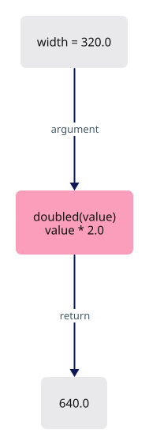
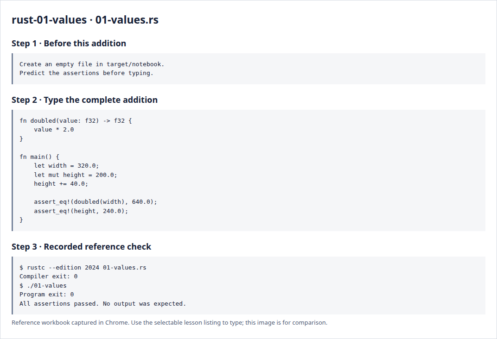

# Rust 1 · Names, numbers and functions

**Estimated study time: about 1–2 hours.** Includes reading, typing and experiments; this is a planning range, not a deadline.

**In the viewer:** Values and small functions become camera dimensions, GPU sizes and ordinary calculations. Aim to explain the input and returned value of one function.

[See the whole viewer](../map.md)

[Course foundations](../foundations.md)

## Picture the idea

A program works with values. A name lets us refer to a value without repeating it. Rust checks the kind of value, called its type, before running the program. Here f32 means a 32-bit floating-point number—the kind we will use for most GPU coordinates.



## Step 1 · Read and predict

Read doubled as a small machine: it receives value and returns twice that number. The last expression has no semicolon, so its value becomes the function result. main is the entry point of this native practice program. let makes a binding; mut allows the binding to change.

What values will the two assertions compare?

<details>
<summary>Compare your prediction</summary>

640.0 with 640.0, and 240.0 with 240.0. An assertion stops the program if its expected fact is false.

</details>

## Step 2 · Type a complete small program

Create `target/notebook/01-values.rs` under `session_viewer` and type the entire listing. Create the notebook folder first. These practice programs are a separate notebook; the viewer project begins empty afterwards.

```rust
--8<-- "foundations/code/01-values.rs"
```

## Step 3 · Run and investigate

From `session_viewer`:

```sh
rustc --edition 2024 target/notebook/01-values.rs -o target/notebook/01-values
./target/notebook/01-values
```

Success is a normal exit with no output. Each assertion has checked its expected result. A failed assertion or compiler error needs investigation.

Change the multiplier to 3.0 without changing the first assertion. Run again and read the failure. Restore 2.0. Then add a semicolon after value * 2.0 and compile: explain why the function no longer returns f32.

<details>
<summary>Reference screenshots of preparation, source and actual check output</summary>



</details>

**Before moving on:** explain the program without reading the listing. Keep your experiment in the notebook; it is yours to return to.

[Next](../foundations/02-records.md)
