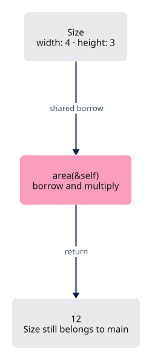
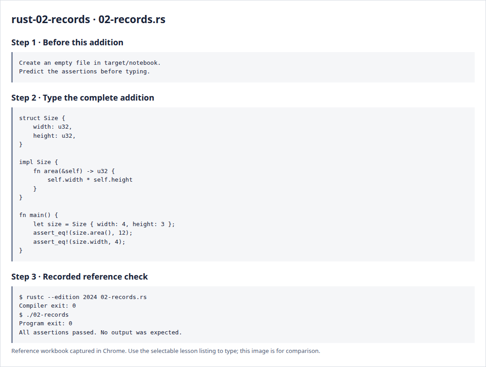

# Rust 2 · Records and methods

**Estimated study time: about 1–2 hours.** Includes reading, typing and experiments; this is a planning range, not a deadline.

**In the viewer:** Records hold related values such as camera settings and GPU object rows. Aim to distinguish a type, one value of that type and a method acting on it.

[See the whole viewer](../map.md)

[Course foundations](../foundations.md)

## Picture the idea

A struct keeps related values together. Our Size has two fields. u32 means an unsigned 32-bit integer: it cannot represent a negative width. A method is a function associated with a type.



## Step 1 · Read and predict

impl Size contains behavior for Size. &self borrows the particular size for reading; it does not consume it. The value therefore remains available for the second assertion. Self, with a capital S, would name the type rather than this particular value.

Can we read size.width after calling area?

<details>
<summary>Compare your prediction</summary>

Yes. area receives a shared borrow and leaves ownership with main.

</details>

## Step 2 · Type a complete small program

Create `target/notebook/02-records.rs` under `session_viewer` and type the entire listing. Create the notebook folder first. These practice programs are a separate notebook; the viewer project begins empty afterwards.

```rust
--8<-- "foundations/code/02-records.rs"
```

## Step 3 · Run and investigate

From `session_viewer`:

```sh
rustc --edition 2024 target/notebook/02-records.rs -o target/notebook/02-records
./target/notebook/02-records
```

Success is a normal exit with no output. Each assertion has checked its expected result. A failed assertion or compiler error needs investigation.

Add a perimeter method that returns twice the width plus twice the height. Assert that this specimen has perimeter 14. Explain why a size record is more meaningful than passing two unrelated integers everywhere.

<details>
<summary>Reference screenshots of preparation, source and actual check output</summary>



</details>

**Before moving on:** explain the program without reading the listing. Keep your experiment in the notebook; it is yours to return to.

[Previous](../foundations/01-values.md)

[Next](../foundations/03-lists.md)
