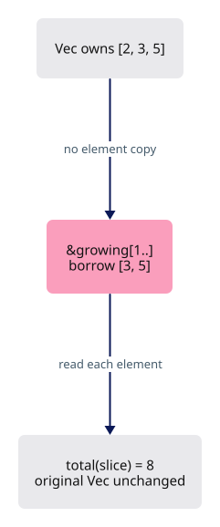
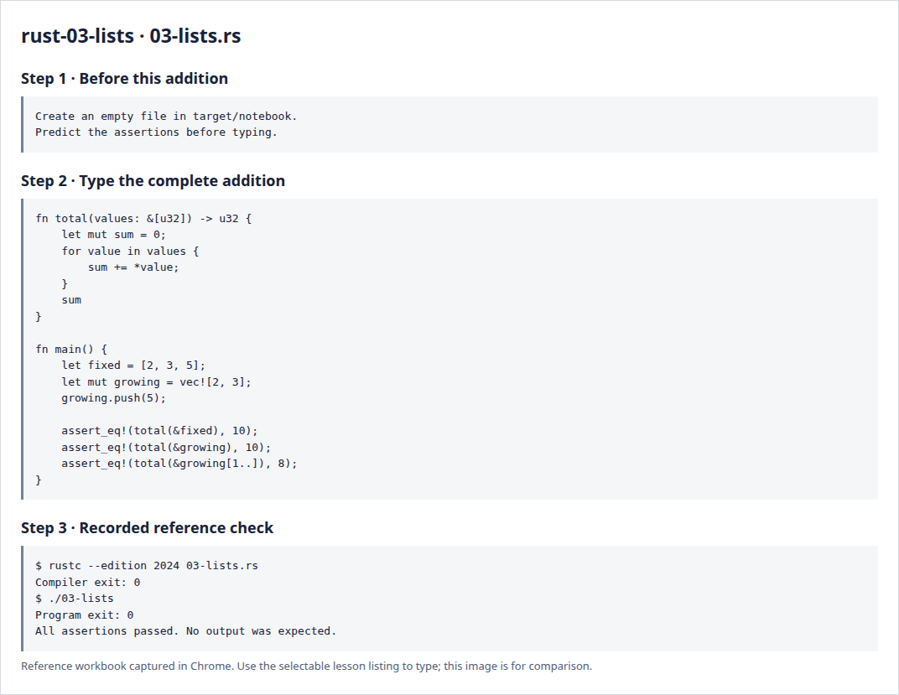

# Rust 3 · Arrays, vectors and slices

**Estimated study time: about 1–2 hours.** Includes reading, typing and experiments; this is a planning range, not a deadline.

**In the viewer:** Arrays, vectors and slices carry vertices, indices and lists of objects. Aim to say who owns the collection and what a borrowed slice lets a function access.

[See the whole viewer](../map.md)

[Course foundations](../foundations.md)

## Picture the idea

An array has a fixed number of elements. A Vec owns a growable list. A slice is a borrowed view of consecutive elements; it does not own another copy. Our total function can work with either container because it only needs that view.



## Step 1 · Read and predict

The type &[u32] reads “a borrowed slice of unsigned integers.” The loop receives references to elements, so *value reads the integer through its reference. The range 1.. starts at index 1 and continues to the end. Indices start at zero.

Why does the last assertion expect 8?

<details>
<summary>Compare your prediction</summary>

The borrowed suffix contains the elements 3 and 5. The original vector still contains all three elements.

</details>

## Step 2 · Type a complete small program

Create `target/notebook/03-lists.rs` under `session_viewer` and type the entire listing. Create the notebook folder first. These practice programs are a separate notebook; the viewer project begins empty afterwards.

```rust
--8<-- "foundations/code/03-lists.rs"
```

## Step 3 · Run and investigate

From `session_viewer`:

```sh
rustc --edition 2024 target/notebook/03-lists.rs -o target/notebook/03-lists
./target/notebook/03-lists
```

Success is a normal exit with no output. Each assertion has checked its expected result. A failed assertion or compiler error needs investigation.

Change the slice to ..2 and predict its sum before running. Then try index 3 on fixed: explain the out-of-bounds failure. Relate element counts to buffer byte sizes: three u32 values occupy 12 component bytes.

<details>
<summary>Reference screenshots of preparation, source and actual check output</summary>



</details>

**Before moving on:** explain the program without reading the listing. Keep your experiment in the notebook; it is yours to return to.

[Previous](../foundations/02-records.md)

[Next](../foundations/04-ownership.md)
