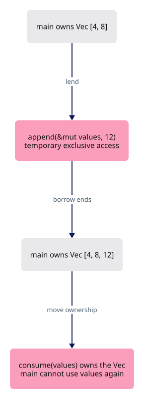
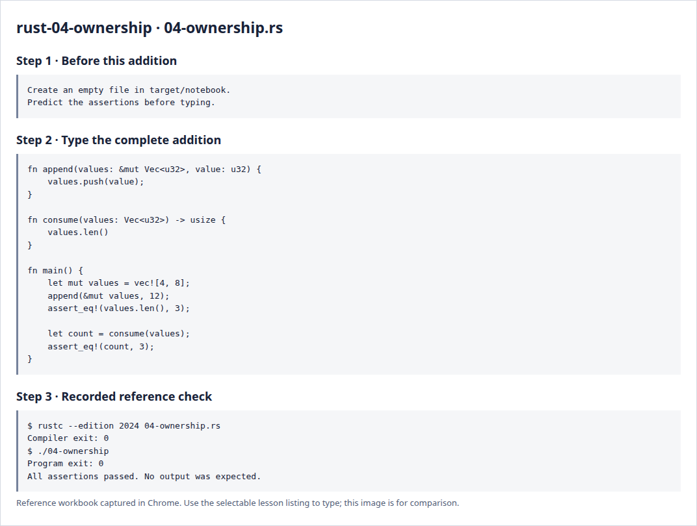

# Rust 4 · Ownership and borrowing

**Estimated study time: about 1–3 hours.** Includes reading, typing and experiments; this is a planning range, not a deadline.

**In the viewer:** Ownership explains who keeps a document or GPU resource alive. Aim to distinguish moving a value, borrowing it and giving it another shared owner.

[See the whole viewer](../map.md)

[Course foundations](../foundations.md)

## Picture the idea

An owned value has a responsible owner. Moving a Vec transfers that ownership; it does not copy every element. Borrowing lends access while the owner keeps responsibility. Rust checks these relationships so references cannot outlive their data or conflict with mutation.



## Step 1 · Read and predict

append borrows values exclusively through &mut and returns that access when the call finishes. consume receives the Vec itself. After that call, main no longer owns values, even though the name still appears in the source above.

Would values.len() be allowed after consume(values)?

<details>
<summary>Compare your prediction</summary>

No. The vector moved into consume. The compiler prevents using the old binding as if it still owned the vector.

</details>

## Step 2 · Type a complete small program

Create `target/notebook/04-ownership.rs` under `session_viewer` and type the entire listing. Create the notebook folder first. These practice programs are a separate notebook; the viewer project begins empty afterwards.

```rust
--8<-- "foundations/code/04-ownership.rs"
```

## Step 3 · Run and investigate

From `session_viewer`:

```sh
rustc --edition 2024 target/notebook/04-ownership.rs -o target/notebook/04-ownership
./target/notebook/04-ownership
```

Success is a normal exit with no output. Each assertion has checked its expected result. A failed assertion or compiler error needs investigation.

Add that forbidden call and read the compiler explanation. Restore the program, then change consume to take &[u32] and call it with &values. Now the later length check should work. Explain why cloning is not the first remedy for every borrow error.

<details>
<summary>Reference screenshots of preparation, source and actual check output</summary>



</details>

**Before moving on:** explain the program without reading the listing. Keep your experiment in the notebook; it is yours to return to.

[Previous](../foundations/03-lists.md)

[Next](../foundations/05-errors.md)
