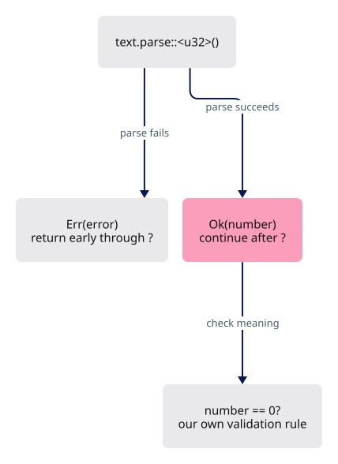
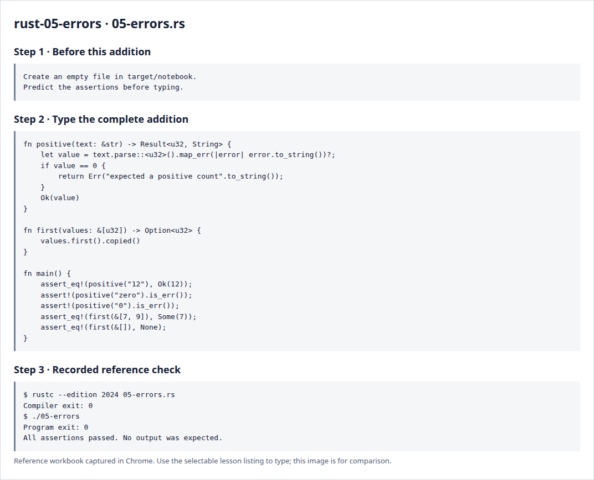

# Rust 5 · Missing values and errors

**Estimated study time: about 1–3 hours.** Includes reading, typing and experiments; this is a planning range, not a deadline.

**In the viewer:** Loading and GPU creation can fail; selection can be absent. Aim to explain why missing data and a failed operation use different return types.

[See the whole viewer](../map.md)

[Course foundations](../foundations.md)

## Picture the idea

Absence and failure are ordinary cases. Option says a value may be absent. Result says an operation may fail and carries information about that failure. Neither case should be disguised as a made-up successful value.



## Step 1 · Read and predict

The notation ::<u32> tells parse which number type to produce. map_err converts the parser error into a String. The closure between vertical bars performs that conversion. ? returns early on an error; on success, value receives the parsed number. copied turns an optional borrowed integer into an optional owned integer.

Does ? skip the zero check when parsing "12" succeeds?

<details>
<summary>Compare your prediction</summary>

No. It unwraps the successful number and execution continues. The zero check is a separate rule.

</details>

## Step 2 · Type a complete small program

Create `target/notebook/05-errors.rs` under `session_viewer` and type the entire listing. Create the notebook folder first. These practice programs are a separate notebook; the viewer project begins empty afterwards.

```rust
--8<-- "foundations/code/05-errors.rs"
```

## Step 3 · Run and investigate

From `session_viewer`:

```sh
rustc --edition 2024 target/notebook/05-errors.rs -o target/notebook/05-errors
./target/notebook/05-errors
```

Success is a normal exit with no output. Each assertion has checked its expected result. A failed assertion or compiler error needs investigation.

Add assertions for "-2", an empty string and an overflowing integer. Then explain why first returns None for an empty list instead of inventing a coordinate of zero.

<details>
<summary>Reference screenshots of preparation, source and actual check output</summary>



</details>

**Before moving on:** explain the program without reading the listing. Keep your experiment in the notebook; it is yours to return to.

[Previous](../foundations/04-ownership.md)

[Next](../foundations/06-states.md)
