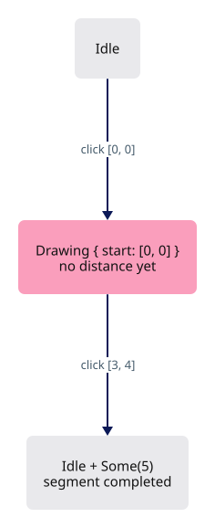
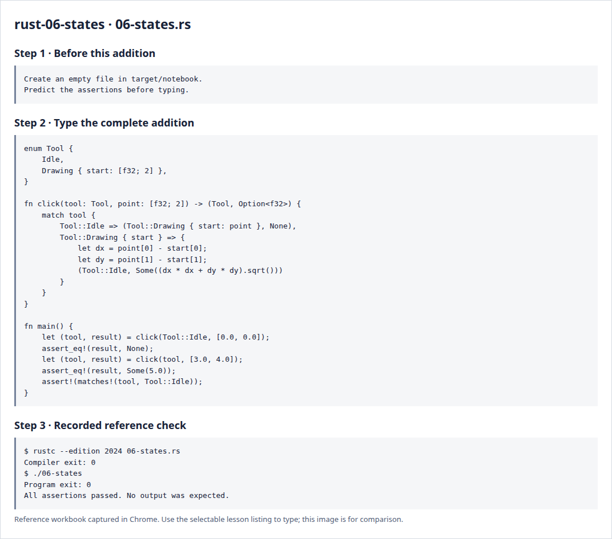

# Rust 6 · Enums and state machines

**Estimated study time: about 1–3 hours.** Includes reading, typing and experiments; this is a planning range, not a deadline.

**In the viewer:** An enum describes the phases of an interactive tool. Aim to predict which inputs are valid now and which state comes next.

[See the whole viewer](../map.md)

[Course foundations](../foundations.md)

## Picture the idea

An enum chooses one of several forms. Each form can carry the data it needs. Our tool is either idle or drawing from a saved start point. This is clearer than several booleans that might describe impossible combinations.



## Step 1 · Read and predict

match handles both possible states. The first click remembers a point; the second computes a distance and returns to idle. The tuple (Tool, Option<f32>) returns two related results. Destructuring with let gives each result its own name.

Why is the first result None while the second is Some(5.0)?

<details>
<summary>Compare your prediction</summary>

One point is insufficient to define the segment length. The second point completes a 3–4–5 triangle.

</details>

## Step 2 · Type a complete small program

Create `target/notebook/06-states.rs` under `session_viewer` and type the entire listing. Create the notebook folder first. These practice programs are a separate notebook; the viewer project begins empty afterwards.

```rust
--8<-- "foundations/code/06-states.rs"
```

## Step 3 · Run and investigate

From `session_viewer`:

```sh
rustc --edition 2024 target/notebook/06-states.rs -o target/notebook/06-states
./target/notebook/06-states
```

Success is a normal exit with no output. Each assertion has checked its expected result. A failed assertion or compiler error needs investigation.

Draw the two states and arrows on paper. Add an explicit cancel function returning Idle. Explain why a drawing state owns its start point instead of borrowing a temporary mouse-event value.

<details>
<summary>Reference screenshots of preparation, source and actual check output</summary>



</details>

**Before moving on:** explain the program without reading the listing. Keep your experiment in the notebook; it is yours to return to.

[Previous](../foundations/05-errors.md)

[Next](../foundations/07-behavior.md)
