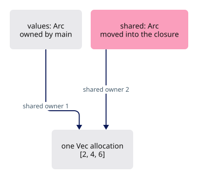
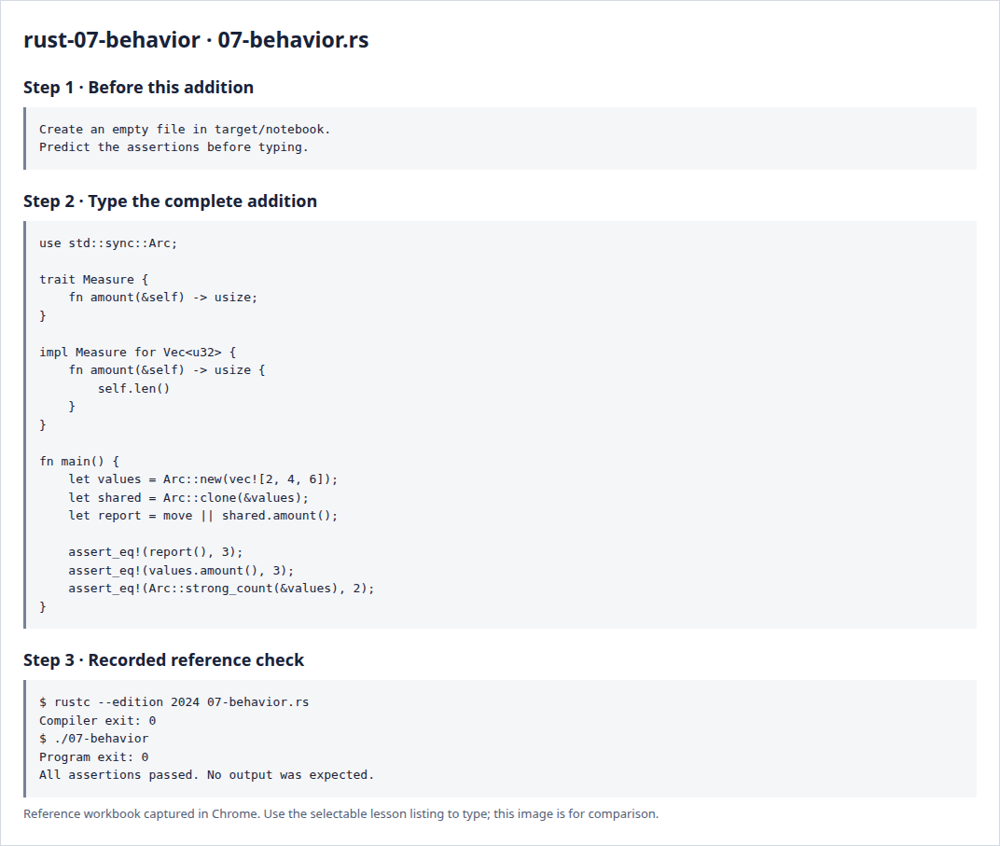

# Rust 7 · Traits, closures and shared ownership

**Estimated study time: about 1–3 hours.** Includes reading, typing and experiments; this is a planning range, not a deadline.

**In the viewer:** Traits describe shared behavior, closures carry small operations, and shared ownership keeps reused data alive. Aim to name the owner and the behavior separately.

[See the whole viewer](../map.md)

[Course foundations](../foundations.md)

## Picture the idea

A trait names behavior a type offers. A closure packages a small function together with values from its surroundings. Arc permits several owners to share one allocation. These ideas meet when a callback needs data after the function that created it has returned.



## Step 1 · Read and predict

impl Measure for Vec<u32> supplies the trait method. Arc::clone increments shared ownership instead of cloning the vector contents. move transfers shared into the closure. The original values Arc still owns the same allocation, so both can read it.

How many vector allocations exist after Arc::clone?

<details>
<summary>Compare your prediction</summary>

One. There are two owning Arc handles to that allocation, one held inside the closure.

</details>

## Step 2 · Type a complete small program

Create `target/notebook/07-behavior.rs` under `session_viewer` and type the entire listing. Create the notebook folder first. These practice programs are a separate notebook; the viewer project begins empty afterwards.

```rust
--8<-- "foundations/code/07-behavior.rs"
```

## Step 3 · Run and investigate

From `session_viewer`:

```sh
rustc --edition 2024 target/notebook/07-behavior.rs -o target/notebook/07-behavior
./target/notebook/07-behavior
```

Success is a normal exit with no output. Each assertion has checked its expected result. A failed assertion or compiler error needs investigation.

Replace Arc::clone with a clone of the inner vector and describe what additional work would occur. Explain why Arc alone does not grant arbitrary shared mutation; that would need a separate access rule such as a mutex.

<details>
<summary>Reference screenshots of preparation, source and actual check output</summary>



</details>

**Before moving on:** explain the program without reading the listing. Keep your experiment in the notebook; it is yours to return to.

[Previous](../foundations/06-states.md)

[Next](../foundations/08-bytes.md)
