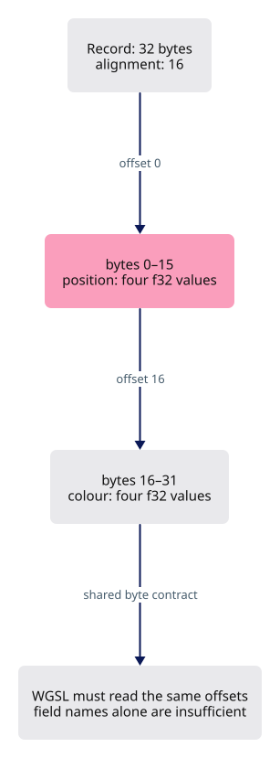
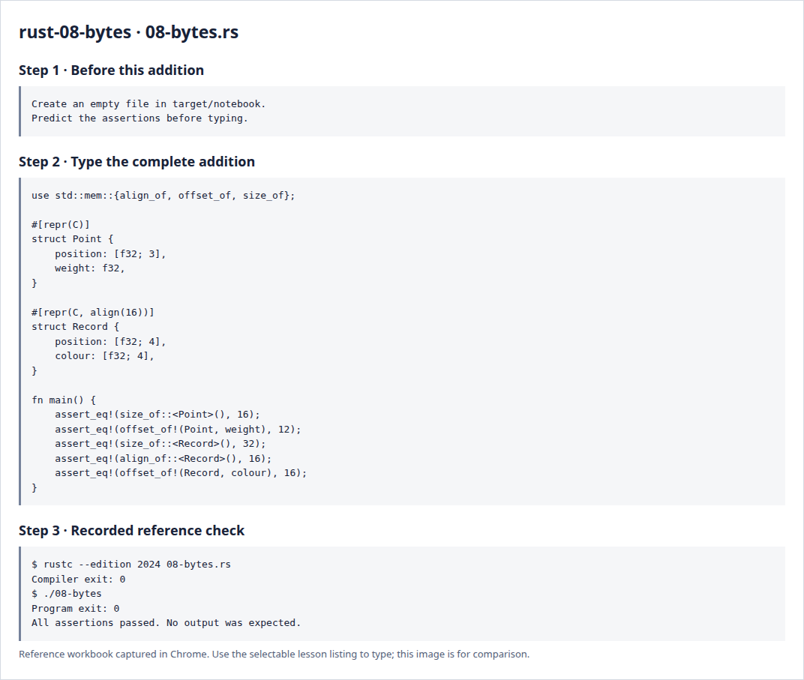

# Rust 8 · Bytes, alignment and shader contracts

**Estimated study time: about 1–3 hours.** Includes reading, typing and experiments; this is a planning range, not a deadline.

**In the viewer:** Rust and WGSL must interpret uploaded bytes in the same way. Aim to calculate a small record’s offsets and explain why a byte-count mismatch corrupts the drawing.

[See the whole viewer](../map.md)

[Course foundations](../foundations.md)

## Picture the idea

A struct is laid out in bytes, but each field also has alignment requirements. Alignment determines legal starting offsets. When Rust uploads a record to a shader, the two languages must agree on those offsets. Matching field names is not enough.



## Step 1 · Read and predict

repr(C) requests a predictable C-compatible field order and padding. It does not automatically create a WGSL-compatible type. A WGSL vec3<f32> has size 12 and alignment 16; a following f32 can start at byte 12, while a following vec3 needs a 16-byte boundary. Four-component vectors often make the intended layout easier to see.

Why does the colour field begin at byte 16 in Record?

<details>
<summary>Compare your prediction</summary>

The preceding four f32 components occupy 16 bytes. The second group begins at the next 16-byte boundary.

</details>

## Step 2 · Type a complete small program

Create `target/notebook/08-bytes.rs` under `session_viewer` and type the entire listing. Create the notebook folder first. These practice programs are a separate notebook; the viewer project begins empty afterwards.

```rust
--8<-- "foundations/code/08-bytes.rs"
```

## Step 3 · Run and investigate

From `session_viewer`:

```sh
rustc --edition 2024 target/notebook/08-bytes.rs -o target/notebook/08-bytes
./target/notebook/08-bytes
```

Success is a normal exit with no output. Each assertion has checked its expected result. A failed assertion or compiler error needs investigation.

Draw the 32-byte Record as two rows of 16 boxes. Label position and colour. Then replace position with three floats and remove the explicit align attribute; inspect offsets again. Explain why a Rust layout assertion and a matching shader declaration are both necessary.

<details>
<summary>Reference screenshots of preparation, source and actual check output</summary>



</details>

**Before moving on:** explain the program without reading the listing. Keep your experiment in the notebook; it is yours to return to.

[Previous](../foundations/07-behavior.md)

[Begin the viewer](../00-environment.md)
