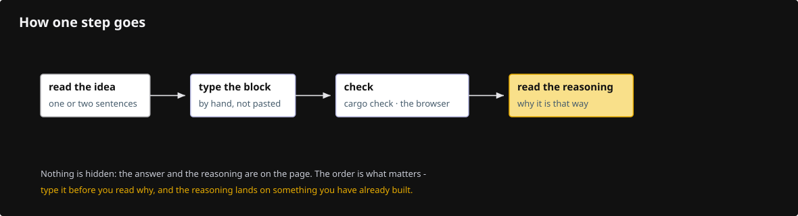
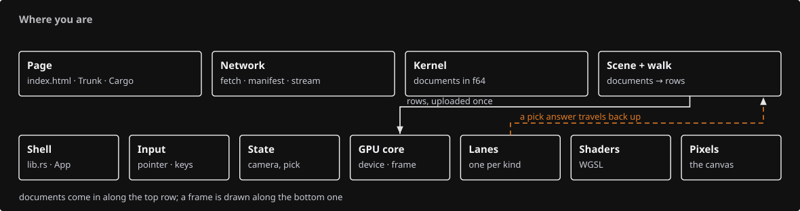

# How to use this course

Nothing in this course is hidden. Every question is followed by its reasoning and then its answer, on the same page, always visible. You are never one click away from the thing you need.

That is deliberate. Being stuck with no way forward teaches nothing; being shown *how someone worked it out* teaches the move you can reuse next time.

## The loop

- **Read the idea.** Each step names what it adds before the code. If you want to guess the shape of the code first, guess — a wrong guess turns the block into an answer to a question you actually had. If you do not want to guess, read on; the block is right there.
- **Type** the blocks marked **TYPE THIS**. Typing is slow on purpose; it is the part where your hands learn the API. Blocks marked **COPY** are boilerplate, fixtures and lockfiles — copy those, you learn nothing by retyping a font table.
- **Check** at every marker. `cargo check` is the cheapest feedback in the course, and the checkpoint build tells you what the screen should show. Never carry a broken state into the next lesson.
    Know what a check proves, though: a Rust file enters the build only when a `mod` line names it, and the bigger lessons create files first and declare them at the end. A check before that wiring step proves you have not broken the *previous* checkpoint; the check after it is the one that compiles what you just typed. Both are worth running — the first is how you notice you deleted the wrong line.
- **Read the reasoning.** Every lesson ends in **Questions and answers**. Each entry has two parts: *how to work it out* — the chain of reasoning, starting from what you already know — and *the answer*. The reasoning is the part worth reading twice. The answers to the questions matter less than the way they were reached, because the next problem will be a different question.

## One map, always the same

Every step that writes a file opens with the same picture of the whole viewer, with the box you are working in filled pink, the boxes you have already built solid, and the ones still ahead dashed.

This is deliberate repetition. A diagram that changes shape every time has to be read; a diagram that never changes shape is *seen*. By lesson 05 you should be able to glance at the pink box and know, without reading a word, whether this step is about getting data in, deciding what to draw, or drawing it. [The map](map.md) explains the eleven zones once.

## Every lesson has the same shape

- **You are building** — the mechanism this lesson adds, as one diagram.
- **Starting point** — what the last checkpoint left you, and what is still wrong with it.
- **Steps** — one idea each: a sentence or two, then the code, then why the important lines are there.
- **Check** — `cargo check`, then the checkpoint build and exactly what you should see.
- **What changed** — the data flow in one line, and the production files this maps to.
- **Try** — small experiments with visible results; each one changes the picture.
- **Questions and answers** — the reasoning, then the answers, then what you should be able to do now.

## The same depth all the way through

The last lessons are not thinner than the first. Lesson 18 explains the tile walk as completely as lesson 01 explains the adapter — the subjects get harder, the explanations do not get shorter. Where a later lesson says less about something, it is because an earlier lesson said it in full and names the lesson that did.

The [capstone](capstone.md) is the one place you are asked to build something without a step-by-step, and even there nothing is withheld: the questions to answer are listed, the reasoning for each is worked through, and the full design is written out in the answer key. It asks you to try first because trying first is how the answer sticks — not because the answer is rationed.

## When you are stuck

- Read the error, not the code. [Reading failures](debugging.md) covers the ten errors this course actually produces and how to reason about each.
- Go back one checkpoint. Every lesson ends in a state that compiles and draws; `docs/reconstruction/replay.py --output <dir> --through NN` rebuilds any checkpoint exactly, so a mistake five lessons ago is never a trap.
- A word you do not know is a word the course owes you: [Words before code](words.md) defines every term before its lesson needs it.

## What finishing means

Not "I typed all twenty lessons." It means you can sit in front of an empty crate and, without this page open:

- name the objects between an empty `main` and a cleared canvas, in order;
- say where any piece of data lives — CPU, GPU, or in transit — and who owns it;
- add a new primitive: decide its rows, its buffers, its pipeline, its shader, its pass, and its answer to a pick;
- read a wgpu validation error and know which of the three declarations disagreed.

If a lesson leaves you unable to do its share of that, redo the lesson before moving on. The course is short; the list is the point.
