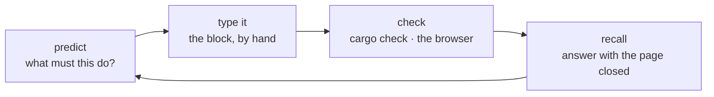

# How to use this course

A smooth explanation is not evidence of learning. You can read this whole course, agree with every sentence, and still be unable to write `create_render_pipeline` from an empty file. The measure that matters is the one at the end of every lesson: **what can you now do with the page closed?**

So the course is built to interrupt reading with work.

## The loop

- **Predict** before you type. Each step names its idea in one or two sentences before the code. Stop there and guess the shape of the code. A wrong guess is the useful kind: you now have a question, and the block answers it.
- **Type** the blocks marked **TYPE THIS**. Typing is slow on purpose; it is the only part of the course where your hands learn the API. Blocks marked **COPY** are boilerplate, fixtures and lockfiles — copy those, you learn nothing by retyping a font table.
- **Check** at every marker. `cargo check` is the cheapest feedback in the course, and the checkpoint build tells you what the screen should show. Never carry a broken state into the next lesson.
    Know what a check proves, though: a Rust file enters the build only when a `mod` line names it, and the bigger lessons create files first and declare them at the end. A check before that wiring step proves you have not broken the *previous* checkpoint; the check after it is the one that compiles what you just typed. Both are worth running — the first is how you notice you deleted the wrong line.
- **Recall** at the end. Each lesson closes with questions whose answers are hidden. Answer out loud or on paper *first*, then open the answer and compare. The comparison is the learning; reading the answer is not.

## Why the answers are hidden

Retrieving a fact strengthens it. Re-reading it does not. That is why every **Recall** answer is behind a click, and why the lessons never repeat an explanation you have already met — you are meant to reconstruct it, not look it up.

The same goes for the assistant on your other screen. Ask it to *check* your reasoning, to explain an error message, to ask you a question back. If you ask it to write the step for you, you have bought the code and skipped the course.

## Fading assistance

The early lessons hold your hand: every line typed, every field explained.

- **00–05** — 90% guidance. Everything is new: instance, adapter, device, surface, pipeline, depth.
- **06–11** — 70%. You know the frame; now geometry, boundaries and text arrive. Recall questions start asking *why this design* rather than *what does this call do*.
- **12–17** — 50%. Whole mechanisms (a pick round-trip, a coverage mask) are described and you are asked to predict the implementation before you see it.
- **18–20 and the capstone** — you are given requirements and constraints, and you decide the implementation.

The [capstone](capstone.md) has no line-by-line instructions at all. That is the exam, and it is the only honest one.

## When you are stuck

- Read the error, not the code. [Reading failures](debugging.md) covers the ten errors this course actually produces and how to reason about each.
- Go back one checkpoint. Every lesson ends in a state that compiles and draws; `docs/reconstruction/replay.py --output <dir> --through NN` rebuilds any checkpoint exactly, so a mistake five lessons ago is never a trap.
- A word you do not know is a word the course owes you: [Words before code](words.md) defines every term before its lesson needs it.

## What finishing means

Not "I typed all twenty lessons." It means you can sit in front of an empty crate and, without this page open:

- name the objects between an empty `main` and a cleared canvas, in order;
- say where any piece of data lives — CPU, GPU, or in transit — and who owns it;
- add a new primitive: decide its rows, its buffers, its pipeline, its shader, its pass, and its answer to a pick;
- read a wgpu validation error and know which of the three declarations disagreed.

If a lesson leaves you unable to do its share of that, redo the lesson before moving on. The course is short; the list is the point.
