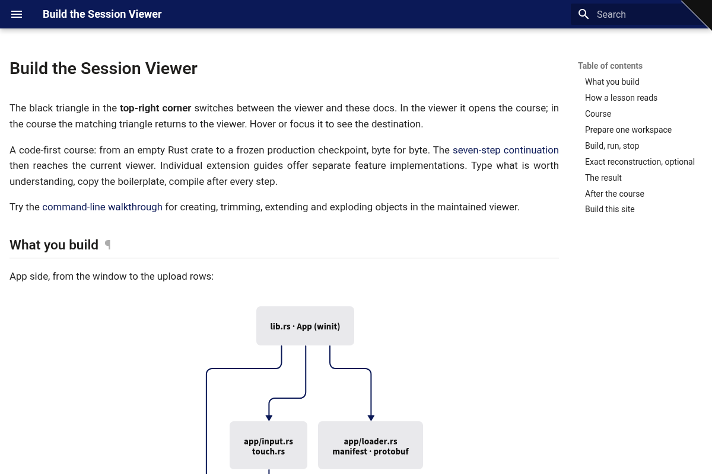

# How to use this course

The black triangle in the **top-right corner** switches between the viewer and these docs. In the viewer it opens the course; in the course the matching triangle returns to the viewer. Hover or focus it to see the destination.

## The loop

- **Read the idea.** Each step names what it adds before the code.
- **Type** the blocks marked **TYPE THIS**. Blocks marked **COPY** are boilerplate, fixtures and lockfiles.
- **Check** at every marker. `cargo check` is the cheapest feedback in the course, and the checkpoint build tells you what the screen should show. Never carry a broken state into the next lesson.
    A Rust file enters the build only when a `mod` line names it, and the bigger lessons create files first and declare them at the end. A check before that wiring step proves only that you have not broken the *previous* checkpoint; the check after it compiles what you just typed. Run both.
- **Read the reasoning.** Every lesson ends in **Questions and answers**: *how to work it out*, the chain from what you already know, then *the answer*.

## One map, always the same

Every step that writes a file opens with the same picture of the whole viewer: the box you are working in is **pink**, the ones already built **light slate**, the ones still ahead **near-black**. A compact copy stays pinned at the top of the page, with the same key.

By lesson 05 the pink box alone should tell you whether this step is about getting data in, deciding what to draw, or drawing it. [The map](map.md) explains the eleven zones once.

## Every lesson has the same shape

- **You are building** — the mechanism this lesson adds, as one diagram.
- **Starting point** — what the last checkpoint left you, and what is still wrong with it.
- **Steps** — one idea each: a sentence or two, then the code, then why the important lines are there.
- **Check** — `cargo check`, then the checkpoint build and exactly what you should see.
- **What changed** — the data flow in one line, and the production files this maps to.
- **Try** — small experiments with visible results; each one changes the picture.
- **Questions and answers** — the reasoning, then the answers, then what you should be able to do now.

Where a later lesson says less about something, an earlier one said it in full and is named. Every required answer is written out; no answer is collapsed or withheld. The [capstone](capstone.md) is optional design practice. After checkpoint 21, follow the [seven current-viewer checkpoints](extend-integrated-tutorial.md): every code edit is shown, every checkpoint compiles, and the final code matches the maintained source. The [independent lessons](extend-implementation.md) teach one optional feature per fresh workspace. [Small code, bounded work](performance-patterns.md) explains the patterns to reuse.

## When you are stuck

- Read the error, not the code. [Reading failures](debugging.md) covers the ten errors this course actually produces and how to reason about each.
- Go back one checkpoint. Every lesson ends in a state that compiles and draws; `docs/reconstruction/replay.py --output <dir> --through NN` rebuilds any checkpoint exactly.
- A word you do not know is defined in [Words before code](words.md), before the lesson that needs it.

## What finishing means

Keep the pages open as a reference. By the end, the diagrams, code and visible answers show how to:

- name the objects between an empty `main` and a cleared canvas, in order;
- say where any piece of data lives — CPU, GPU, or in transit — and who owns it;
- add a new primitive: decide its rows, its buffers, its pipeline, its shader, its pass, and its answer to a pick;
- read a wgpu validation error and know which of the three declarations disagreed.

Each current-viewer chapter ends with its expected result and the exact next page. If a check fails, correct that checkpoint before continuing.
