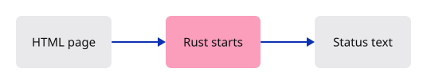
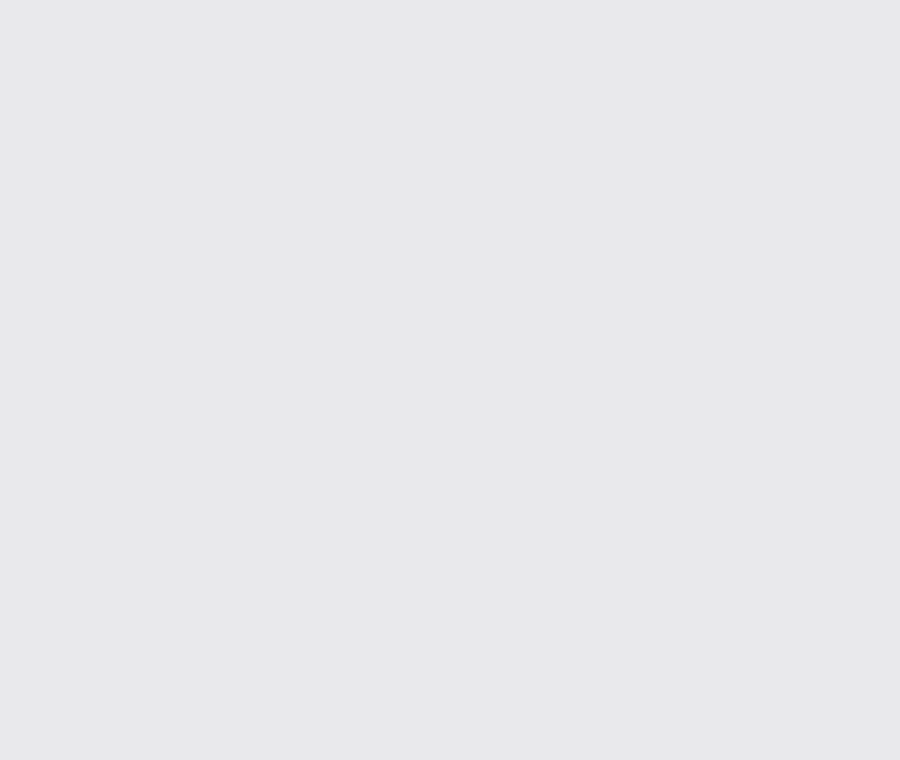

# 01 · A page that Rust can reach

**Combined study estimate: 1–2 hours.** Includes reading, typing, reasoning and experiments.

**Typing estimate: 16–32 minutes.** 49 added or changed lines; unchanged context is excluded. [How this is estimated](typing-load.md).

**Today:** Fill the browser window with a canvas and let Rust signal that it has started.

**Follow:** HTML canvas → WebAssembly entry point → hidden startup status.

Think of the canvas as an empty sheet of paper. Today that sheet fills the browser window. Rust records a startup message in a hidden page element. We are checking the connection before asking the GPU to draw.

You will make three files. `index.html` owns the page. `Cargo.toml` tells Rust which libraries the project uses. `src/lib.rs` contains the function the browser will call. There is no application state or renderer yet.



From `session_viewer`, create your project with `npm --prefix ../session_tests run course -- init`. This supplies only the fixed dependency lock. Create a `src` folder inside `workspace/journey`, then type the files below. All lessons use this same project.

`let` gives a value a name. `fn` defines a function. `Result<(), JsValue>` means “success with no returned value, or a browser error”. The `?` after a lookup stops the function if that lookup failed. Read each lookup as a question: do we have a window, then a document, then our status element?

The dependencies for the next lessons are listed now so this release can use one unchanged lock file. They are libraries, not hidden viewer code. `dev-dependencies` are used by the course's verification tools. You can explore [Rust values](../foundations/01-values.md) and [errors](../foundations/05-errors.md) before typing if these expressions are unfamiliar.

The page has no margin or scrolling: the canvas owns the whole window from this first lesson. The hidden status element lets our browser check read the startup result without putting teaching text over your drawing.

## Type the change

### 1. `Cargo.toml`

Create the manifest. cdylib makes browser-loadable code; rlib will let our native checks use the same renderer.

Create the file and type:

```toml
--8<-- "journey/code/01-canvas-01.toml"
```

### 2. `index.html`

Let the canvas fill the window from the start. Keep startup information hidden; the documentation explains the lesson.

Create the file and type:

```html
--8<-- "journey/code/01-canvas-fullscreen-1.html"
```

### 3. `src/lib.rs`

Create Rust’s entry point. The browser calls start after loading WebAssembly; ? returns an error if a required element is missing.

Create the file and type:

```rust
--8<-- "journey/code/01-canvas-fullscreen-2.rs"
```

## Run and look

From `session_viewer`, enter your project folder:

```sh
cd workspace/journey
cargo build --lib --locked --target wasm32-unknown-unknown -j4
CARGO_BUILD_JOBS=4 trunk serve --port 8780
```

Open `http://127.0.0.1:8780/`. If Trunk is already running in this project, leave it running; it rebuilds when you save.

The window is white. In the browser console, evaluate `document.getElementById("status").textContent`. It should say “Rust is running. The canvas is ready.” Rust has started; GPU drawing comes next.

**Verified checkpoint in Chrome.**



[What this screenshot checks](release.md).

<details>
<summary>Optional experiment</summary>

Change the sentence passed to `set_text_content`, save, and read the hidden status again in the browser console. The sentence changes while the white canvas stays still. Restore the original sentence before comparing your code.

</details>

## Explain the change

Does seeing the canvas prove that the GPU has drawn anything?

<details>
<summary>Compare your explanation</summary>

No. HTML creates the canvas and CSS gives it a background. The status proves Rust ran; GPU commands begin in the next lesson.

</details>

## Keep your working result

Return to `session_viewer` in a second terminal. Restore experimental edits before comparing:

```sh
npm --prefix ../session_tests run course -- check 01-canvas
npm --prefix ../session_tests run course -- save 01-canvas
```

Check compares your typed source; run the focused check above for behavior. [Recover your work](recovery.md).

<details>
<summary>Where this fits in the finished viewer</summary>

Our entry point will grow into the maintained viewer’s `lib.rs`. Browser setup is deliberately small here; the later application needs winit event routing, resizing and device recovery.

</details>

<details>
<summary>Verification notes and browser acceptance</summary>

A white canvas fills the window. Rust startup is checked through the hidden status; there is deliberately no visible heading or message.

[Full validation scope](release.md).

</details>
