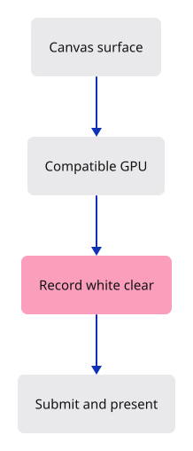

# 01a · Paint the first GPU frame

**Typing: 30–59 minutes.** [Estimate](typing-load.md).

Give the GPU one instruction: clear the canvas to white. The picture will look like lesson 01, but its pixels now come from a real GPU frame.

## Type

Continue from [A page that Rust can reach](01-canvas.md). [Save or recover your work](recovery.md).

### 1. `src/lib.rs`

Start asynchronous GPU setup without blocking the browser. A setup error goes to the developer console.

<details>
<summary>Locate the existing block</summary>

```rust
use wasm_bindgen::prelude::*;

#[wasm_bindgen(start)]
pub fn start() -> Result<(), JsValue> {
    console_error_panic_hook::set_once();
    let window = web_sys::window().ok_or("No browser window")?;
    let document = window.document().ok_or("No document")?;
    let status = document.get_element_by_id("status").ok_or("Missing status")?;
    status.set_text_content(Some("Rust is running. The canvas is ready."));
    Ok(())
}
```

</details>

Replace that block with:

```rust
--8<-- "journey/code/01a-gpu-01.rs"
```

### 2. `src/renderer.rs`

Own the device and queue; record and submit one white clear.

Create the file and type:

```rust
--8<-- "journey/code/01a-gpu-02.rs"
```

### 3. `src/browser.rs`

Connect the canvas to an adapter, configure its image and present the clear.

Create the file and type:

```rust
--8<-- "journey/code/01a-gpu-03.rs"
```

## Run and check

In your project:

```sh
cd workspace/journey
cargo build --lib --locked --target wasm32-unknown-unknown -j4
CARGO_BUILD_JOBS=4 trunk serve --port 8780
```

Open `http://127.0.0.1:8780/`. Keep an existing Trunk server running; saving rebuilds it.

The canvas stays white. Change `wgpu::Color::WHITE` to `wgpu::Color::BLACK`, save, and check that it turns black. Restore WHITE. These pixels now come from the GPU.

**Verified checkpoint in Chrome.**


[Verification scope](release.md).

<details>
<summary>Code explanation and diagram</summary>

An **adapter** chooses a GPU compatible with our canvas surface. A **device** creates resources; its **queue** receives recorded work. A **surface** supplies the image that can appear in the canvas. `.await` waits for adapter/device requests while leaving the browser free.

`Renderer` keeps the device and queue in a `struct`. Its `draw(&self, view)` method borrows those values and a supplied image view. The render pass borrows the encoder inside a brace-delimited scope. End that scope before `finish` consumes the encoder, then submit its commands.

`map_err(error)` converts GPU errors into `JsValue`; `impl ToString` accepts error types that can produce text. `expect` reports failed startup through the panic hook. Descriptor defaults are enough for this first clear. The next lesson adds bounded sizing, colour-view configuration and page feedback.

canvas → compatible adapter → device and queue → clear → present.



Why does the render pass end before encoder.finish()?

The pass borrows the encoder. Ending its scope releases that borrow so finish can take the encoder and return the recorded commands.

Study estimate, including typing and experiments: 1–2 hours.

</details>

<details>
<summary>Optional experiment</summary>

Remove the inner braces around the render pass and keep its named binding alive until finish. Read the borrow error, then restore the scope.

</details>

<details>
<summary>Check and save your work</summary>

Restore experimental edits, then run from `session_viewer`:

```sh
npm --prefix ../session_tests run course -- check 01a-gpu
npm --prefix ../session_tests run course -- save 01a-gpu
```

Source comparison leaves your project untouched. [Save and recovery instructions](recovery.md).

</details>

<details>
<summary>Viewer coverage and verification</summary>

This is the first complete GPU frame. The next step keeps this drawing operation while separating browser presentation and adding explicit configuration.

Actual Chrome verifies an opaque white GPU canvas at the full initial window size. It intentionally looks like lesson 01: the new result is a submitted GPU clear, not a different drawing.

[Full validation scope](release.md).

</details>
