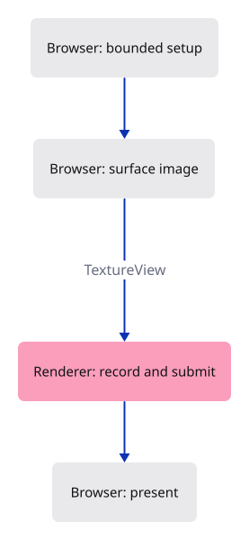

# 02 · Give browser presentation its own function

**Typing: 28–56 minutes.** [Estimate](typing-load.md).

Keep the white GPU frame and separate its browser presentation into `present`. Setup requests the device and configures the surface; presentation obtains an image, calls `Renderer::draw`, then presents it.

Clamp canvas dimensions to the device’s texture limit, with at least one pixel per axis. This prevents a zero-sized or oversized surface. CSS still determines the visible window area; lesson 20 handles later resizes and display density.

## Type

Continue from [Paint the first GPU frame](01a-gpu.md). [Save or recover your work](recovery.md).

### 1. `src/lib.rs`

Report startup failure on the page through the browser owner.

<details>
<summary>Locate the existing block</summary>

```rust
pub mod renderer;
#[cfg(target_arch = "wasm32")]
mod browser;

use wasm_bindgen::prelude::*;

#[wasm_bindgen(start)]
pub fn start() {
    console_error_panic_hook::set_once();
    #[cfg(target_arch = "wasm32")]
    wasm_bindgen_futures::spawn_local(async {
        browser::run().await.expect("GPU startup failed");
    });
}
```

</details>

Replace that block with:

```rust
--8<-- "journey/code/02-clear-fullscreen-2.rs"
```

### 2. `src/renderer.rs`

Name the render pass and spell out the clear colour for later experiments.

<details>
<summary>Locate the existing block</summary>

```rust
pub struct Renderer {
    pub device: wgpu::Device,
    pub queue: wgpu::Queue,
}

impl Renderer {
    pub fn new(device: wgpu::Device, queue: wgpu::Queue) -> Self {
        Self { device, queue }
    }

    pub fn draw(&self, view: &wgpu::TextureView) {
        let mut encoder = self.device.create_command_encoder(&Default::default());
        {
            // The pass borrows the encoder. This scope ends that borrow before finish takes it.
            let _pass = encoder.begin_render_pass(&wgpu::RenderPassDescriptor {
                color_attachments: &[Some(wgpu::RenderPassColorAttachment {
                    view,
                    depth_slice: None,
                    resolve_target: None,
                    ops: wgpu::Operations {
                        load: wgpu::LoadOp::Clear(wgpu::Color::WHITE),
                        store: wgpu::StoreOp::Store,
                    },
                })],
                ..Default::default()
            });
        }
        self.queue.submit([encoder.finish()]);
    }
}
```

</details>

Replace that block with:

```rust
--8<-- "journey/code/02-clear-fullscreen-4.rs"
```

### 3. `src/browser.rs`

Separate presentation, bound the canvas size and choose the colour view explicitly.

<details>
<summary>Locate the existing block</summary>

```rust
use crate::renderer::Renderer;
use wasm_bindgen::{JsCast, JsValue};

fn error(value: impl ToString) -> JsValue { JsValue::from_str(&value.to_string()) }

pub async fn run() -> Result<(), JsValue> {
    let window = web_sys::window().ok_or("No window")?;
    let document = window.document().ok_or("No document")?;
    let canvas: web_sys::HtmlCanvasElement = document.get_element_by_id("canvas").ok_or("No canvas")?.dyn_into()?;
    let instance = wgpu::Instance::default();
    let surface = instance.create_surface(wgpu::SurfaceTarget::Canvas(canvas.clone())).map_err(error)?;
    let adapter = instance.request_adapter(&wgpu::RequestAdapterOptions {
        compatible_surface: Some(&surface), ..Default::default()
    }).await.map_err(error)?;
    let (device, queue) = adapter.request_device(&Default::default()).await.map_err(error)?;
    let width = window.inner_width()?.as_f64().ok_or("No width")? as u32;
    let height = window.inner_height()?.as_f64().ok_or("No height")? as u32;
    canvas.set_width(width); canvas.set_height(height);
    let config = surface.get_default_config(&adapter, width, height).ok_or("No surface format")?;
    surface.configure(&device, &config);
    let renderer = Renderer::new(device, queue);
    let frame = match surface.get_current_texture() {
        wgpu::CurrentSurfaceTexture::Success(frame) | wgpu::CurrentSurfaceTexture::Suboptimal(frame) => frame,
        _ => return Err("No surface image".into()),
    };
    renderer.draw(&frame.texture.create_view(&Default::default()));
    frame.present();
    document.get_element_by_id("status").ok_or("No status")?.set_text_content(Some("The GPU painted the canvas."));
    Ok(())
}
```

</details>

Replace that block with:

```rust
--8<-- "journey/code/02-clear-window-1.rs"
```

## Run and check

In your project:

```sh
cd workspace/journey
cargo build --lib --locked --target wasm32-unknown-unknown -j4
CARGO_BUILD_JOBS=4 trunk serve --port 8780
```

Open `http://127.0.0.1:8780/`. Keep an existing Trunk server running; saving rebuilds it.

The canvas remains white. Change its clear colour to `r: 0.9, g: 0.9, b: 0.9`: it becomes light grey through the sRGB view. Restore all three values to `1.0`.

**Verified checkpoint in Chrome.**


[Verification scope](release.md).

<details>
<summary>Code explanation and diagram</summary>

Allow an sRGB texture view and use it for drawing. It converts linear colour values into display encoding. The triangle pipeline added next must use that same view format.

`Arc::new` gives wgpu’s error callback a shared owner. The short `|error| ...` closures convert errors into page feedback. `report` exposes startup failures through the existing status element; it adds no feature control.

configure within device limits → present(surface, renderer) → independent draw → page feedback.



What starts the GPU work, and what makes its image appear in the canvas?

queue.submit sends the recorded commands to the GPU. The browser presents its canvas image automatically. We still call frame.present to mark the end of our surface frame through wgpu’s shared API; native surface backends use that call to request presentation.

Study estimate, including typing and experiments: 1–2 hours.

</details>

<details>
<summary>Optional experiment</summary>

Compare width and height with the device limit in run. Explain why a drawing buffer needs pixel dimensions even though CSS already fills the window.

</details>

<details>
<summary>Check and save your work</summary>

Restore experimental edits, then run from `session_viewer`:

```sh
npm --prefix ../session_tests run course -- check 02-clear
npm --prefix ../session_tests run course -- save 02-clear
```

Source comparison leaves your project untouched. [Save and recovery instructions](recovery.md).

</details>

<details>
<summary>Viewer coverage and verification</summary>

These owners become the production GPU device setup and presentation modules. The drawing operation stays independent of page lookup. Surface resizing, retry and recovery are later lessons, not hidden in this one.

The actual opaque white GPU frame is deliberately identical to lesson 01a. This step changes presentation ownership, bounded configuration and error feedback.

[Full validation scope](release.md).

</details>
