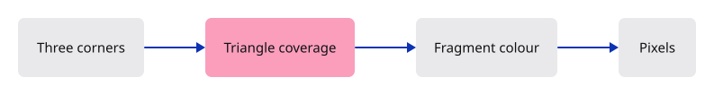
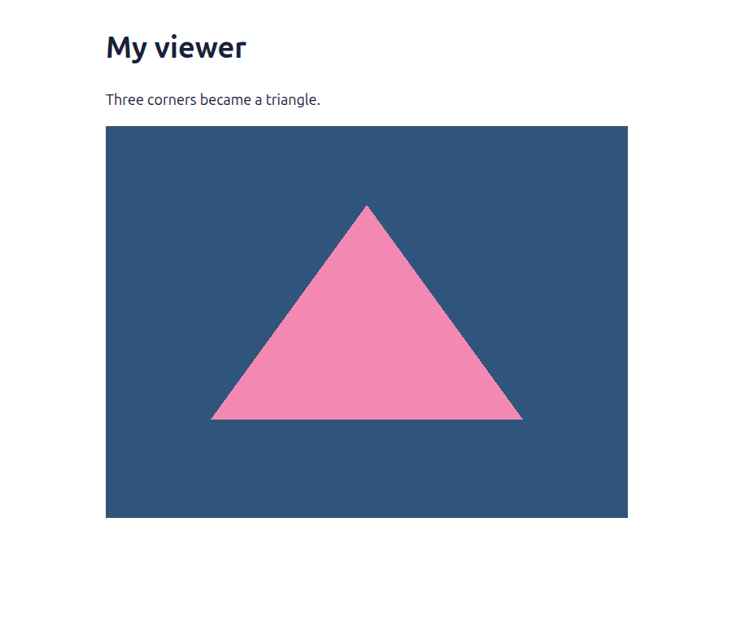

# 03 · Give the GPU three corners

**Combined study estimate: 1–2 hours.** Includes reading, typing, reasoning and experiments.

**Typing estimate: 19–38 minutes.** 47 added or changed lines; unchanged context is excluded. [How this is estimated](typing-load.md).

**Today:** Draw a pink triangle on the white background.

**Follow:** Three shader positions → triangle coverage → fragment colour → canvas.

Draw one pink triangle inside the white GPU frame. The shader supplies three corners; the renderer keeps one pipeline and records its draw.

The vertex shader places corners in clip space, where x and y near −1 and +1 reach the image edges. The fragment shader supplies colour. `0..3` draws three vertices; `0..1` draws one instance.

A pipeline is the reusable recipe connecting these shaders to the colour target. Keep it between frames. `include_str!` embeds the WGSL text at compile time. An empty vertex-buffer list means the shader still supplies its own positions; Rust will supply geometry in lesson 05. Use the same sRGB view format as browser presentation.



## Type the change

Continue from [Give browser presentation its own function](02-clear.md). Save your own work first: `npm --prefix ../session_tests run course -- save before-03-triangle` (from `session_viewer`).

### 1. `src/triangle.wgsl`

Create the shader. Rust runs on the CPU; these two functions run on the GPU. The fourth position component is 1 because we have not introduced perspective.

Create the file and type:

```wgsl
--8<-- "journey/code/03-triangle-01.wgsl"
```

### 2. `src/renderer.rs`

Keep the compiled drawing recipe beside the device and queue. It will be reused for every frame.

<details>
<summary>Locate the existing block</summary>

```rust
pub struct Renderer {
    pub device: wgpu::Device,
    pub queue: wgpu::Queue,
}

impl Renderer {
    pub fn new(device: wgpu::Device, queue: wgpu::Queue) -> Self {
        Self { device, queue }
    }

    pub fn draw(&self, view: &wgpu::TextureView) {
        let mut encoder = self.device.create_command_encoder(&Default::default());
        {
            // The pass borrows the encoder. This scope ends that borrow before finish takes it.
            let _pass = encoder.begin_render_pass(&wgpu::RenderPassDescriptor {
                label: Some("canvas"),
                color_attachments: &[Some(wgpu::RenderPassColorAttachment {
                    view,
```

</details>

Replace that block with:

```rust
--8<-- "journey/code/03-triangle-fullscreen-2.rs"
```

### 3. `src/renderer.rs`

Keep the compiled drawing recipe beside the device and queue. It will be reused for every frame.

<details>
<summary>Locate the existing block</summary>

```rust
                })],
                ..Default::default()
            });
        }
        self.queue.submit([encoder.finish()]);
    }
```

</details>

Replace that block with:

```rust
--8<-- "journey/code/03-triangle-fullscreen-3.rs"
```

### 4. `src/browser.rs`

Pass the surface format to the renderer; a pipeline must agree with the texture it draws into.

<details>
<summary>Locate the existing block</summary>

```rust
        .ok_or("No compatible surface format")?;
    config.view_formats = vec![config.format.add_srgb_suffix()];
    surface.configure(&device, &config);
    let renderer = Renderer::new(device, queue);
    present(&surface, &renderer)?;
    report("The GPU painted the canvas.");
    Ok(())
}
```

</details>

Replace that block with:

```rust
--8<-- "journey/code/03-triangle-window-1.rs"
```

## Run and look

From `session_viewer`, enter your project folder:

```sh
cd workspace/journey
cargo build --lib --locked --target wasm32-unknown-unknown -j4
CARGO_BUILD_JOBS=4 trunk serve --port 8780
```

Open `http://127.0.0.1:8780/`. If Trunk is already running in this project, leave it running; it rebuilds when you save.

A pink triangle appears on white. Change its top vertex in the shader, save, and check that only the triangle’s shape changes. Restore the vertex.

**Verified checkpoint in Chrome.**



[What this screenshot checks](release.md).

<details>
<summary>Optional experiment</summary>

Predict the result of changing the last corner from `(0.0, 0.6)` to `(0.4, 0.6)`. Run it: the top should move right while the base stays still. Then change only the fragment colour. Explain why that changes the inside colour but not the silhouette. Restore both edits.

</details>

## Explain the change

If you change the top vertex, which part of the picture changes, and which stays the same?

<details>
<summary>Compare your explanation</summary>

The triangle silhouette changes because its corner positions changed. The surrounding white stays the same: the render pass clears the background before drawing the triangle.

</details>

## Keep your working result

Return to `session_viewer` in a second terminal. Restore experimental edits before comparing:

```sh
npm --prefix ../session_tests run course -- check 03-triangle
npm --prefix ../session_tests run course -- save 03-triangle
```

Check compares your typed source; run the focused check above for behavior. [Recover your work](recovery.md).

<details>
<summary>Where this fits in the finished viewer</summary>

The production viewer also separates shader programs, pipeline setup and frame recording. Later mesh buffers replace the shader’s three hard-coded positions. We will make that replacement explicitly, after understanding what the positions do.

</details>
