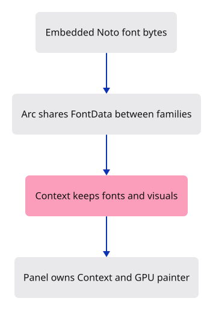
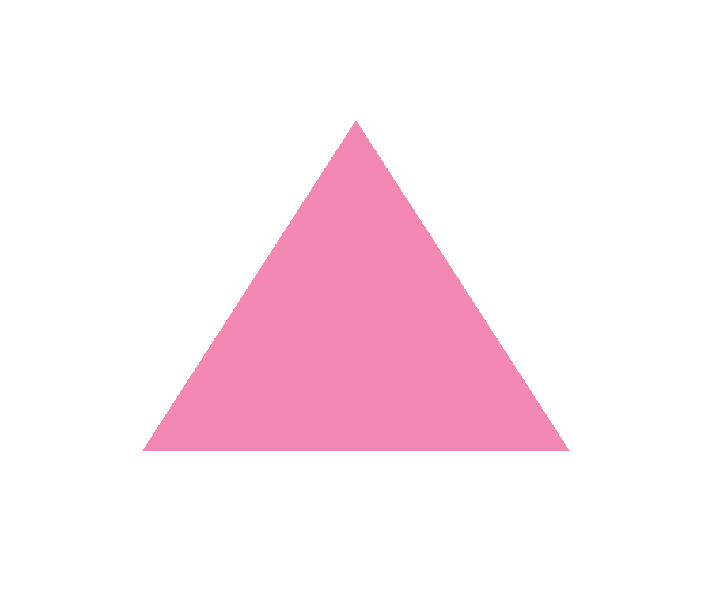

# 03a · Prepare the command fonts and painter

**Combined study estimate: 1–2 hours.** Includes reading, typing, reasoning and experiments.

**Typing estimate: 30–60 minutes.** 82 added or changed lines; unchanged context is excluded. [How this is estimated](typing-load.md).

**Today:** Create the font and GPU painter owner while keeping the triangle.

**Follow:** Embedded font bytes → shared font definitions → egui context → GPU painter.

Prepare one owner for the command drawing. It keeps an `egui::Context` and a GPU painter. The browser constructs this owner now; the triangle stays unchanged until we connect drawing.

`include_bytes!` embeds the three Noto font files in the program. Their static lifetime lets the font definitions retain them. `Arc` gives egui shared ownership of the font data; both families list the same font names. The `fonts` helper returns that configuration; `new` installs it, chooses the light theme and creates a painter using the existing device.

The painter records interface work on our GPU. It does not need a second canvas or HTML controls.



## Type the change

Continue from [Give the GPU three corners](03-triangle.md). Save your own work first: `npm --prefix ../session_tests run course -- save before-03a-fonts` (from `session_viewer`).

### 1. `Cargo.toml`

Add egui and its GPU painter.

<details>
<summary>Locate the existing block</summary>

```toml
wasm-bindgen-futures = "=0.4.78"
wgpu = "=29.0.4"

[dev-dependencies]
pollster = "=0.4.0"
log = "=0.4.34"
```

</details>

Replace that block with:

```toml
--8<-- "journey/code/03a-fonts-01.toml"
```

### 2. `src/panel.rs`

Keep the context and painter together.

Create the file and type:

```rust
--8<-- "journey/code/03a-fonts-02.rs"
```

### 3. `src/browser.rs`

Create the painter owner before presenting the scene.

<details>
<summary>Locate the existing block</summary>

```rust
    config.view_formats = vec![config.format.add_srgb_suffix()];
    surface.configure(&device, &config);
    let renderer = Renderer::new(device, queue, config.format.add_srgb_suffix());
    present(&surface, &renderer)?;
    report("Three corners became a triangle.");
    Ok(())
```

</details>

Replace that block with:

```rust
--8<-- "journey/code/03a-fonts-03.rs"
```

### 4. `src/lib.rs`

Register the browser-only drawing modules.

<details>
<summary>Locate the existing block</summary>

```rust
        }
    });
}
```

</details>

Replace that block with:

```rust
--8<-- "journey/code/03a-fonts-04.rs"
```

### 5. `src/command_dock/theme.rs`

Configure Noto fonts and the light theme.

Create the file and type:

```rust
--8<-- "journey/code/03a-fonts-05.rs"
```

### 6. `src/command_dock/mod.rs`

Register the shared styling module.

Create the file and type:

```rust
--8<-- "journey/code/03a-fonts-06.rs"
```

## Run and look

After typing the manifest, run this from `session_viewer` to select the fixed dependency versions. It updates Cargo.lock, preserves the previous lock, and installs any supplied binary font assets. It does not write implementation code:

```sh
npm --prefix ../session_tests run course -- dependencies 03a-fonts
```

From `session_viewer`, enter your project folder:

```sh
cd workspace/journey
cargo build --lib --locked --target wasm32-unknown-unknown -j4
CARGO_BUILD_JOBS=4 trunk serve --port 8780
```

Open `http://127.0.0.1:8780/`. If Trunk is already running in this project, leave it running; it rebuilds when you save.

The triangle stays visible in the full window. The font and painter owner is constructed, but no interface drawing is connected yet.

**Verified checkpoint in Chrome.**



[What this screenshot checks](release.md).

<details>
<summary>Optional experiment</summary>

Change visuals.window_fill and rebuild. Predict why the triangle stays unchanged before the painter is called, then restore the colour.

</details>

## Explain the change

Why can the font configuration keep the embedded byte slices?

<details>
<summary>Compare your explanation</summary>

include_bytes! supplies bytes with a static lifetime, so FontData can retain those slices. Arc lets egui share the same font data allocation; both families refer to its registered name.

</details>

## Keep your working result

Return to `session_viewer` in a second terminal. Restore experimental edits before comparing:

```sh
npm --prefix ../session_tests run course -- check 03a-fonts
npm --prefix ../session_tests run course -- save 03a-fonts
```

Check compares your typed source; run the focused check above for behavior. [Recover your work](recovery.md).

<details>
<summary>Where this fits in the finished viewer</summary>

This is the same Noto font setup and GPU painter used by the finished command dock.

</details>

<details>
<summary>Verification notes and browser acceptance</summary>

Chrome observes creation of the actual egui GPU shader and pipeline while the triangle stays unchanged. No interface is drawn yet.

[Full validation scope](release.md).

To reproduce the scripted acceptance of the reference checkpoint, run from `session_viewer` with the [course bundle server](release.md#reproduce) running on port 8781:

```sh
npm --prefix ../session_tests run course -- capture 03a-fonts
```

This uses the verified reference bundle; it does not check or change your typed project.

</details>
