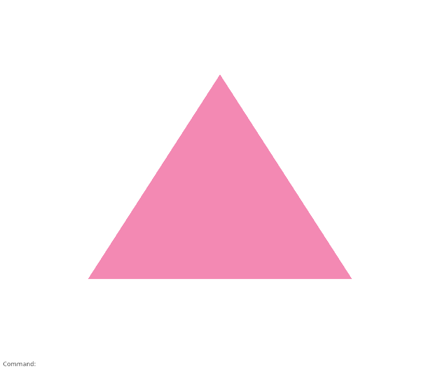
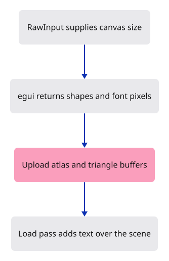

# 03a · Paint command text over the scene

**Typing: 25–49 minutes.** [Estimate](typing-load.md).

Draw the Command label after the triangle and before presenting the image. `RawInput` gives egui the available canvas size. `run_ui` calls our layout closure and returns shapes plus changed font-atlas pixels.

Upload those pixels, turn the shapes into triangle jobs and update their GPU buffers. The second render pass uses `Load`, so it keeps the scene pixels already drawn. The panel uses a white frame and the production margins.

## Type

Continue from [Prepare the command fonts and painter](03a-fonts.md). [Save or recover your work](recovery.md).

### 1. `src/panel.rs`

Lay out the label, upload its font atlas and draw over the scene.

<details>
<summary>Locate the existing block</summary>

```rust
        Self { context, painter }
    }

}
```

</details>

Replace that block with:

```rust
--8<-- "journey/code/03a-paint-01.rs"
```

### 2. `src/browser.rs`

Create the panel and pass it into presentation.

<details>
<summary>Locate the existing block</summary>

```rust
    config.view_formats = vec![config.format.add_srgb_suffix()];
    surface.configure(&device, &config);
    let renderer = Renderer::new(device, queue, config.format.add_srgb_suffix());
    let _panel = crate::panel::Panel::new(&renderer, config.format.add_srgb_suffix());
    present(&surface, &renderer)?;
    report("Three corners became a triangle.");
    Ok(())
}

fn present(surface: &wgpu::Surface<'_>, renderer: &Renderer) -> Result<(), JsValue> {
    let frame = match surface.get_current_texture() {
        wgpu::CurrentSurfaceTexture::Success(frame)
        | wgpu::CurrentSurfaceTexture::Suboptimal(frame) => frame,
```

</details>

Replace that block with:

```rust
--8<-- "journey/code/03a-paint-02.rs"
```

### 3. `src/browser.rs`

Draw the panel over the scene before presenting.

<details>
<summary>Locate the existing block</summary>

```rust
        ..Default::default()
    });
    renderer.draw(&view);
    frame.present();
    Ok(())
}
```

</details>

Replace that block with:

```rust
--8<-- "journey/code/03a-paint-03.rs"
```

## Run and check

In your project:

```sh
cd workspace/journey
cargo build --lib --locked --target wasm32-unknown-unknown -j4
CARGO_BUILD_JOBS=4 trunk serve --port 8780
```

Open `http://127.0.0.1:8780/`. Keep an existing Trunk server running; saving rebuilds it.

Command: appears at the bottom of the full-window canvas. The triangle remains unchanged above it. Keyboard input is not connected yet.

**Verified checkpoint in Chrome.**



[Verification scope](release.md).

<details>
<summary>Code explanation and diagram</summary>

`forget_lifetime` removes the pass’s compile-time link to the encoder. The pass still must end before we finish the encoder. Submit its buffers, then release textures egui no longer needs.

RawInput → egui shapes and font atlas → GPU upload → Load pass → present.



Why does the interface pass use Load?

The triangle is already in the target image. Load keeps those pixels while the interface draws over them; another Clear would erase the scene.

Study estimate, including typing and experiments: 1–2 hours.

</details>

<details>
<summary>Optional experiment</summary>

Change only Load to a white Clear, rebuild and see which earlier drawing disappears. Restore Load.

</details>

<details>
<summary>Check and save your work</summary>

Restore experimental edits, then run from `session_viewer`:

```sh
npm --prefix ../session_tests run course -- check 03a-paint
npm --prefix ../session_tests run course -- save 03a-paint
```

Source comparison leaves your project untouched. [Save and recovery instructions](recovery.md).

</details>

<details>
<summary>Viewer coverage and verification</summary>

This introduces the interface upload and second GPU pass that the full command dock keeps.

Chrome verifies visible Noto label ink, white panel pixels and exact preservation of the scene above the dock. Keyboard input is not connected.

[Full validation scope](release.md).

To reproduce the scripted acceptance of the reference checkpoint, run from `session_viewer` with the [course bundle server](release.md#reproduce) running on port 8781:

```sh
npm --prefix ../session_tests run course -- capture 03a-paint
```

This uses the verified reference bundle; it does not check or change your typed project.

</details>
