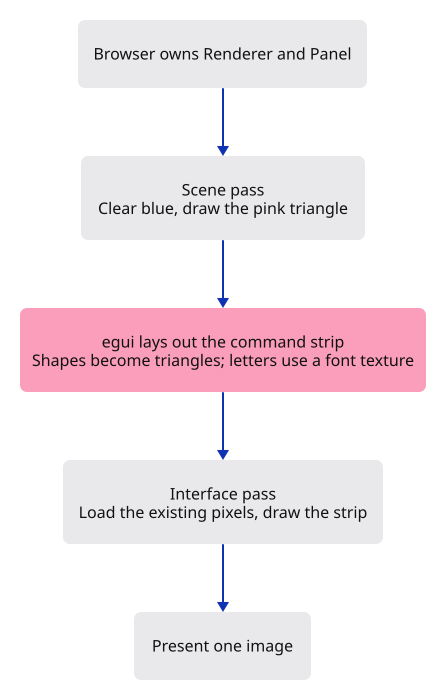
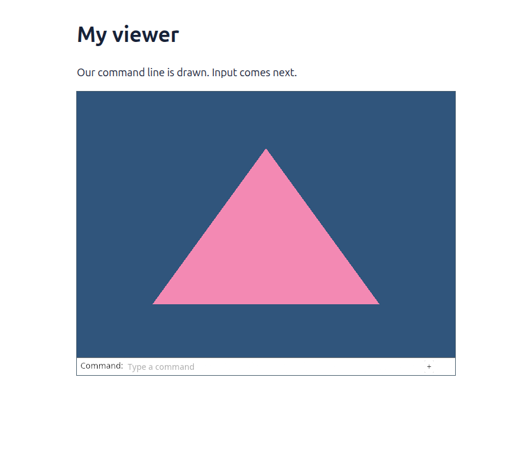

# 03a · Draw our command line

**Plan about 4–6 hours.** 218 lines to type, including comments and blank lines. Allow time to read, predict and experiment; this is an estimate, not a deadline.

**Today:** Draw the production command panel and its Noto text over the triangle, using the same GPU.

**In the whole viewer:** Connect the browser, drawing and input, then extend the same project. [See the destination](../journey.md#the-destination).

**Follow:** Panel layout → shapes and font atlas → egui triangles → second GPU pass → one presented image.

**Before you finish, explain:** Why does the interface pass load the existing image instead of clearing it?

We already know that a GPU draws triangles. A command line may look different, but its letters and rectangles eventually become triangles too. egui measures and arranges the interface for us; egui-wgpu paints the result with the device we already own.

Today we draw the real viewer’s panel, fonts and field. Keyboard input comes in the following command-line lesson. This checkpoint is deliberately about the picture: the field and + sign are visible, but their actions are not connected yet.



There are three small owners. `command_dock/theme.rs` chooses fonts and colours. `command_dock/view.rs` lays out the real viewer’s panel and text field. `Panel` keeps egui’s context and GPU painter alive between frames. The browser owns one Panel beside its scene Renderer.

A **context** remembers egui’s fonts and interface state. A **font atlas** is a texture containing letter shapes. **Tessellation** turns interface shapes into triangles. We upload changed atlas pixels, upload the triangles, then draw them over the scene.

The theme and field functions below are the same implementation used by the production viewer. Type them here; there is no hidden dependency on its application. The three .ttf files are binary font assets, supplied by the dependency command below. You do not need to type a font file.

The panel currently covers the bottom 30 pixels of the picture. Later, when input and resizable panels are connected, we will also distinguish the scene rectangle from the full canvas. Do not confuse interface layout coordinates with camera coordinates.

`String` owns editable text. `&mut self` lets Panel update that text and its painter. `Arc` lets egui share the embedded font bytes without copying them for each label. In the font loop, `zip` pairs each name with its matching byte slice.

Read the two paint operations carefully: the scene uses **Clear**, while the panel uses **Load**. Both store their result, and only the browser presents it. There is one picture, built in order by two painters.

`|ui| { ... }` is a short function egui calls with an area to draw in. Here it borrows Panel’s text for one layout call; it does not outlive draw. An `egui::Frame` describes a widget’s decoration and margins. It is different from the surface image we present to the browser.

## Type the change

Continue [Give the GPU three corners](03-triangle.md). From `session_viewer`, save your files with `npm --prefix ../session_tests run course -- save before-03a-panel`. A save keeps your own work; it does not fill in the next lesson.

### 1. `Cargo.toml`

Add egui for layout and egui-wgpu for painting. Both use the same wgpu 29.0.4 device as our scene; no second GPU connection is created. After this edit, run `npm --prefix ../session_tests run course -- dependencies 03a-panel` from `session_viewer`. It supplies the locked libraries and three binary fonts, without writing Rust code.

Find this exact block:

```toml
wasm-bindgen-futures = "=0.4.78"
wgpu = "=29.0.4"

[dev-dependencies]
pollster = "=0.4.0"
log = "=0.4.34"
```

Replace that block with:

```toml
--8<-- "journey/code/03a-panel-panel-01.toml"
```

### 2. `src/command_dock/theme.rs`

Type the viewer’s actual font families and white theme. The main font draws letters; the two fallback fonts supply symbols. A static byte slice borrows bytes embedded in the program for its whole lifetime.

Create the file and type:

```rust
--8<-- "journey/code/03a-panel-panel-06.rs"
```

### 3. `src/command_dock/view.rs`

Type the production panel and field layout. Sizes are egui points. panel chooses folded or expanded dimensions; prepare sets text and the top rule; field draws the editable area. Its future input state is passed in, not stored in the style functions.

Create the file and type:

```rust
--8<-- "journey/code/03a-panel-panel-07.rs"
```

### 4. `src/command_dock/mod.rs`

Group the appearance code under one owner. pub(crate) lets the rest of this project use these modules without making them a public library API.

Create the file and type:

```rust
--8<-- "journey/code/03a-panel-panel-05.rs"
```

### 5. `src/lib.rs`

Register the interface modules only for browser builds. Native scene checks continue to use the existing Renderer.

Find this exact block:

```rust
        }
    });
}
```

Replace that block with:

```rust
--8<-- "journey/code/03a-panel-panel-02.rs"
```

### 6. `src/browser.rs`

Create the interface once beside the scene renderer. Pass that same mutable Panel to present, then paint the interface after the scene and before presenting the frame.

Find this exact block:

```rust
    config.view_formats = vec![config.format.add_srgb_suffix()];
    surface.configure(&device, &config);
    let renderer = Renderer::new(device, queue, config.format.add_srgb_suffix());
    present(&surface, &renderer)?;
    report("Three corners became a triangle.");
    Ok(())
}

fn present(surface: &wgpu::Surface<'_>, renderer: &Renderer) -> Result<(), JsValue> {
    let frame = match surface.get_current_texture() {
        wgpu::CurrentSurfaceTexture::Success(frame)
        | wgpu::CurrentSurfaceTexture::Suboptimal(frame) => frame,
```

Replace that block with:

```rust
--8<-- "journey/code/03a-panel-panel-03.rs"
```

### 7. `src/browser.rs`

Create the interface once beside the scene renderer. Pass that same mutable Panel to present, then paint the interface after the scene and before presenting the frame.

Find this exact block:

```rust
        ..Default::default()
    });
    renderer.draw(&view);
    frame.present();
    Ok(())
}
```

Replace that block with:

```rust
--8<-- "journey/code/03a-panel-panel-04.rs"
```

### 8. `src/panel.rs`

Keep the context and painter alive. Each draw lays out widgets, uploads changed font pixels, tessellates shapes, then paints with Load. forget_lifetime lets egui receive the render pass; finish the pass before finishing its encoder. The temporary pass still ends at the semicolon; forget_lifetime does not keep it alive forever.

Create the file and type:

```rust
--8<-- "journey/code/03a-panel-scale-1.rs"
```

## Run and look

After typing the manifest, run this from `session_viewer` to select the fixed dependency versions. It updates Cargo.lock, preserves the previous lock, and installs any supplied binary font assets. It does not write implementation code:

```sh
npm --prefix ../session_tests run course -- dependencies 03a-panel
```

From `session_viewer`, enter your project folder:

```sh
cd workspace/journey
cargo build --lib --locked --target wasm32-unknown-unknown -j4
CARGO_BUILD_JOBS=4 trunk serve --port 8780
```

Open `http://127.0.0.1:8780/`. If Trunk is already running in this project, leave it running; it rebuilds when you save.

The triangle remains pink. A white command strip sits at the bottom of the same canvas, with Noto text, an empty field and a + sign. Typing and history expansion are not connected at this checkpoint.

**Actual Chrome screenshot.**

Actual Chrome capture of this typed checkpoint: the triangle and real command-panel styling share one canvas. This image proves the drawing step, not keyboard handling.



*Captured from this checkpoint’s browser bundle after its browser checks passed. [Check scope and environment](release.md).*

## Try one small experiment

Change only the interface pass from Load to Clear with a white colour. Predict what will happen to the triangle, then try it. Restore Load afterward. Which painter still drew correctly, and whose work did the later pass erase?

## Explain it in your own words

Trace the values through the files without reading the answer first. If you lose the connection, stop at the last value you can follow.

<details>
<summary>Compare your explanation</summary>

The scene pass has already drawn the triangle. Load keeps those pixels. The interface pass draws its own triangles over them; another Clear would erase the scene.

</details>

## Keep your working result

Return to `session_viewer` in a second terminal. Restore experimental edits before comparing:

```sh
npm --prefix ../session_tests run course -- check 03a-panel
npm --prefix ../session_tests run course -- save 03a-panel
```

The comparison spots typing differences; it does not prove behaviour. Keep three notes: what I changed; the values I followed; the question I still have. [Recover a checkpoint](recovery.md) if an experiment gets tangled.

## Where this grows

This is the actual production panel and field styling, introduced before command behaviour. The next command-line parts connect input, submission, completion and history. We will keep these theme and layout functions as the application grows.

[Validation status and course release](release.md).
