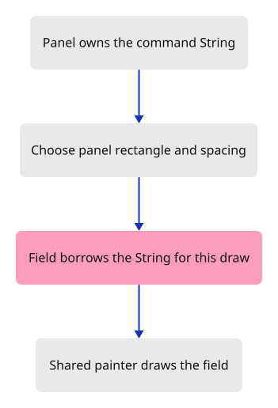

# 03a · Lay out the command field

**Combined study estimate: 1–2 hours.** Includes reading, typing, reasoning and experiments.

**Typing estimate: 30–60 minutes.** 76 added or changed lines; unchanged context is excluded. [How this is estimated](typing-load.md).

**Today:** Draw the production command field beside its label.

**Follow:** Panel rectangle → spacing and text style → local String → field response.

Add the command field beside its label. Keep panel sizing, shared spacing and field styling in the view module so later command behaviour can reuse them.

The field receives `&mut String`: egui borrows the text for this draw instead of owning a separate copy. It returns a `Response` describing the widget. The current page still supplies no keyboard events, so drawing the field does not connect typing yet.

The panel keeps its white fill, thin top rule, Noto text and unframed field. The history expansion control arrives with its behaviour in later steps.



## Type the change

Continue from [Paint command text over the scene](03a-paint.md). Save your own work first: `npm --prefix ../session_tests run course -- save before-03a-panel` (from `session_viewer`).

### 1. `src/panel.rs`

Own the field text and draw it beside the label.

<details>
<summary>Locate the existing block</summary>

```rust
use crate::command_dock::theme;
use crate::renderer::Renderer;

pub struct Panel {
    context: egui::Context,
    painter: egui_wgpu::Renderer,
}

impl Panel {
```

</details>

Replace that block with:

```rust
--8<-- "journey/code/03a-panel-01.rs"
```

### 2. `src/panel.rs`

Own the field text and draw it beside the label.

<details>
<summary>Locate the existing block</summary>

```rust
        // One layout pass prevents a future text event from being replayed.
        context.options_mut(|options| options.max_passes = 1.try_into().unwrap());
        let painter = egui_wgpu::Renderer::new(&renderer.device, format, Default::default());
        Self { context, painter }
    }

    pub fn draw(&mut self, renderer: &Renderer, target: &wgpu::TextureView) {
```

</details>

Replace that block with:

```rust
--8<-- "journey/code/03a-panel-02.rs"
```

### 3. `src/panel.rs`

Own the field text and draw it beside the label.

<details>
<summary>Locate the existing block</summary>

```rust
            ..Default::default()
        };
        let output = self.context.run_ui(input, |root| {
            egui::Panel::bottom("command-line-collapsed").exact_size(30.0)
                .frame(egui::Frame::new().fill(egui::Color32::WHITE)
                    .inner_margin(egui::Margin::symmetric(6, 4)))
                .show_inside(root, |ui| {
                ui.label("Command:");
            });
        });
        // The font atlas is a texture: upload its changed pixels before drawing the letters.
```

</details>

Replace that block with:

```rust
--8<-- "journey/code/03a-panel-03.rs"
```

### 4. `src/command_dock/theme.rs`

Style selection and the caret for the command field.

<details>
<summary>Locate the existing block</summary>

```rust
    visuals.panel_fill = egui::Color32::from_gray(245);
    visuals.window_stroke = egui::Stroke::NONE;
    visuals.extreme_bg_color = egui::Color32::WHITE;
    visuals.text_cursor.blink = false; // frames are drawn on demand
    visuals.indent_has_left_vline = false;
```

</details>

Replace that block with:

```rust
--8<-- "journey/code/03a-panel-04.rs"
```

### 5. `src/command_dock/mod.rs`

Register the shared field layout.

<details>
<summary>Locate the existing block</summary>

```rust
pub(crate) mod theme;
```

</details>

Replace that block with:

```rust
--8<-- "journey/code/03a-panel-05.rs"
```

### 6. `src/command_dock/view.rs`

Add reusable panel, spacing and field functions.

Create the file and type:

```rust
--8<-- "journey/code/03a-panel-06.rs"
```

## Run and look

From `session_viewer`, enter your project folder:

```sh
cd workspace/journey
cargo build --lib --locked --target wasm32-unknown-unknown -j4
CARGO_BUILD_JOBS=4 trunk serve --port 8780
```

Open `http://127.0.0.1:8780/`. If Trunk is already running in this project, leave it running; it rebuilds when you save.

The production command field appears beside Command: over the triangle. Input handling comes in the next command-line steps.

**Verified checkpoint in Chrome.**


[What this screenshot checks](release.md).

<details>
<summary>Optional experiment</summary>

Change the hint text, rebuild and check only the empty field hint changes. Restore it.

</details>

## Explain the change

Why does the field receive &mut String?

<details>
<summary>Compare your explanation</summary>

The Panel owns the text. A mutable borrow lets the widget edit that same value during a draw without moving it or keeping a second copy.

</details>

## Keep your working result

Return to `session_viewer` in a second terminal. Restore experimental edits before comparing:

```sh
npm --prefix ../session_tests run course -- check 03a-panel
npm --prefix ../session_tests run course -- save 03a-panel
```

Check compares your typed source; run the focused check above for behavior. [Recover your work](recovery.md).

<details>
<summary>Where this fits in the finished viewer</summary>

The same panel, spacing and field functions are reused by the full viewer.

</details>

<details>
<summary>Verification notes and browser acceptance</summary>

Chrome verifies the actual production field drawing over the preserved triangle. Keyboard event handling comes later.

[Full validation scope](release.md).

</details>
