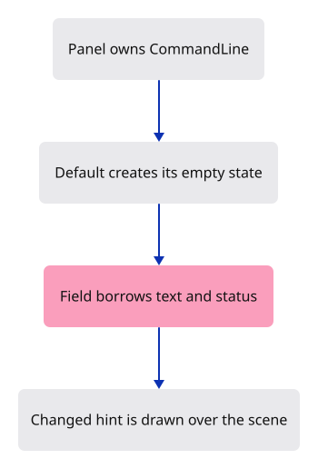

# 03b · Give the command field its memory

**Combined study estimate: 1–2 hours.** Includes reading, typing, reasoning and experiments.

**Typing estimate: 25–49 minutes.** 46 added or changed lines; unchanged context is excluded. [How this is estimated](typing-load.md).

**Today:** Store the field text and history in one owned model.

**Follow:** Panel owns CommandLine → field borrows text → placeholder borrows status.

Replace the panel’s local `String` with `CommandLine`. The field now reads and edits `model.command`; its empty hint comes from `model.status`.

`String` owns editable text. `VecDeque<String>` retains ordered history and can remove the oldest entry from the front. `Option` represents values that do not exist yet, such as an undrawn widget’s rectangle. `Default` starts strings and queues empty, flags false and optional values absent.

`placeholder` returns borrowed text. Its lifetime keeps that slice tied to the supplied prompt or status. Rust allows the field to borrow command mutably and status immutably because they are separate fields.

The model also reserves completion and input state used by the next lessons. Keyboard events are connected later.



## Type the change

Continue from [Lay out the command field](03a-panel.md). Save your own work first: `npm --prefix ../session_tests run course -- save before-03b-memory` (from `session_viewer`).

### 1. `src/panel.rs`

Replace the local String with an owned CommandLine.

<details>
<summary>Locate the existing block</summary>

```rust
use crate::command_dock::{theme, view};
use crate::renderer::Renderer;

pub struct Panel {
    context: egui::Context,
    painter: egui_wgpu::Renderer,
    line: String,
}

impl Panel {
```

</details>

Replace that block with:

```rust
--8<-- "journey/code/03b-memory-01.rs"
```

### 2. `src/panel.rs`

Give the model its initial status; keep all other fields at their defaults.

<details>
<summary>Locate the existing block</summary>

```rust
        // One layout pass prevents a future text event from being replayed.
        context.options_mut(|options| options.max_passes = 1.try_into().unwrap());
        let painter = egui_wgpu::Renderer::new(&renderer.device, format, Default::default());
        Self { context, painter, line: String::new() }
    }

    pub fn draw(&mut self, renderer: &Renderer, target: &wgpu::TextureView) {
```

</details>

Replace that block with:

```rust
--8<-- "journey/code/03b-memory-02.rs"
```

### 3. `src/panel.rs`

Borrow the model text for editing and its status for the empty-field hint.

<details>
<summary>Locate the existing block</summary>

```rust
                ui.horizontal(|ui| {
                    ui.set_max_width((ui.available_width() - 26.0).max(80.0));
                    ui.label("Command:");
                    view::field(ui, &mut self.line, "Type a command", 0.0, false);
                    let _ = ui.button("+").on_hover_text("Collapse or expand history");
                });
            });
```

</details>

Replace that block with:

```rust
--8<-- "journey/code/03b-memory-03.rs"
```

### 4. `src/browser.rs`

Report that the field now uses the command model.

<details>
<summary>Locate the existing block</summary>

```rust
    let renderer = Renderer::new(device, queue, config.format.add_srgb_suffix());
    let mut panel = crate::panel::Panel::new(&renderer, config.format.add_srgb_suffix());
    present(&surface, &renderer, &mut panel)?;
    report("Our command line is drawn. Input comes next.");
    Ok(())
}
```

</details>

Replace that block with:

```rust
--8<-- "journey/code/03b-memory-04.rs"
```

### 5. `src/command_dock/mod.rs`

Define the state and choose the empty-field hint from borrowed text.

<details>
<summary>Locate the existing block</summary>

```rust
pub(crate) mod theme;
pub(crate) mod view;
```

</details>

Replace that block with:

```rust
--8<-- "journey/code/03b-memory-05.rs"
```

## Run and look

From `session_viewer`, enter your project folder:

```sh
cd workspace/journey
cargo build --lib --locked --target wasm32-unknown-unknown -j4
CARGO_BUILD_JOBS=4 trunk serve --port 8780
```

Open `http://127.0.0.1:8780/`. If Trunk is already running in this project, leave it running; it rebuilds when you save.

The empty field now shows “The field now belongs to CommandLine.” Change that initial status, save, and check the hint changes. Restore it. Keyboard input comes later.

**Verified checkpoint in Chrome.**


[What this screenshot checks](release.md).

<details>
<summary>Optional experiment</summary>

Change only the initial status. Predict which part of the dock changes, then rebuild and restore it.

</details>

## Explain the change

Which value keeps the command text between draws?

<details>
<summary>Compare your explanation</summary>

CommandLine inside Panel owns it. The field borrows model.command during layout; finishing the draw does not discard that String.

</details>

## Keep your working result

Return to `session_viewer` in a second terminal. Restore experimental edits before comparing:

```sh
npm --prefix ../session_tests run course -- check 03b-memory
npm --prefix ../session_tests run course -- save 03b-memory
```

Check compares your typed source; run the focused check above for behavior. [Recover your work](recovery.md).

<details>
<summary>Where this fits in the finished viewer</summary>

This is the production command dock and styling. Its vocabulary grows with the course; the scene renderer stays independent of text editing.

</details>

<details>
<summary>Verification notes and browser acceptance</summary>

Native checks exercise retained text/history and every placeholder priority branch. Chrome checks the changed dock hint and preserves every scene pixel above it.

Actual browser drawing of the connected model. Keyboard event handling is still absent.

[Full validation scope](release.md).

To reproduce the scripted acceptance of the reference checkpoint, run from `session_viewer` with the [course bundle server](release.md#reproduce) running on port 8781:

```sh
npm --prefix ../session_tests run course -- capture 03b-memory
```

This uses the verified reference bundle; it does not check or change your typed project.

</details>
