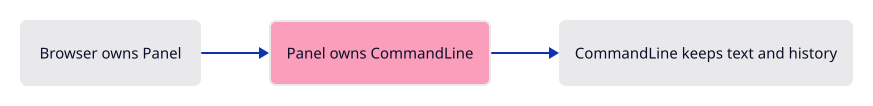
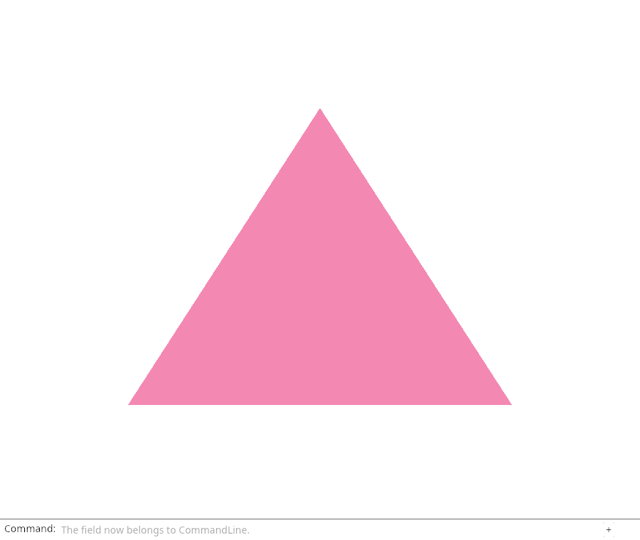

# 03b · Give the command line its memory

**Combined study estimate: 3–5 hours.** Includes reading, typing, reasoning and experiments.

**Typing estimate: 74–148 minutes.** 195 added or changed lines; unchanged context is excluded. [How this is estimated](typing-load.md).

**Splitting required:** this verified checkpoint exceeds the one-hour typing target. Smaller runnable lessons are still being prepared.

**Today:** The text field and history have one owner.

**Follow:** Browser → Panel → CommandLine → layout → existing GPU.

Replace the field's single `String` with `CommandLine`, the production dock's state. `Panel` owns this one model; layout reads and updates it.

Group its fields by purpose: text and history, focus, completion, and widget rectangles. Drawing and snap prompts start hidden and are used later.

`VecDeque<String>` retains answers and can discard the oldest from the front. `Option<Rect>` allows an undrawn widget to have no rectangle. `Default` creates the empty state; `pub(crate)` exposes it within this project.

Caret helpers use character positions rather than UTF-8 byte offsets. That keeps symbols editable. `record` stores widget rectangles for inspection; it does not generate input.



## Type the change

Continue from [Draw our command line](03a-panel.md). Save your own work first: `npm --prefix ../session_tests run course -- save before-03b-state` (from `session_viewer`).

### 1. `Cargo.toml`

Enable the browser bindings for the dock and serde for its inspection record. The GPU dependency stays pinned.

<details>
<summary>Locate the existing block</summary>

```toml

[dependencies]
wasm-bindgen = "=0.2.128"
web-sys = { version = "=0.3.105", features = ["Window", "Document", "Element", "HtmlCanvasElement", "EventTarget", "Event"] }
console_error_panic_hook = "=0.1.7"
wasm-bindgen-futures = "=0.4.78"
wgpu = "=29.0.4"
```

</details>

Replace that block with:

```toml
--8<-- "journey/code/03b-state-dock-01.toml"
```

### 2. `Cargo.toml`

Enable the browser bindings for the dock and serde for its inspection record. The GPU dependency stays pinned.

<details>
<summary>Locate the existing block</summary>

```toml
egui = { version = "=0.34.3", default-features = false }
egui-wgpu = { version = "=0.34.3", default-features = false }

[dev-dependencies]
pollster = "=0.4.0"
log = "=0.4.34"
```

</details>

Replace that block with:

```toml
--8<-- "journey/code/03b-state-dock-02.toml"
```

### 3. `src/command_dock/mod.rs`

Keep command text, history and completion state together. The application supplies vocabulary through Commands; this component owns editing and drawing.

<details>
<summary>Locate the existing block</summary>

```rust
pub(crate) mod theme;
pub(crate) mod view;
```

</details>

Replace that block with:

```rust
--8<-- "journey/code/03b-state-dock-08.rs"
```

### 4. `src/panel.rs`

Keep one Panel alive beside the Renderer. Read the layout, input and painting paths separately; they communicate through the stored model and FullOutput.

<details>
<summary>Locate the existing block</summary>

```rust
use crate::command_dock::{theme, view};
use crate::renderer::Renderer;

pub struct Panel {
    context: egui::Context,
    painter: egui_wgpu::Renderer,
    line: String,
}

impl Panel {
```

</details>

Replace that block with:

```rust
--8<-- "journey/code/03b-state-scale-1.rs"
```

### 5. `src/panel.rs`

Keep one Panel alive beside the Renderer. Read the layout, input and painting paths separately; they communicate through the stored model and FullOutput.

<details>
<summary>Locate the existing block</summary>

```rust
        // One layout pass prevents a future text event from being replayed.
        context.options_mut(|options| options.max_passes = 1.try_into().unwrap());
        let painter = egui_wgpu::Renderer::new(&renderer.device, format, Default::default());
        Self { context, painter, line: String::new() }
    }

    pub fn draw(&mut self, renderer: &Renderer, target: &wgpu::TextureView) {
        let size = [target.texture().width(), target.texture().height()];
        let screen = egui_wgpu::ScreenDescriptor { size_in_pixels: size, pixels_per_point: 1.0 };
        let input = egui::RawInput {
            screen_rect: Some(egui::Rect::from_min_size(
                egui::Pos2::ZERO, egui::vec2(size[0] as f32, size[1] as f32),
            )),
            ..Default::default()
        };
```

</details>

Replace that block with:

```rust
--8<-- "journey/code/03b-state-scale-2.rs"
```

### 6. `src/panel.rs`

Keep one Panel alive beside the Renderer. Read the layout, input and painting paths separately; they communicate through the stored model and FullOutput.

<details>
<summary>Locate the existing block</summary>

```rust
                ui.horizontal(|ui| {
                    ui.set_max_width((ui.available_width() - 26.0).max(80.0));
                    ui.label("Command:");
                    view::field(ui, &mut self.line, "Type a command", 0.0, false);
                    let _ = ui.button("+").on_hover_text("Collapse or expand history");
                });
            });
        });
        // The font atlas is a texture: upload its changed pixels before drawing the letters.
        for (id, delta) in &output.textures_delta.set {
            self.painter.update_texture(&renderer.device, &renderer.queue, *id, delta);
        }
        let jobs = self.context.tessellate(output.shapes, output.pixels_per_point);
        let mut encoder = renderer.device.create_command_encoder(&Default::default());
        let mut buffers = self.painter.update_buffers(
            &renderer.device, &renderer.queue, &mut encoder, &jobs, &screen,
        );
        let pass = encoder.begin_render_pass(&wgpu::RenderPassDescriptor {
            label: Some("command panel"),
            color_attachments: &[Some(wgpu::RenderPassColorAttachment {
                view: target, resolve_target: None, depth_slice: None,
                ops: wgpu::Operations { load: wgpu::LoadOp::Load, store: wgpu::StoreOp::Store },
            })],
            ..Default::default()
        });
        self.painter.render(&mut pass.forget_lifetime(), &jobs, &screen);
        buffers.push(encoder.finish());
        renderer.queue.submit(buffers);
        for id in output.textures_delta.free { self.painter.free_texture(&id); }
    }
}
```

</details>

Replace that block with:

```rust
--8<-- "journey/code/03b-state-scale-3.rs"
```

### 7. `src/browser.rs`

Connect this checkpoint to the existing owners. The event callback retains Panel and Renderer for the lifetime of the page.

<details>
<summary>Locate the existing block</summary>

```rust
    let window = web_sys::window().ok_or("No browser window")?;
    let document = window.document().ok_or("No document")?;
    let canvas: web_sys::HtmlCanvasElement = document
        .get_element_by_id("canvas").ok_or("Missing canvas")?.dyn_into()?;
    let instance = wgpu::Instance::new(wgpu::InstanceDescriptor {
        backends: wgpu::Backends::BROWSER_WEBGPU,
        flags: Default::default(),
```

</details>

Replace that block with:

```rust
--8<-- "journey/code/03b-state-window-1.rs"
```

### 8. `src/browser.rs`

Connect this checkpoint to the existing owners. The event callback retains Panel and Renderer for the lifetime of the page.

<details>
<summary>Locate the existing block</summary>

```rust
        backend_options: Default::default(),
        display: None,
    });
    let surface = instance.create_surface(wgpu::SurfaceTarget::Canvas(canvas.clone()))
        .map_err(|error| JsValue::from_str(&error.to_string()))?;
    let adapter = instance.request_adapter(&wgpu::RequestAdapterOptions {
        compatible_surface: Some(&surface),
        ..Default::default()
    }).await.map_err(|error| JsValue::from_str(&error.to_string()))?;
    let (device, queue) = adapter.request_device(&wgpu::DeviceDescriptor::default())
        .await.map_err(|error| JsValue::from_str(&error.to_string()))?;
    device.on_uncaptured_error(std::sync::Arc::new(|error| report(&error.to_string())));
    let limit = device.limits().max_texture_dimension_2d;
    let width = (window.inner_width()?.as_f64().ok_or("No window width")? as u32).clamp(1, limit);
    let height = (window.inner_height()?.as_f64().ok_or("No window height")? as u32).clamp(1, limit);
    canvas.set_width(width);
    canvas.set_height(height);
    let mut config = surface.get_default_config(&adapter, width, height)
        .ok_or("No compatible surface format")?;
    config.view_formats = vec![config.format.add_srgb_suffix()];
    surface.configure(&device, &config);
    let renderer = Renderer::new(device, queue, config.format.add_srgb_suffix());
    let mut panel = crate::panel::Panel::new(&renderer, config.format.add_srgb_suffix());
    present(&surface, &renderer, &mut panel)?;
    report("Our command line is drawn. Input comes next.");
    Ok(())
}

fn present(surface: &wgpu::Surface<'_>, renderer: &Renderer, panel: &mut crate::panel::Panel) -> Result<(), JsValue> {
    let frame = match surface.get_current_texture() {
        wgpu::CurrentSurfaceTexture::Success(frame)
        | wgpu::CurrentSurfaceTexture::Suboptimal(frame) => frame,
        other => return Err(JsValue::from_str(&format!("Surface unavailable: {other:?}"))),
    };
    let view = frame.texture.create_view(&wgpu::TextureViewDescriptor {
        format: Some(frame.texture.format().add_srgb_suffix()),
```

</details>

Replace that block with:

```rust
--8<-- "journey/code/03b-state-window-2.rs"
```

## Run and look

After typing the manifest, run this from `session_viewer` to select the fixed dependency versions. It updates Cargo.lock, preserves the previous lock, and installs any supplied binary font assets. It does not write implementation code:

```sh
npm --prefix ../session_tests run course -- dependencies 03b-state
```

From `session_viewer`, enter your project folder:

```sh
cd workspace/journey
cargo build --lib --locked --target wasm32-unknown-unknown -j4
CARGO_BUILD_JOBS=4 trunk serve --port 8780
```

Open `http://127.0.0.1:8780/`. If Trunk is already running in this project, leave it running; it rebuilds when you save.

The folded field shows “The field now belongs to CommandLine.” Change its initial `status` to a short message, save, and confirm that the hint changes. Restore the message. Keyboard input arrives in 03d.

**Verified checkpoint in Chrome.**



[What this screenshot checks](release.md).

<details>
<summary>Optional experiment</summary>

Change only the model status sentence. Predict where it appears. Restore it, then trace the borrowed String from Panel through view::field.

</details>

## Explain the change

What survives when the next frame starts?

<details>
<summary>Compare your explanation</summary>

The CommandLine stored inside Panel survives. Local layout widgets are recreated, but the typed text, completion selection and history remain in that model.

</details>

## Keep your working result

Return to `session_viewer` in a second terminal. Restore experimental edits before comparing:

```sh
npm --prefix ../session_tests run course -- check 03b-state
npm --prefix ../session_tests run course -- save 03b-state
```

Check compares your typed source; run the focused check above for behavior. [Recover your work](recovery.md).

<details>
<summary>Where this fits in the finished viewer</summary>

This is the production command dock and styling. Its vocabulary grows with the course; the scene renderer stays independent of text editing.

</details>

<details>
<summary>Verification notes and browser acceptance</summary>

Actual Chrome capture of this checkpoint. The result described above distinguishes drawing-only stages from connected input.

[Full validation scope](release.md).

</details>
