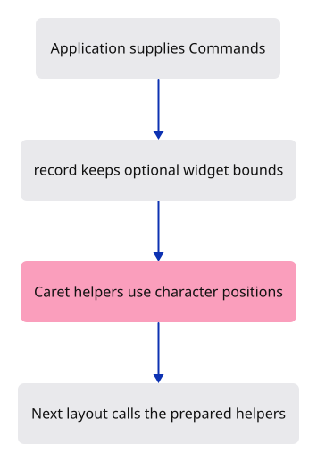

# 03b · Prepare the dock completion helpers

**Typing: 28–55 minutes.** [Estimate](typing-load.md).

The upcoming dock layout needs command names without knowing our scene types. `Commands` defines the methods the application will supply. Static string slices can refer to its fixed vocabulary; `option_label` borrows from the supplied line.

`Control` stores an inspection key, label and rectangle. `record` appends actual egui response bounds through a mutable borrow. If inspection is absent, let-else returns immediately. `serde::Serialize` lets the inspector describe the record as JSON.

## Type

Continue from [Give the command field its memory](03b-memory.md). [Save or recover your work](recovery.md).

### 1. `Cargo.toml`

Enable serialization and the browser bindings used by the dock.

<details>
<summary>Locate the existing block</summary>

```toml

[dependencies]
wasm-bindgen = "=0.2.128"
web-sys = { version = "=0.3.105", features = ["Window", "Document", "Element", "HtmlCanvasElement", "EventTarget", "Event"] }
console_error_panic_hook = "=0.1.7"
wasm-bindgen-futures = "=0.4.78"
wgpu = "=29.0.4"
```

</details>

Replace that block with:

```toml
--8<-- "journey/code/03b-state-01.toml"
```

### 2. `Cargo.toml`

Enable serialization and the browser bindings used by the dock.

<details>
<summary>Locate the existing block</summary>

```toml
egui = { version = "=0.34.3", default-features = false }
egui-wgpu = { version = "=0.34.3", default-features = false }

[dev-dependencies]
pollster = "=0.4.0"
log = "=0.4.34"
```

</details>

Replace that block with:

```toml
--8<-- "journey/code/03b-state-02.toml"
```

### 3. `src/command_dock/mod.rs`

Define the application vocabulary contract without coupling the dock to scene types.

<details>
<summary>Locate the existing block</summary>

```rust

pub(crate) mod theme;
pub(crate) mod view;

/// What the command line shows and remembers between frames.
#[derive(Default)]
```

</details>

Replace that block with:

```rust
--8<-- "journey/code/03b-state-03.rs"
```

### 4. `src/command_dock/mod.rs`

Record actual widget bounds only when inspection is enabled.

<details>
<summary>Locate the existing block</summary>

```rust
    pub(crate) agent_edit: Option<bool>,             // phone keyboard set the text, true on delete
}

/// The grey text of the empty field: the prompt, else the last answer when the history is folded away.
pub(crate) fn placeholder<'a>(prompt: &'a str, status: &'a str, expanded: bool) -> &'a str {
    if !prompt.is_empty() {
```

</details>

Replace that block with:

```rust
--8<-- "journey/code/03b-state-04.rs"
```

### 5. `src/command_dock/mod.rs`

Add character-based caret and prefix helpers for the dock.

<details>
<summary>Locate the existing block</summary>

```rust
    "Type a command"
}
```

</details>

Replace that block with:

```rust
--8<-- "journey/code/03b-state-05.rs"
```

## Run and check

After typing the manifest, run this from `session_viewer` to select the fixed dependency versions. It updates Cargo.lock, preserves the previous lock, and installs any supplied binary font assets. It does not write implementation code:

```sh
npm --prefix ../session_tests run course -- dependencies 03b-state
```

In your project:

```sh
cd workspace/journey
cargo build --lib --locked --target wasm32-unknown-unknown -j4
CARGO_BUILD_JOBS=4 trunk serve --port 8780
```

Open `http://127.0.0.1:8780/`. Keep an existing Trunk server running; saving rebuilds it.

The connected field looks exactly as before. The vocabulary, inspection and caret helpers are ready for the following layout and input lessons.

**Verified checkpoint in Chrome.**


[Verification scope](release.md).

<details>
<summary>Code explanation and diagram</summary>

Caret positions count characters rather than UTF-8 bytes: `é🙂x` has three scalar values. The helpers load a field’s stored egui state, change its range and store it back. An absent field state is left alone. `spelled` counts the displayed completion prefix while ignoring typed spaces.

These helpers are preparation for the following layout and input lessons. They add no controls or keyboard handling; the picture stays the same.

Commands contract → optional inspection → character-based caret positions.



Why does the caret helper use chars().count()?

String::len counts UTF-8 bytes. egui caret ranges use character indices, so é🙂x needs position 3 rather than its byte length.

Study estimate, including typing and experiments: 1–2 hours.

</details>

<details>
<summary>Optional experiment</summary>

For é🙂x, predict the byte length and character count. Compare len() with chars().count() in a small Rust scratch program.

</details>

<details>
<summary>Check and save your work</summary>

Restore experimental edits, then run from `session_viewer`:

```sh
npm --prefix ../session_tests run course -- check 03b-state
npm --prefix ../session_tests run course -- save 03b-state
```

Source comparison leaves your project untouched. [Save and recovery instructions](recovery.md).

</details>

<details>
<summary>Viewer coverage and verification</summary>

This is the production command dock and styling. Its vocabulary grows with the course; the scene renderer stays independent of text editing.

Native checks use actual egui layout bounds and serialized inspection data, spaced/Unicode prefixes, absent field state and stored caret/selection ranges. The trait is compile-checked; application command behavior arrives later.

Chrome verifies the complete frame remains identical to 03b-memory.

[Full validation scope](release.md).

To reproduce the scripted acceptance of the reference checkpoint, run from `session_viewer` with the [course bundle server](release.md#reproduce) running on port 8781:

```sh
npm --prefix ../session_tests run course -- capture 03b-state
```

This uses the verified reference bundle; it does not check or change your typed project.

</details>
