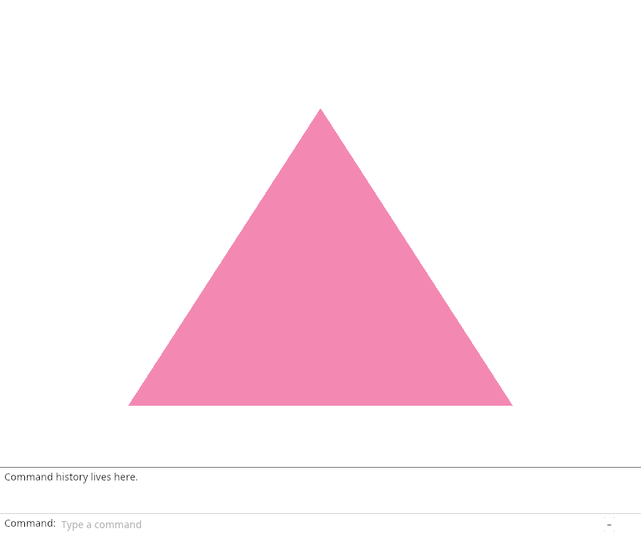
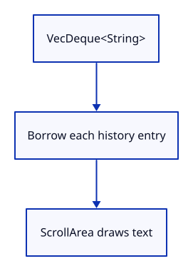

# 03c · Draw retained command history

**Typing: 22–43 minutes.** [Estimate](typing-load.md).

Draw each retained String above the command field. ScrollArea borrows the entries; the model keeps them after drawing.

## Type

Continue from [Prepare the dock completion helpers](03b-state.md). [Save or recover your work](recovery.md).

### 1. `src/browser.rs`

Report that history is drawn.

<details>
<summary>Locate the existing block</summary>

```rust
    present(&surface, &renderer, &mut panel)?;
    report("The command model owns the text and history.");
    Ok(())
```

</details>

Replace that block with:

```rust
--8<-- "journey/code/03c-history-direct-01.rs"
```

### 2. `src/command_dock/mod.rs`

Draw retained history and its divider.

<details>
<summary>Locate the existing block</summary>

```rust
    }
}
```

</details>

Replace that block with:

```rust
--8<-- "journey/code/03c-history-direct-02.rs"
```

### 3. `src/panel.rs`

Start with expanded history and one retained sentence.

<details>
<summary>Locate the existing block</summary>

```rust
        Self { context, painter, model: CommandLine {
            status: "The field now belongs to CommandLine.".into(),
            ..Default::default()
```

</details>

Replace that block with:

```rust
--8<-- "journey/code/03c-history-direct-03.rs"
```

### 4. `src/panel.rs`

Choose panel height from the expanded state.

<details>
<summary>Locate the existing block</summary>

```rust
        let output = self.context.run_ui(input, |root| {
            view::panel(root, false, 0.0).show_inside(root, |ui| {
                view::prepare(ui);
```

</details>

Replace that block with:

```rust
--8<-- "journey/code/03c-history-direct-04.rs"
```

### 5. `src/panel.rs`

Draw history before laying out the field.

<details>
<summary>Locate the existing block</summary>

```rust
                view::prepare(ui);
                ui.horizontal(|ui| {
```

</details>

Replace that block with:

```rust
--8<-- "journey/code/03c-history-direct-05.rs"
```

### 6. `src/panel.rs`

Use the expanded state for the hint and fold symbol.

<details>
<summary>Locate the existing block</summary>

```rust
                    ui.label("Command:");
                    view::field(ui, &mut self.model.command, placeholder("", &self.model.status, false), 0.0, false);
                    let _ = ui.button("+").on_hover_text("Collapse or expand history");
                });
```

</details>

Replace that block with:

```rust
--8<-- "journey/code/03c-history-direct-06.rs"
```

## Run and check

In your project:

```sh
cd workspace/journey
cargo build --lib --locked --target wasm32-unknown-unknown -j4
CARGO_BUILD_JOBS=4 trunk serve --port 8780
```

Open `http://127.0.0.1:8780/`. Keep an existing Trunk server running; saving rebuilds it.

The history sentence appears above the field.

**Verified checkpoint in Chrome.**



[Verification scope](release.md).

<details>
<summary>Code explanation and diagram</summary>


Draw retained history above the field.



Does drawing move the retained strings?

No. The loop borrows each entry.

Study estimate, including typing and experiments: 0.5–1 hours.

</details>

<details>
<summary>Optional experiment</summary>

Change the initial history sentence and rebuild. The new sentence should appear above the field. Restore the original sentence afterward.

</details>

<details>
<summary>Check and save your work</summary>

Restore experimental edits, then run from `session_viewer`:

```sh
npm --prefix ../session_tests run course -- check 03c-history
npm --prefix ../session_tests run course -- save 03c-history
```

Source comparison leaves your project untouched. [Save and recovery instructions](recovery.md).

</details>

<details>
<summary>Viewer coverage and verification</summary>

This step connects one responsibility of the production command dock. Scene commands are added in the following lessons.


[Full validation scope](release.md).

To reproduce the scripted acceptance of the reference checkpoint, run from `session_viewer` with the [course bundle server](release.md#reproduce) running on port 8781:

```sh
npm --prefix ../session_tests run course -- capture 03c-history
```

This uses the verified reference bundle; it does not check or change your typed project.

</details>
