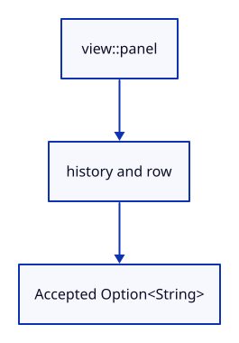

# 03c · Share the production dock layout

**Typing: 29–58 minutes.** [Estimate](typing-load.md).

Put the already connected helpers into one row and layout. The same command_dock source now draws both this lesson and the production viewer.

## Type

Continue from [Scroll through command names](03cl-wheel.md). [Save or recover your work](recovery.md).

### 1. `src/browser.rs`

Report that the shared production layout is connected.

<details>
<summary>Locate the existing block</summary>

```rust
    redraw.forget();
    report("Scrolling selects a command name.");
    Ok(())
```

</details>

Replace that block with:

```rust
--8<-- "journey/code/03c-layout-direct-01.rs"
```

### 2. `src/command_dock/mod.rs`

Combine the connected field, history and controls into row and draw.

<details>
<summary>Locate the existing block</summary>

```rust
        ui.ctx().request_repaint();
    }
}
```

</details>

Replace that block with:

```rust
--8<-- "journey/code/03c-layout-direct-04.rs"
```

### 3. `src/panel.rs`

Remove imports now owned by the shared layout.

<details>
<summary>Locate the existing block</summary>

```rust
use crate::command_dock::{self, CommandLine, Commands as _, placeholder, theme, view};
use crate::renderer::Renderer;
```

</details>

Replace that block with:

```rust
--8<-- "journey/code/03c-layout-direct-05.rs"
```

### 4. `src/panel.rs`

Remove inline setup handled by command_dock::draw.

<details>
<summary>Locate the existing block</summary>

```rust
        };
        let previous = self.model.completion_rect.take();
        self.controls = Some(Vec::new());
```

</details>

Replace that block with:

```rust
--8<-- "journey/code/03c-layout-direct-06.rs"
```

### 5. `src/panel.rs`

Retain an accepted command for this layout.

<details>
<summary>Locate the existing block</summary>

```rust
        self.controls = Some(Vec::new());
        let output = self.context.run_ui(input, |root| {
```

</details>

Replace that block with:

```rust
--8<-- "journey/code/03c-layout-direct-07.rs"
```

### 6. `src/panel.rs`

Call the same command_dock layout as production.

<details>
<summary>Locate the existing block</summary>

```rust
        let output = self.context.run_ui(input, |root| {
            let panel = view::panel(root, self.model.command_expanded, 0.0).show_inside(root, |ui| {
                view::prepare(ui);
                command_dock::history(ui, &self.model, &mut self.controls);
                ui.horizontal(|ui| {
                    ui.set_max_width((ui.available_width() - 26.0).max(80.0));
                    ui.label("Command:");
                    let id = egui::Id::new("command-input");
                    let keys = command_dock::keys(ui, &mut self.model, previous, id);
                    let response = view::field(ui, &mut self.model.command, placeholder("", &self.model.status, self.model.command_expanded), 0.0, self.model.command_open);
                    self.model.command_rect = Some(response.rect);
                    command_dock::record(&mut self.controls, "command/input", "Command", &response);
                    command_dock::refresh(ui, &mut self.model, &response, &self.commands, id, keys.deletes);
                    let mut line = None;
                    let complete = command_dock::browse(ui, &mut self.model, &mut self.controls, &self.commands, &response, &keys, id);
                    command_dock::finish(ui, &mut self.model, &response, &mut line, &self.commands, complete, &keys, true);
                    if let Some(line) = line { if line != "Escape" { self.commands.reply(&mut self.model, &line); } }
                    command_dock::collapse(ui, &mut self.model, &mut self.controls);
                });
            });
            self.top = panel.response.rect.top() - 4.0;
        });
```

</details>

Replace that block with:

```rust
--8<-- "journey/code/03c-layout-direct-08.rs"
```

### 7. `src/panel.rs`

Read the drawn top edge and answer accepted commands.

<details>
<summary>Locate the existing block</summary>

```rust
        });
        if let Some(previous) = self.output.as_mut() { previous.append(output); }
```

</details>

Replace that block with:

```rust
--8<-- "journey/code/03c-layout-direct-09.rs"
```

## Run and check

In your project:

```sh
cd workspace/journey
cargo build --lib --locked --target wasm32-unknown-unknown -j4
CARGO_BUILD_JOBS=4 trunk serve --port 8780
```

Open `http://127.0.0.1:8780/`. Keep an existing Trunk server running; saving rebuilds it.

Type Help and press Enter. The shared dock clears the field and adds one answer.

**Verified checkpoint in Chrome.**


[Verification scope](release.md).

<details>
<summary>Code explanation and diagram</summary>


Connect the existing row and history to one shared layout.



Does sharing the layout give it ownership of the scene?

No. It edits the model and returns an accepted command to its caller.

Study estimate, including typing and experiments: 0.75–1.25 hours.

</details>

<details>
<summary>Optional experiment</summary>

Submit Help, fold history, then expand it. The retained answer should return.

</details>

<details>
<summary>Check and save your work</summary>

Restore experimental edits, then run from `session_viewer`:

```sh
npm --prefix ../session_tests run course -- check 03c-layout
npm --prefix ../session_tests run course -- save 03c-layout
```

Source comparison leaves your project untouched. [Save and recovery instructions](recovery.md).

</details>

<details>
<summary>Viewer coverage and verification</summary>

This step connects one responsibility of the production command dock. Scene commands are added in the following lessons.


[Full validation scope](release.md).

To reproduce the scripted acceptance of the reference checkpoint, run from `session_viewer` with the [course bundle server](release.md#reproduce) running on port 8781:

```sh
npm --prefix ../session_tests run course -- capture 03c-layout
```

This uses the verified reference bundle; it does not check or change your typed project.

</details>
