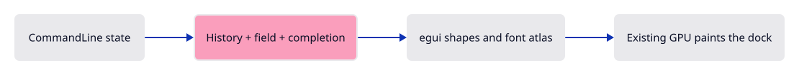
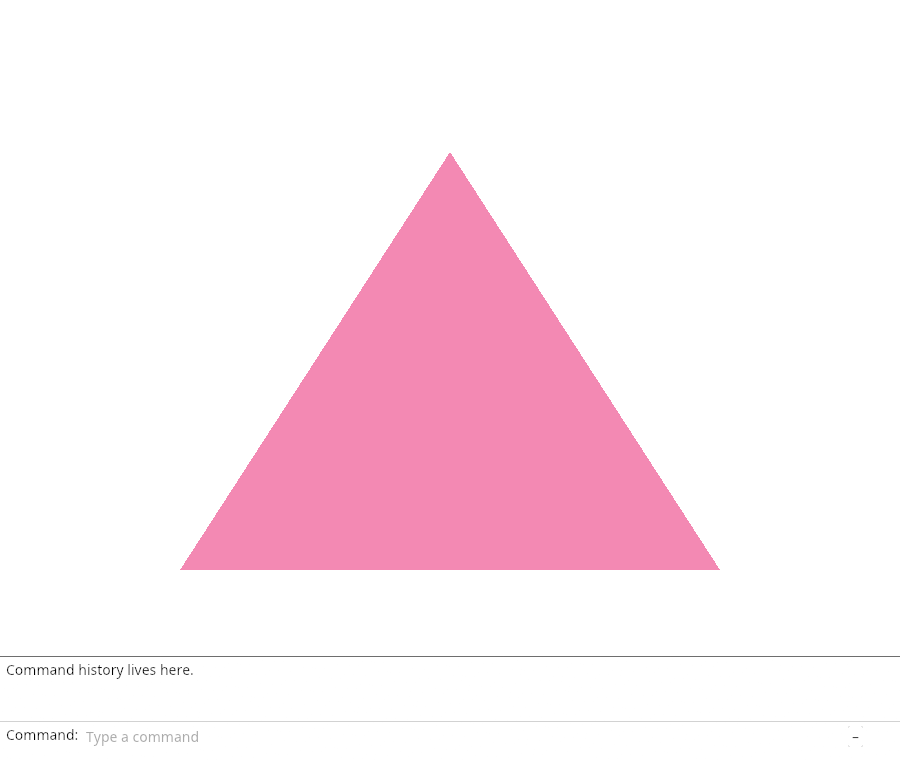

# 03c · Draw completion and history

**Plan about 8–12 hours.** 634 lines to type, including comments and blank lines. Allow time to read, predict and experiment; this is an estimate, not a deadline.

**Today:** Lay out the production command dock from its model.

**In the whole viewer:** Connect the browser, drawing and input, then extend the same project. [See the destination](../journey.md#the-destination).

**Follow:** Browser → Panel → CommandLine → layout → existing GPU.

**Before you finish, explain:** Who decides which commands exist?

We now replace the small field layout with the viewer’s complete dock. Read it in three parts: history above, the command field below, and the completion list beside the field. Each part reads or updates CommandLine. Commands supplies the words this application understands; it does not own the document.

This is the longest early typing lesson. Work in several sittings and save your file between them. The complete function must be present before this checkpoint builds. Its size is stated honestly above; do not try to memorise it. Follow one path first: Enter takes a line from the model and returns it to the caller. Then follow Escape and completion.

We preload one history sentence so you can see the expanded dock before wiring browser events. This checkpoint draws the real layout, but does not yet react to keys. The next lesson supplies those events.



Use these landmarks while typing: `command_expanded` controls the history area; `has_focus` decides whether keys belong to the field; `browse` moves through suggestions; `enter` submits; `inline_suffix` selects the suggested ending so your next letter can replace it. The final return requests canvas focus when editing finishes. Our browser adapter also releases text focus when the drawing is pressed. Full production focus and mobile handoff come later.

A trait is a list of operations another type promises to supply. Here `Commands` is that list, and the small vocabulary implements it. The dock can ask for suggestions without knowing whether the application has a camera, a box or an open file. `&mut` gives the layout temporary permission to edit the existing model; it does not make a copy.

## Type the change

Continue [Give the command line its memory](03b-state.md). From `session_viewer`, save your files with `npm --prefix ../session_tests run course -- save before-03c-layout`. A save keeps your own work; it does not fill in the next lesson.

### 1. `src/command_dock/mod.rs`

Keep command text, history and completion state together. The application supplies vocabulary through Commands; this component owns editing and drawing.

Find this exact block:

```rust
    });
}

/// Put the caret at the end of the field.
pub(crate) fn command_cursor_end(context: &egui::Context, id: egui::Id, command: &str) {
    let end = command.chars().count();
```

Replace that block with:

```rust
--8<-- "journey/code/03c-layout-dock-06.rs"
```

### 2. `src/panel.rs`

Keep one Panel alive beside the Renderer. Read the layout, input and painting paths separately; they communicate through the stored model and FullOutput.

Find this exact block:

```rust
use crate::command_dock::{CommandLine, placeholder, theme, view};
use crate::renderer::Renderer;

pub struct Panel {
    context: egui::Context,
    painter: egui_wgpu::Renderer,
    model: CommandLine,
}

impl Panel {
    pub fn new(renderer: &Renderer, format: wgpu::TextureFormat) -> Self {
        let context = egui::Context::default();
        // Text input must be handled once, even when a widget requests another layout pass.
        context.options_mut(|options| options.max_passes = 1.try_into().unwrap());
        context.set_fonts(theme::fonts([
            include_bytes!("../assets/text/NotoSans-Regular.subset.ttf"),
            include_bytes!("../assets/text/NotoSansSymbols2-Regular.subset.ttf"),
            include_bytes!("../assets/text/NotoSansSymbols-Regular.subset.ttf"),
        ]));
        context.set_theme(egui::Theme::Light);
        context.set_visuals(theme::visuals());
        // One layout pass prevents a future text event from being replayed.
        context.options_mut(|options| options.max_passes = 1.try_into().unwrap());
        let painter = egui_wgpu::Renderer::new(&renderer.device, format, Default::default());
        Self {
            context,
            painter,
            model: CommandLine {
                status: "The field now belongs to CommandLine.".into(),
                ..Default::default()
            },
        }
    }

    pub fn draw(&mut self, renderer: &Renderer, target: &wgpu::TextureView) {
        let size = [target.texture().width(), target.texture().height()];
        let screen = egui_wgpu::ScreenDescriptor {
            size_in_pixels: size,
            pixels_per_point: 1.0,
        };
        let input = egui::RawInput {
            screen_rect: Some(egui::Rect::from_min_size(
                egui::Pos2::ZERO,
                egui::vec2(size[0] as f32, size[1] as f32),
            )),
            ..Default::default()
        };
        let output = self.context.run_ui(input, |root| {
            view::panel(root, false, 0.0).show_inside(root, |ui| {
                view::prepare(ui);
                ui.horizontal(|ui| {
                    ui.set_max_width((ui.available_width() - 26.0).max(80.0));
                    ui.label("Command:");
                    view::field(
                        ui,
                        &mut self.model.command,
                        placeholder("", &self.model.status, false),
                        0.0,
                        false,
                    );
                    let _ = ui.button("+").on_hover_text("Collapse or expand history");
                });
            });
        });
        // The font atlas is a texture: upload its changed pixels before drawing the letters.
        for (id, delta) in &output.textures_delta.set {
            self.painter
                .update_texture(&renderer.device, &renderer.queue, *id, delta);
```

Replace that block with:

```rust
--8<-- "journey/code/03c-layout-scale-1.rs"
```

### 3. `src/panel.rs`

Keep one Panel alive beside the Renderer. Read the layout, input and painting paths separately; they communicate through the stored model and FullOutput.

Find this exact block:

```rust
            &renderer.queue,
            &mut encoder,
            &jobs,
            &screen,
        );
        let pass = encoder.begin_render_pass(&wgpu::RenderPassDescriptor {
            label: Some("command panel"),
            color_attachments: &[Some(wgpu::RenderPassColorAttachment {
                view: target,
                resolve_target: None,
                depth_slice: None,
                ops: wgpu::Operations {
```

Replace that block with:

```rust
--8<-- "journey/code/03c-layout-scale-2.rs"
```

### 4. `src/panel.rs`

Keep one Panel alive beside the Renderer. Read the layout, input and painting paths separately; they communicate through the stored model and FullOutput.

Find this exact block:

```rust
            ..Default::default()
        });
        self.painter
            .render(&mut pass.forget_lifetime(), &jobs, &screen);
        buffers.push(encoder.finish());
        renderer.queue.submit(buffers);
        for id in output.textures_delta.free {
```

Replace that block with:

```rust
--8<-- "journey/code/03c-layout-scale-3.rs"
```

### 5. `src/browser.rs`

Connect this checkpoint to the existing owners. The event callback retains Panel and Renderer for the lifetime of the page.

Find this exact block:

```rust
    config.view_formats = vec![config.format.add_srgb_suffix()];
    surface.configure(&device, &config);
    let renderer = Renderer::new(device, queue, config.format.add_srgb_suffix());
    let mut panel = crate::panel::Panel::new(&renderer, config.format.add_srgb_suffix());
    present(&surface, &renderer, &mut panel)?;
    report("The command model owns the text and history.");
    Ok(())
}
```

Replace that block with:

```rust
--8<-- "journey/code/03c-layout-window-1.rs"
```

## Run and look

From `session_viewer`, enter your project folder:

```sh
cd workspace/journey
cargo build --lib --locked --target wasm32-unknown-unknown -j4
CARGO_BUILD_JOBS=4 trunk serve --port 8780
```

Open `http://127.0.0.1:8780/`. If Trunk is already running in this project, leave it running; it rebuilds when you save.

The white dock is expanded and shows “Command history lives here.” Its field, separator, fonts and spacing use the production implementation. Input is connected next.

**Actual Chrome screenshot.**

Actual Chrome capture of this checkpoint. The result described above distinguishes drawing-only stages from connected input.



*Captured from this checkpoint’s browser bundle after its browser checks passed. [Check scope and environment](release.md).*

## Try one small experiment

Set command_expanded to false, run, and compare the folded panel. Restore true. The history remains in memory even when its layout is hidden.

## Explain it in your own words

Trace the values through the files without reading the answer first. If you lose the connection, stop at the last value you can follow.

<details>
<summary>Compare your explanation</summary>

The application’s Commands implementation supplies names and completion choices. The dock edits and displays text, then returns a submitted line. It does not create geometry.

</details>

## Keep your working result

Return to `session_viewer` in a second terminal. Restore experimental edits before comparing:

```sh
npm --prefix ../session_tests run course -- check 03c-layout
npm --prefix ../session_tests run course -- save 03c-layout
```

The comparison spots typing differences; it does not prove behaviour. Keep three notes: what I changed; the values I followed; the question I still have. [Recover a checkpoint](recovery.md) if an experiment gets tangled.

## Where this grows

This is the production command dock and styling. Its vocabulary grows with the course; the scene renderer stays independent of text editing.

[Validation status and course release](release.md).
