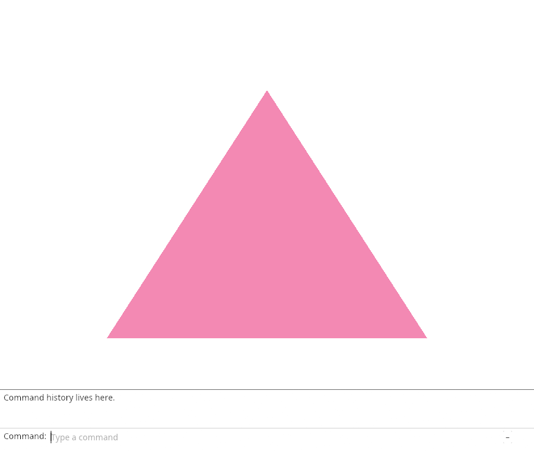
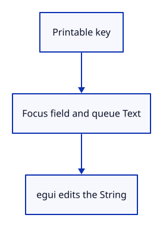

# 03ca · Type directly into the command field

**Typing: 20–39 minutes.** [Estimate](typing-load.md).

Focus the field before sending the first Text event. Panel owns the event queue; mem::take leaves it empty after drawing.

## Type

Continue from [Draw retained command history](03c-history.md). [Save or recover your work](recovery.md).

### 1. `src/browser.rs`

Retain the panel in keyboard callbacks; redraw and inspect accepted input.

<details>
<summary>Locate the existing block</summary>

```rust
    present(&surface, &renderer, &mut panel)?;
    report("The history panel is drawn.");
    Ok(())
```

</details>

Replace that block with:

```rust
--8<-- "journey/code/03ca-typing-direct-01.rs"
```

### 2. `src/panel.rs`

Store pending egui events in Panel.

<details>
<summary>Locate the existing block</summary>

```rust
    model: CommandLine,
}
```

</details>

Replace that block with:

```rust
--8<-- "journey/code/03ca-typing-direct-02.rs"
```

### 3. `src/panel.rs`

Initialize the empty event queue.

<details>
<summary>Locate the existing block</summary>

```rust
        let painter = egui_wgpu::Renderer::new(&renderer.device, format, Default::default());
        Self { context, painter, model: CommandLine {
            command_expanded: true,
```

</details>

Replace that block with:

```rust
--8<-- "journey/code/03ca-typing-direct-03.rs"
```

### 4. `src/panel.rs`

Focus before queuing printable text or Backspace; expose the current text.

<details>
<summary>Locate the existing block</summary>

```rust

    pub fn draw(&mut self, renderer: &Renderer, target: &wgpu::TextureView) {
```

</details>

Replace that block with:

```rust
--8<-- "journey/code/03ca-typing-direct-04.rs"
```

### 5. `src/panel.rs`

Move queued events into the frame once.

<details>
<summary>Locate the existing block</summary>

```rust
        let input = egui::RawInput {
            screen_rect: Some(egui::Rect::from_min_size(
```

</details>

Replace that block with:

```rust
--8<-- "journey/code/03ca-typing-direct-05.rs"
```

### 6. `src/panel.rs`

Draw the field with its current input focus.

<details>
<summary>Locate the existing block</summary>

```rust
                    ui.label("Command:");
                    view::field(ui, &mut self.model.command, placeholder("", &self.model.status, self.model.command_expanded), 0.0, false);
                    let _ = ui.button(if self.model.command_expanded { "–" } else { "+" }).on_hover_text("Collapse or expand history");
```

</details>

Replace that block with:

```rust
--8<-- "journey/code/03ca-typing-direct-06.rs"
```

## Run and check

In your project:

```sh
cd workspace/journey
cargo build --lib --locked --target wasm32-unknown-unknown -j4
CARGO_BUILD_JOBS=4 trunk serve --port 8780
```

Open `http://127.0.0.1:8780/`. Keep an existing Trunk server running; saving rebuilds it.

Click the scene and type G. G appears immediately in the command field.

**Verified checkpoint in Chrome.**



[Verification scope](release.md).

<details>
<summary>Code explanation and diagram</summary>


Send the first printable key directly into the field.



Why focus before Text?

The editor needs focus when egui processes the first character.

Study estimate, including typing and experiments: 0.5–1 hours.

</details>

<details>
<summary>Optional experiment</summary>

Click the triangle and type xyz without clicking the field. All three letters should appear in order.

</details>

<details>
<summary>Check and save your work</summary>

Restore experimental edits, then run from `session_viewer`:

```sh
npm --prefix ../session_tests run course -- check 03ca-typing
npm --prefix ../session_tests run course -- save 03ca-typing
```

Source comparison leaves your project untouched. [Save and recovery instructions](recovery.md).

</details>

<details>
<summary>Viewer coverage and verification</summary>

This step connects one responsibility of the production command dock. Scene commands are added in the following lessons.


[Full validation scope](release.md).

To reproduce the scripted acceptance of the reference checkpoint, run from `session_viewer` with the [course bundle server](release.md#reproduce) running on port 8781:

```sh
npm --prefix ../session_tests run course -- capture 03ca-typing
```

This uses the verified reference bundle; it does not check or change your typed project.

</details>
