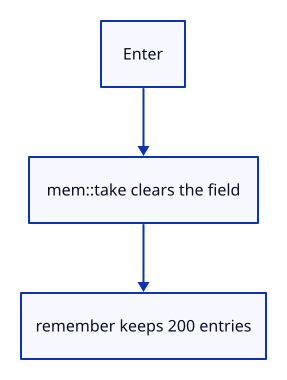

# 03cb · Submit command text once

**Typing: 14–27 minutes.** [Estimate](typing-load.md).

Consume Enter before drawing the field. take_command moves a nonblank String out and leaves an empty String. remember retains at most 200 entries.

## Type

Continue from [Type directly into the command field](03ca-typing.md). [Save or recover your work](recovery.md).

### 1. `src/browser.rs`

Expose the actual retained history to browser inspection.

<details>
<summary>Locate the existing block</summary>

```rust
            }
        }
```

</details>

Replace that block with:

```rust
--8<-- "journey/code/03cb-submit-direct-01.rs"
```

### 2. `src/browser.rs`

Report that Enter submits text.

<details>
<summary>Locate the existing block</summary>

```rust
    redraw.forget();
    report("Typing goes directly into the command field.");
    Ok(())
```

</details>

Replace that block with:

```rust
--8<-- "journey/code/03cb-submit-direct-02.rs"
```

### 3. `src/command_dock/mod.rs`

Take nonblank owned text and retain at most 200 history entries.

<details>
<summary>Locate the existing block</summary>

```rust
        );
    }
}
```

</details>

Replace that block with:

```rust
--8<-- "journey/code/03cb-submit-direct-03.rs"
```

### 4. `src/panel.rs`

Expose the model’s retained history by reference.

<details>
<summary>Locate the existing block</summary>

```rust

    pub fn key(&mut self, event: &web_sys::KeyboardEvent) -> bool {
```

</details>

Replace that block with:

```rust
--8<-- "journey/code/03cb-submit-direct-04.rs"
```

### 5. `src/panel.rs`

Recognize Enter as an editing key.

<details>
<summary>Locate the existing block</summary>

```rust
        let down = event.type_() == "keydown";
        let input = if key == "Backspace" {
            egui::Event::Key {
```

</details>

Replace that block with:

```rust
--8<-- "journey/code/03cb-submit-direct-05.rs"
```

### 6. `src/panel.rs`

Queue the corresponding Enter or Backspace event.

<details>
<summary>Locate the existing block</summary>

```rust
            egui::Event::Key {
                key: egui::Key::Backspace, physical_key: None,
                pressed: down, repeat: event.repeat(), modifiers: Default::default(),
```

</details>

Replace that block with:

```rust
--8<-- "journey/code/03cb-submit-direct-06.rs"
```

### 7. `src/panel.rs`

Consume Enter once; retain the submitted line and answer.

<details>
<summary>Locate the existing block</summary>

```rust
                view::prepare(ui);
                command_dock::history(ui, &self.model, &mut None);
```

</details>

Replace that block with:

```rust
--8<-- "journey/code/03cb-submit-direct-07.rs"
```

## Run and check

In your project:

```sh
cd workspace/journey
cargo build --lib --locked --target wasm32-unknown-unknown -j4
CARGO_BUILD_JOBS=4 trunk serve --port 8780
```

Open `http://127.0.0.1:8780/`. Keep an existing Trunk server running; saving rebuilds it.

Type Help and press Enter. One entry appears and the field clears. Empty Enter adds nothing.

**Verified checkpoint in Chrome.**


[Verification scope](release.md).

<details>
<summary>Code explanation and diagram</summary>


Clear submitted text and retain one history entry.



Why take rather than clone the String?

Submission transfers its ownership once and clears the source.

Study estimate, including typing and experiments: 0.5–0.75 hours.

</details>

<details>
<summary>Optional experiment</summary>

Submit Help twice. Two entries should appear; pressing Enter with an empty field should add none.

</details>

<details>
<summary>Check and save your work</summary>

Restore experimental edits, then run from `session_viewer`:

```sh
npm --prefix ../session_tests run course -- check 03cb-submit
npm --prefix ../session_tests run course -- save 03cb-submit
```

Source comparison leaves your project untouched. [Save and recovery instructions](recovery.md).

</details>

<details>
<summary>Viewer coverage and verification</summary>

This step connects one responsibility of the production command dock. Scene commands are added in the following lessons.


[Full validation scope](release.md).

To reproduce the scripted acceptance of the reference checkpoint, run from `session_viewer` with the [course bundle server](release.md#reproduce) running on port 8781:

```sh
npm --prefix ../session_tests run course -- capture 03cb-submit
```

This uses the verified reference bundle; it does not check or change your typed project.

</details>
