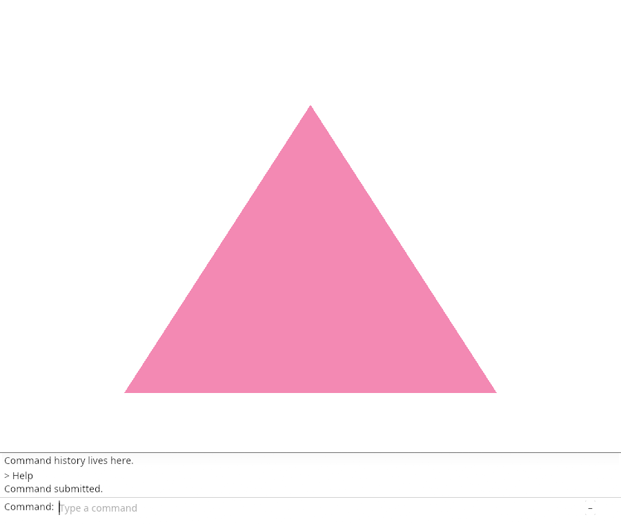
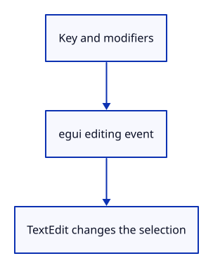

# 03cc · Edit the command text

**Typing: 14–28 minutes.** [Estimate](typing-load.md).

Translate modifiers and editing keys into egui events. Ctrl+A selects text; Backspace deletes it; Escape clears and closes the field.

## Type

Continue from [Submit command text once](03cb-submit.md). [Save or recover your work](recovery.md).

### 1. `src/browser.rs`

Report that editing stays in the field.

<details>
<summary>Locate the existing block</summary>

```rust
    redraw.forget();
    report("Enter submits the owned command text.");
    Ok(())
```

</details>

Replace that block with:

```rust
--8<-- "journey/code/03cc-edit-direct-01.rs"
```

### 2. `src/command_dock/mod.rs`

Separate the model helpers with a blank line.

<details>
<summary>Locate the existing block</summary>

```rust
        self.history.push_back(line);
    }
}
```

</details>

Replace that block with:

```rust
--8<-- "journey/code/03cc-edit-direct-02.rs"
```

### 3. `src/panel.rs`

Translate modifiers and named editing keys; ignore composing text.

<details>
<summary>Locate the existing block</summary>

```rust
    pub fn key(&mut self, event: &web_sys::KeyboardEvent) -> bool {
        if event.ctrl_key() || event.alt_key() || event.meta_key() { return false; }
        let key = event.key();
        let down = event.type_() == "keydown";
        let input = if key == "Backspace" || key == "Enter" {
            egui::Event::Key {
                key: if key == "Enter" { egui::Key::Enter } else { egui::Key::Backspace }, physical_key: None,
                pressed: down, repeat: event.repeat(), modifiers: Default::default(),
            }
        } else if down && key.chars().count() == 1 {
            egui::Event::Text(key)
        } else { return false; };
        self.context.memory_mut(|memory| memory.request_focus(egui::Id::new("command-input")));
        self.model.command_open = true;
        self.events.push(input);
        event.prevent_default();
```

</details>

Replace that block with:

```rust
--8<-- "journey/code/03cc-edit-direct-03.rs"
```

### 4. `src/panel.rs`

Consume Escape, clear text and surrender field focus.

<details>
<summary>Locate the existing block</summary>

```rust
                }
                command_dock::history(ui, &self.model, &mut None);
```

</details>

Replace that block with:

```rust
--8<-- "journey/code/03cc-edit-direct-04.rs"
```

## Run and check

In your project:

```sh
cd workspace/journey
cargo build --lib --locked --target wasm32-unknown-unknown -j4
CARGO_BUILD_JOBS=4 trunk serve --port 8780
```

Open `http://127.0.0.1:8780/`. Keep an existing Trunk server running; saving rebuilds it.

Type abc, press Ctrl+A, type x, then Escape. The field clears.

**Verified checkpoint in Chrome.**



[Verification scope](release.md).

<details>
<summary>Code explanation and diagram</summary>


Keep text selection, deletion and Escape in the field.



Why skip text when Ctrl or Alt is held?

Those keys modify an editing action rather than insert ordinary text.

Study estimate, including typing and experiments: 0.5–0.75 hours.

</details>

<details>
<summary>Optional experiment</summary>

Type abc, press Backspace once, then Enter. History should contain ab. Escape should clear any unfinished text.

</details>

<details>
<summary>Check and save your work</summary>

Restore experimental edits, then run from `session_viewer`:

```sh
npm --prefix ../session_tests run course -- check 03cc-edit
npm --prefix ../session_tests run course -- save 03cc-edit
```

Source comparison leaves your project untouched. [Save and recovery instructions](recovery.md).

</details>

<details>
<summary>Viewer coverage and verification</summary>

This step connects one responsibility of the production command dock. Scene commands are added in the following lessons.


[Full validation scope](release.md).

To reproduce the scripted acceptance of the reference checkpoint, run from `session_viewer` with the [course bundle server](release.md#reproduce) running on port 8781:

```sh
npm --prefix ../session_tests run course -- capture 03cc-edit
```

This uses the verified reference bundle; it does not check or change your typed project.

</details>
