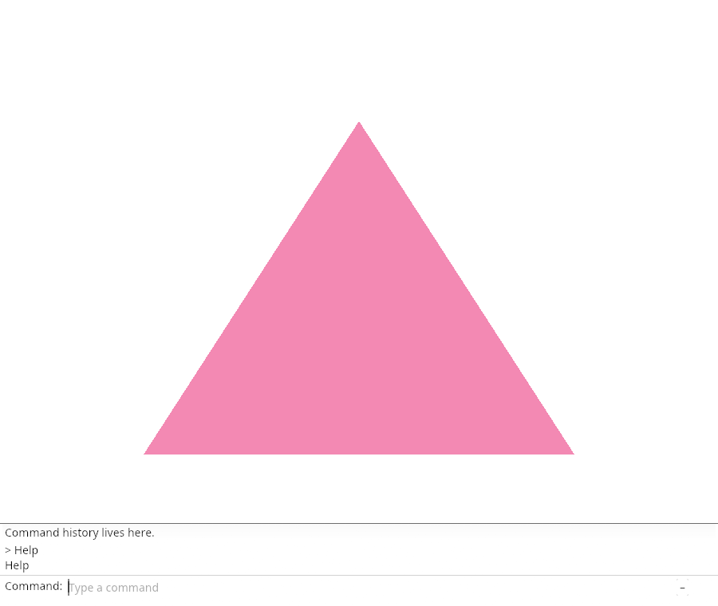
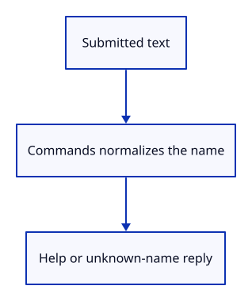

# 03cd · Recognize Help

**Typing: 19–37 minutes.** [Estimate](typing-load.md).

Commands borrows a fixed vocabulary. The adapter normalizes spacing and case; Help lists its names. Unknown input receives a useful reply.

## Type

Continue from [Edit the command text](03cc-edit.md). [Save or recover your work](recovery.md).

### 1. `src/browser.rs`

Supply Help as the initial application vocabulary.

<details>
<summary>Locate the existing block</summary>

```rust
    let renderer = Renderer::new(device, queue, config.format.add_srgb_suffix());
    let mut panel = crate::panel::Panel::new(&renderer, config.format.add_srgb_suffix());
    present(&surface, &renderer, &mut panel)?;
```

</details>

Replace that block with:

```rust
--8<-- "journey/code/03cd-vocabulary-direct-01.rs"
```

### 2. `src/browser.rs`

Report that Help is recognized.

<details>
<summary>Locate the existing block</summary>

```rust
    redraw.forget();
    report("Editing stays in the command field.");
    Ok(())
```

</details>

Replace that block with:

```rust
--8<-- "journey/code/03cd-vocabulary-direct-02.rs"
```

### 3. `src/panel.rs`

Import the vocabulary trait methods.

<details>
<summary>Locate the existing block</summary>

```rust
use crate::command_dock::{self, CommandLine, placeholder, theme, view};
use crate::renderer::Renderer;
```

</details>

Replace that block with:

```rust
--8<-- "journey/code/03cd-vocabulary-direct-03.rs"
```

### 4. `src/panel.rs`

Normalize names, find completions and answer Help or unknown input.

<details>
<summary>Locate the existing block</summary>

```rust

pub struct Panel {
```

</details>

Replace that block with:

```rust
--8<-- "journey/code/03cd-vocabulary-direct-04.rs"
```

### 5. `src/panel.rs`

Store the vocabulary adapter in Panel.

<details>
<summary>Locate the existing block</summary>

```rust
pub struct Panel {
    context: egui::Context,
```

</details>

Replace that block with:

```rust
--8<-- "journey/code/03cd-vocabulary-direct-05.rs"
```

### 6. `src/panel.rs`

Accept a static vocabulary in the constructor.

<details>
<summary>Locate the existing block</summary>

```rust
impl Panel {
    pub fn new(renderer: &Renderer, format: wgpu::TextureFormat) -> Self {
        let context = egui::Context::default();
```

</details>

Replace that block with:

```rust
--8<-- "journey/code/03cd-vocabulary-direct-06.rs"
```

### 7. `src/panel.rs`

Initialize the supplied vocabulary.

<details>
<summary>Locate the existing block</summary>

```rust
        let painter = egui_wgpu::Renderer::new(&renderer.device, format, Default::default());
        Self { context, painter, events: Vec::new(), model: CommandLine {
            command_expanded: true,
```

</details>

Replace that block with:

```rust
--8<-- "journey/code/03cd-vocabulary-direct-07.rs"
```

### 8. `src/panel.rs`

Answer the submitted line through the vocabulary adapter.

<details>
<summary>Locate the existing block</summary>

```rust
                    if let Some(line) = self.model.take_command() {
                        self.model.status = "Command submitted.".into();
                        self.model.remember(format!("> {line}\n{}", self.model.status));
                    }
```

</details>

Replace that block with:

```rust
--8<-- "journey/code/03cd-vocabulary-direct-08.rs"
```

## Run and check

In your project:

```sh
cd workspace/journey
cargo build --lib --locked --target wasm32-unknown-unknown -j4
CARGO_BUILD_JOBS=4 trunk serve --port 8780
```

Open `http://127.0.0.1:8780/`. Keep an existing Trunk server running; saving rebuilds it.

Type Help and press Enter. History shows Help as the available command.

**Verified checkpoint in Chrome.**



[Verification scope](release.md).

<details>
<summary>Code explanation and diagram</summary>


Connect known names and useful unknown-command replies.



Why keep vocabulary in an adapter?

The dock can edit text without knowing any scene types.

Study estimate, including typing and experiments: 0.5–1 hours.

</details>

<details>
<summary>Optional experiment</summary>

Submit lowercase help, then an unknown name. Help should still list the vocabulary; the unknown name should receive an error reply.

</details>

<details>
<summary>Check and save your work</summary>

Restore experimental edits, then run from `session_viewer`:

```sh
npm --prefix ../session_tests run course -- check 03cd-vocabulary
npm --prefix ../session_tests run course -- save 03cd-vocabulary
```

Source comparison leaves your project untouched. [Save and recovery instructions](recovery.md).

</details>

<details>
<summary>Viewer coverage and verification</summary>

This step connects one responsibility of the production command dock. Scene commands are added in the following lessons.


[Full validation scope](release.md).

To reproduce the scripted acceptance of the reference checkpoint, run from `session_viewer` with the [course bundle server](release.md#reproduce) running on port 8781:

```sh
npm --prefix ../session_tests run course -- capture 03cd-vocabulary
```

This uses the verified reference bundle; it does not check or change your typed project.

</details>
