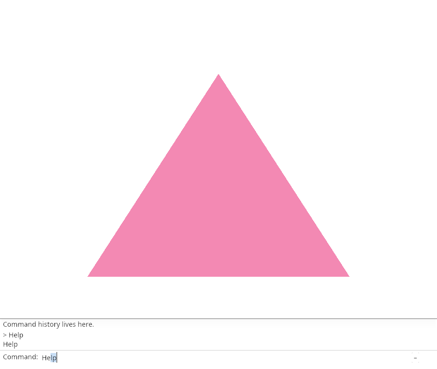
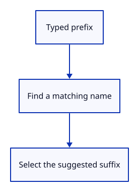

# 03ce · Complete a command name

**Typing: 22–43 minutes.** [Estimate](typing-load.md).

After the field changes, find a matching command name. Replace the text and select only the suggested suffix, so the next letter replaces that suffix.

## Type

Continue from [Recognize Help](03cd-vocabulary.md). [Save or recover your work](recovery.md).

### 1. `src/browser.rs`

Report that inline completion is connected.

<details>
<summary>Locate the existing block</summary>

```rust
    redraw.forget();
    report("Help recognizes the command vocabulary.");
    Ok(())
```

</details>

Replace that block with:

```rust
--8<-- "journey/code/03ce-complete-direct-01.rs"
```

### 2. `src/command_dock/mod.rs`

Match names after changes and select only the suggested suffix.

<details>
<summary>Locate the existing block</summary>

```rust
        self.history.push_back(line);
    }
}
```

</details>

Replace that block with:

```rust
--8<-- "journey/code/03ce-complete-direct-02.rs"
```

### 3. `src/panel.rs`

Keep the field response and refresh completion after editing.

<details>
<summary>Locate the existing block</summary>

```rust
                    ui.label("Command:");
                    view::field(ui, &mut self.model.command, placeholder("", &self.model.status, self.model.command_expanded), 0.0, self.model.command_open);
                    let _ = ui.button(if self.model.command_expanded { "–" } else { "+" }).on_hover_text("Collapse or expand history");
```

</details>

Replace that block with:

```rust
--8<-- "journey/code/03ce-complete-direct-03.rs"
```

## Run and check

In your project:

```sh
cd workspace/journey
cargo build --lib --locked --target wasm32-unknown-unknown -j4
CARGO_BUILD_JOBS=4 trunk serve --port 8780
```

Open `http://127.0.0.1:8780/`. Keep an existing Trunk server running; saving rebuilds it.

Type He. The field shows Help with the suggested ending selected. Backspace leaves He.

**Verified checkpoint in Chrome.**



[Verification scope](release.md).

<details>
<summary>Code explanation and diagram</summary>


Select only the suggested suffix while retaining typed text.



Why count characters instead of bytes?

egui caret positions use characters; UTF-8 characters can occupy several bytes.

Study estimate, including typing and experiments: 0.5–1 hours.

</details>

<details>
<summary>Optional experiment</summary>

Type He, then x. The selected lp should be replaced by x, leaving Hex with no matching completion.

</details>

<details>
<summary>Check and save your work</summary>

Restore experimental edits, then run from `session_viewer`:

```sh
npm --prefix ../session_tests run course -- check 03ce-complete
npm --prefix ../session_tests run course -- save 03ce-complete
```

Source comparison leaves your project untouched. [Save and recovery instructions](recovery.md).

</details>

<details>
<summary>Viewer coverage and verification</summary>

This step connects one responsibility of the production command dock. Scene commands are added in the following lessons.


[Full validation scope](release.md).

To reproduce the scripted acceptance of the reference checkpoint, run from `session_viewer` with the [course bundle server](release.md#reproduce) running on port 8781:

```sh
npm --prefix ../session_tests run course -- capture 03ce-complete
```

This uses the verified reference bundle; it does not check or change your typed project.

</details>
