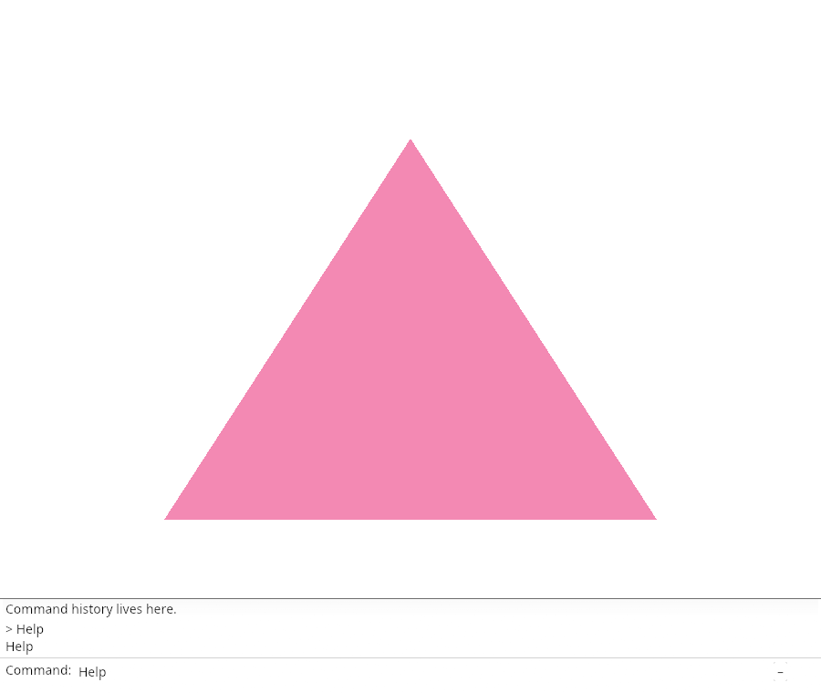
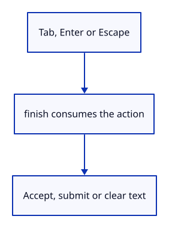

# 03cf · Accept or cancel a completion

**Typing: 29–57 minutes.** [Estimate](typing-load.md).

Read Enter and Tab before the field. finish accepts a completion, submits a nonblank command, or cancels with Escape.

## Type

Continue from [Complete a command name](03ce-complete.md). [Save or recover your work](recovery.md).

### 1. `src/browser.rs`

Report that Tab accepts completion.

<details>
<summary>Locate the existing block</summary>

```rust
    redraw.forget();
    report("The field completes known names.");
    Ok(())
```

</details>

Replace that block with:

```rust
--8<-- "journey/code/03cf-accept-direct-01.rs"
```

### 2. `src/command_dock/mod.rs`

Retain the editing-key results for this frame.

<details>
<summary>Locate the existing block</summary>

```rust

pub(crate) fn refresh(
```

</details>

Replace that block with:

```rust
--8<-- "journey/code/03cf-accept-direct-02.rs"
```

### 3. `src/command_dock/mod.rs`

Accept completion, submit Enter or cancel Escape once.

<details>
<summary>Locate the existing block</summary>

```rust
        model.completion_prefix.clone_from(&model.command);
    }
}
```

</details>

Replace that block with:

```rust
--8<-- "journey/code/03cf-accept-direct-03.rs"
```

### 4. `src/panel.rs`

Consume Enter and Tab before the field handles input.

<details>
<summary>Locate the existing block</summary>

```rust
                view::prepare(ui);
                if ui.input_mut(|input| input.consume_key(egui::Modifiers::NONE, egui::Key::Enter)) {
                    if let Some(line) = self.model.take_command() {
                        self.commands.reply(&mut self.model, &line);
                    }
                }
                if self.model.command_open && ui.input_mut(|input| input.consume_key(egui::Modifiers::NONE, egui::Key::Escape)) {
                    self.model.command.clear();
                    self.model.command_open = false;
                    ui.memory_mut(|memory| memory.surrender_focus(egui::Id::new("command-input")));
                }
                command_dock::history(ui, &self.model, &mut None);
```

</details>

Replace that block with:

```rust
--8<-- "journey/code/03cf-accept-direct-04.rs"
```

### 5. `src/panel.rs`

Route completion and submission through finish.

<details>
<summary>Locate the existing block</summary>

```rust
                    let response = view::field(ui, &mut self.model.command, placeholder("", &self.model.status, self.model.command_expanded), 0.0, self.model.command_open);
                    command_dock::refresh(ui, &mut self.model, &response, &self.commands, id, ui.input(|input| input.key_pressed(egui::Key::Backspace) || input.key_pressed(egui::Key::Delete)));
                    let _ = ui.button(if self.model.command_expanded { "–" } else { "+" }).on_hover_text("Collapse or expand history");
```

</details>

Replace that block with:

```rust
--8<-- "journey/code/03cf-accept-direct-05.rs"
```

## Run and check

In your project:

```sh
cd workspace/journey
cargo build --lib --locked --target wasm32-unknown-unknown -j4
CARGO_BUILD_JOBS=4 trunk serve --port 8780
```

Open `http://127.0.0.1:8780/`. Keep an existing Trunk server running; saving rebuilds it.

Type He, then Tab. Help gains a trailing space. Escape clears it.

**Verified checkpoint in Chrome.**



[Verification scope](release.md).

<details>
<summary>Code explanation and diagram</summary>


Use Tab, Enter and Escape without losing input ownership.



Why consume Enter once?

The field and command dispatcher must not both submit the same event.

Study estimate, including typing and experiments: 0.75–1.25 hours.

</details>

<details>
<summary>Optional experiment</summary>

Type He and press Tab. Check that history stays unchanged until you press Enter.

</details>

<details>
<summary>Check and save your work</summary>

Restore experimental edits, then run from `session_viewer`:

```sh
npm --prefix ../session_tests run course -- check 03cf-accept
npm --prefix ../session_tests run course -- save 03cf-accept
```

Source comparison leaves your project untouched. [Save and recovery instructions](recovery.md).

</details>

<details>
<summary>Viewer coverage and verification</summary>

This step connects one responsibility of the production command dock. Scene commands are added in the following lessons.


[Full validation scope](release.md).

To reproduce the scripted acceptance of the reference checkpoint, run from `session_viewer` with the [course bundle server](release.md#reproduce) running on port 8781:

```sh
npm --prefix ../session_tests run course -- capture 03cf-accept
```

This uses the verified reference bundle; it does not check or change your typed project.

</details>
