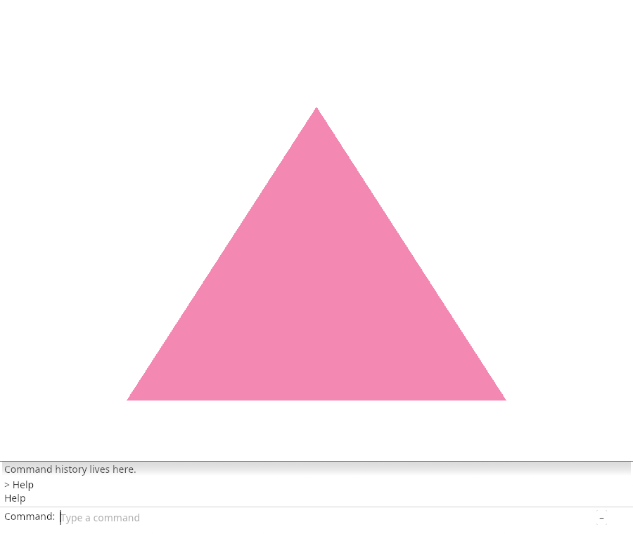
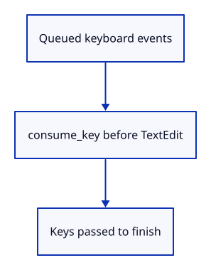

# 03cg · Read editing keys before the field

**Typing: 23–46 minutes.** [Estimate](typing-load.md).

Move key handling into keys. Restore focus before text editing; suffix_space keeps a space inside a multiword completion rather than replacing the remaining name.

## Type

Continue from [Accept or cancel a completion](03cf-accept.md). [Save or recover your work](recovery.md).

### 1. `src/browser.rs`

Report that editing keys are read first.

<details>
<summary>Locate the existing block</summary>

```rust
    redraw.forget();
    report("Tab accepts the completion.");
    Ok(())
```

</details>

Replace that block with:

```rust
--8<-- "journey/code/03cg-keys-direct-01.rs"
```

### 2. `src/command_dock/mod.rs`

Handle a space inside the selected suffix; centralize editing and focus keys.

<details>
<summary>Locate the existing block</summary>

```rust

pub(crate) fn refresh(
```

</details>

Replace that block with:

```rust
--8<-- "journey/code/03cg-keys-direct-02.rs"
```

### 3. `src/panel.rs`

Restore field focus before accepting the first text event.

<details>
<summary>Locate the existing block</summary>

```rust
        if text {
            self.context.memory_mut(|memory| memory.request_focus(egui::Id::new("command-input")));
```

</details>

Replace that block with:

```rust
--8<-- "journey/code/03cg-keys-direct-03.rs"
```

### 4. `src/panel.rs`

Remove the replaced inline key collection.

<details>
<summary>Locate the existing block</summary>

```rust
                view::prepare(ui);
                let keys = command_dock::Keys {
                    enter: ui.input_mut(|input| input.consume_key(egui::Modifiers::NONE, egui::Key::Enter)),
                    tab: ui.input_mut(|input| input.consume_key(egui::Modifiers::NONE, egui::Key::Tab)),
                    deletes: ui.input(|input| input.key_pressed(egui::Key::Backspace) || input.key_pressed(egui::Key::Delete)),
                    ..Default::default()
                };
                command_dock::history(ui, &self.model, &mut None);
```

</details>

Replace that block with:

```rust
--8<-- "journey/code/03cg-keys-direct-04.rs"
```

### 5. `src/panel.rs`

Read the editing keys before drawing the field.

<details>
<summary>Locate the existing block</summary>

```rust
                    let id = egui::Id::new("command-input");
                    let response = view::field(ui, &mut self.model.command, placeholder("", &self.model.status, self.model.command_expanded), 0.0, self.model.command_open);
```

</details>

Replace that block with:

```rust
--8<-- "journey/code/03cg-keys-direct-05.rs"
```

## Run and check

In your project:

```sh
cd workspace/journey
cargo build --lib --locked --target wasm32-unknown-unknown -j4
CARGO_BUILD_JOBS=4 trunk serve --port 8780
```

Open `http://127.0.0.1:8780/`. Keep an existing Trunk server running; saving rebuilds it.

Type He, press Tab, then Enter. The command is submitted once.

**Verified checkpoint in Chrome.**



[Verification scope](release.md).

<details>
<summary>Code explanation and diagram</summary>


Consume command editing once and restore field focus.



Why restore focus before drawing the field?

The field must own input when it handles queued events.

Study estimate, including typing and experiments: 0.5–1.25 hours.

</details>

<details>
<summary>Optional experiment</summary>

Submit Help, then press Enter again without typing. Only the first Enter should create a history entry.

</details>

<details>
<summary>Check and save your work</summary>

Restore experimental edits, then run from `session_viewer`:

```sh
npm --prefix ../session_tests run course -- check 03cg-keys
npm --prefix ../session_tests run course -- save 03cg-keys
```

Source comparison leaves your project untouched. [Save and recovery instructions](recovery.md).

</details>

<details>
<summary>Viewer coverage and verification</summary>

This step connects one responsibility of the production command dock. Scene commands are added in the following lessons.


[Full validation scope](release.md).

To reproduce the scripted acceptance of the reference checkpoint, run from `session_viewer` with the [course bundle server](release.md#reproduce) running on port 8781:

```sh
npm --prefix ../session_tests run course -- capture 03cg-keys
```

This uses the verified reference bundle; it does not check or change your typed project.

</details>
