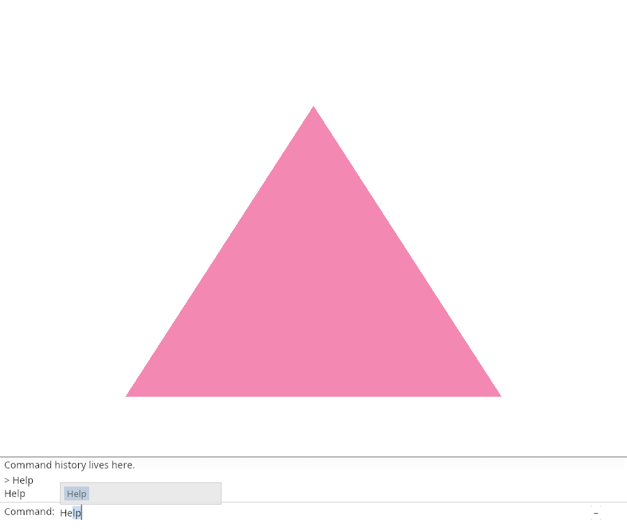
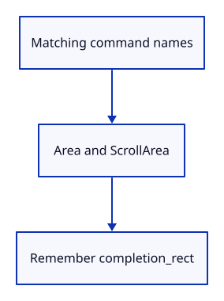

# 03ch · Show matching commands

**Typing: 27–53 minutes.** [Estimate](typing-load.md).

Draw matching names above the field. A scroll area bounds the list, and the model remembers its actual rectangle. Pointer selection is connected later.

## Type

Continue from [Read editing keys before the field](03cg-keys.md). [Save or recover your work](recovery.md).

### 1. `src/browser.rs`

Report that matching commands are drawn.

<details>
<summary>Locate the existing block</summary>

```rust
    redraw.forget();
    report("Editing keys are handled before the field.");
    Ok(())
```

</details>

Replace that block with:

```rust
--8<-- "journey/code/03ch-popup-direct-01.rs"
```

### 2. `src/command_dock/mod.rs`

Draw matching names in a bounded popup and remember its rectangle.

<details>
<summary>Locate the existing block</summary>

```rust

pub(crate) fn finish(
```

</details>

Replace that block with:

```rust
--8<-- "journey/code/03ch-popup-direct-02.rs"
```

### 3. `src/panel.rs`

Clear the previous popup rectangle before layout.

<details>
<summary>Locate the existing block</summary>

```rust
        };
        let output = self.context.run_ui(input, |root| {
```

</details>

Replace that block with:

```rust
--8<-- "journey/code/03ch-popup-direct-03.rs"
```

### 4. `src/panel.rs`

Draw current matches; preserve Tab acceptance.

<details>
<summary>Locate the existing block</summary>

```rust
                    let mut line = None;
                    let complete = keys.tab.then(|| self.commands.completions(&self.model.completion_prefix).first().copied()).flatten();
                    command_dock::finish(ui, &mut self.model, &response, &mut line, &self.commands, complete, &keys, true);
```

</details>

Replace that block with:

```rust
--8<-- "journey/code/03ch-popup-direct-04.rs"
```

## Run and check

In your project:

```sh
cd workspace/journey
cargo build --lib --locked --target wasm32-unknown-unknown -j4
CARGO_BUILD_JOBS=4 trunk serve --port 8780
```

Open `http://127.0.0.1:8780/`. Keep an existing Trunk server running; saving rebuilds it.

Type He. Help appears above the field as a suggestion.

**Verified checkpoint in Chrome.**



[Verification scope](release.md).

<details>
<summary>Code explanation and diagram</summary>


Draw the matching names above the field.



Why store the drawn rectangle?

Later pointer handling needs the actual layout bounds.

Study estimate, including typing and experiments: 0.75–1.25 hours.

</details>

<details>
<summary>Optional experiment</summary>

Clear the field and type Z. The Help suggestion should disappear because the prefix no longer matches.

</details>

<details>
<summary>Check and save your work</summary>

Restore experimental edits, then run from `session_viewer`:

```sh
npm --prefix ../session_tests run course -- check 03ch-popup
npm --prefix ../session_tests run course -- save 03ch-popup
```

Source comparison leaves your project untouched. [Save and recovery instructions](recovery.md).

</details>

<details>
<summary>Viewer coverage and verification</summary>

This step connects one responsibility of the production command dock. Scene commands are added in the following lessons.


[Full validation scope](release.md).

To reproduce the scripted acceptance of the reference checkpoint, run from `session_viewer` with the [course bundle server](release.md#reproduce) running on port 8781:

```sh
npm --prefix ../session_tests run course -- capture 03ch-popup
```

This uses the verified reference bundle; it does not check or change your typed project.

</details>
