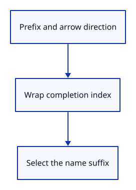

# 03ci · Browse matching names

**Typing: 23–45 minutes.** [Estimate](typing-load.md).

Use the original typed prefix while browsing matches. Arrow keys wrap the highlighted index; the selected suffix remains replaceable.

## Type

Continue from [Show matching commands](03ch-popup.md). [Save or recover your work](recovery.md).

### 1. `src/browser.rs`

Report that arrow browsing is connected.

<details>
<summary>Locate the existing block</summary>

```rust
    redraw.forget();
    report("Matching commands appear above the field.");
    Ok(())
```

</details>

Replace that block with:

```rust
--8<-- "journey/code/03ci-browse-direct-01.rs"
```

### 2. `src/command_dock/mod.rs`

Wrap the match index and retain the original typed prefix.

<details>
<summary>Locate the existing block</summary>

```rust

pub(crate) fn finish(
```

</details>

Replace that block with:

```rust
--8<-- "journey/code/03ci-browse-direct-02.rs"
```

### 3. `src/panel.rs`

Use browse for arrow keys, Tab and popup choices.

<details>
<summary>Locate the existing block</summary>

```rust
                    let mut line = None;
                    let choices = self.commands.completions(&self.model.completion_prefix);
                    let complete = if self.model.completion_visible && !choices.is_empty() { command_dock::popup(ui, &mut self.model, &mut None, &choices, &response, 0) } else { None };
                    let complete = complete.or_else(|| keys.tab.then(|| choices.first().copied()).flatten());
                    command_dock::finish(ui, &mut self.model, &response, &mut line, &self.commands, complete, &keys, true);
```

</details>

Replace that block with:

```rust
--8<-- "journey/code/03ci-browse-direct-03.rs"
```

## Run and check

In your project:

```sh
cd workspace/journey
cargo build --lib --locked --target wasm32-unknown-unknown -j4
CARGO_BUILD_JOBS=4 trunk serve --port 8780
```

Open `http://127.0.0.1:8780/`. Keep an existing Trunk server running; saving rebuilds it.

Press ArrowDown in the empty field. Help appears. Escape clears it.

**Verified checkpoint in Chrome.**


[Verification scope](release.md).

<details>
<summary>Code explanation and diagram</summary>


Move through matching command names without changing the scene.



Why retain the prefix while browsing?

The chosen suggestion must not become a new search filter.

Study estimate, including typing and experiments: 0.5–1 hours.

</details>

<details>
<summary>Optional experiment</summary>

Press ArrowDown twice in the empty field. The one-item list should wrap to Help without submitting it.

</details>

<details>
<summary>Check and save your work</summary>

Restore experimental edits, then run from `session_viewer`:

```sh
npm --prefix ../session_tests run course -- check 03ci-browse
npm --prefix ../session_tests run course -- save 03ci-browse
```

Source comparison leaves your project untouched. [Save and recovery instructions](recovery.md).

</details>

<details>
<summary>Viewer coverage and verification</summary>

This step connects one responsibility of the production command dock. Scene commands are added in the following lessons.


[Full validation scope](release.md).

To reproduce the scripted acceptance of the reference checkpoint, run from `session_viewer` with the [course bundle server](release.md#reproduce) running on port 8781:

```sh
npm --prefix ../session_tests run course -- capture 03ci-browse
```

This uses the verified reference bundle; it does not check or change your typed project.

</details>
