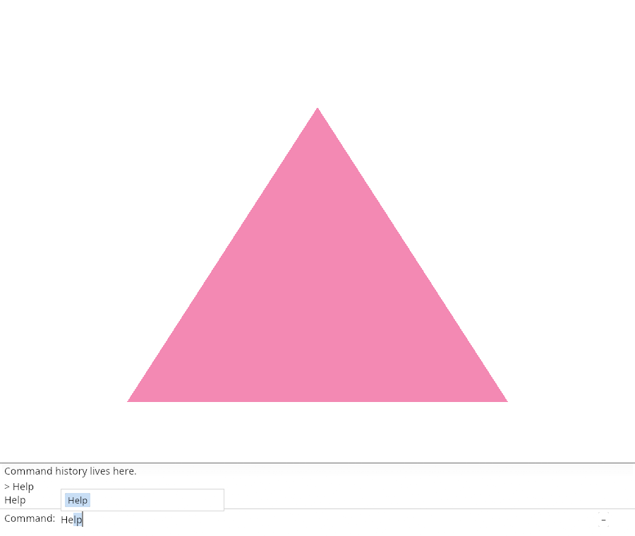
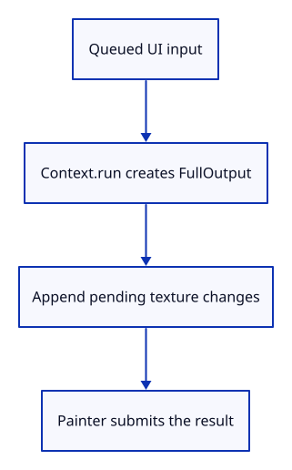

# 03cj · Prepare the dock before painting

**Typing: 11–22 minutes.** [Estimate](typing-load.md).

Prepare UI output before painting. Append any additional layout output so changed font textures survive until the single GPU submission.

## Type

Continue from [Browse matching names](03ci-browse.md). [Save or recover your work](recovery.md).

### 1. `src/browser.rs`

Report that prepared UI is painted once.

<details>
<summary>Locate the existing block</summary>

```rust
    redraw.forget();
    report("Arrow keys browse matching commands.");
    Ok(())
```

</details>

Replace that block with:

```rust
--8<-- "journey/code/03cj-prepare-direct-01.rs"
```

### 2. `src/panel.rs`

Own prepared output and the screen descriptor.

<details>
<summary>Locate the existing block</summary>

```rust
    events: Vec<egui::Event>,
}
```

</details>

Replace that block with:

```rust
--8<-- "journey/code/03cj-prepare-direct-02.rs"
```

### 3. `src/panel.rs`

Initialize pending output and screen size.

<details>
<summary>Locate the existing block</summary>

```rust
        let painter = egui_wgpu::Renderer::new(&renderer.device, format, Default::default());
        Self { commands: Commands(commands), context, painter, events: Vec::new(), model: CommandLine {
            command_expanded: true,
```

</details>

Replace that block with:

```rust
--8<-- "journey/code/03cj-prepare-direct-03.rs"
```

### 4. `src/panel.rs`

Move input and layout into prepare.

<details>
<summary>Locate the existing block</summary>

```rust

    pub fn draw(&mut self, renderer: &Renderer, target: &wgpu::TextureView) {
        let size = [target.texture().width(), target.texture().height()];
        let screen = egui_wgpu::ScreenDescriptor { size_in_pixels: size, pixels_per_point: 1.0 };
        let input = egui::RawInput {
```

</details>

Replace that block with:

```rust
--8<-- "journey/code/03cj-prepare-direct-04.rs"
```

### 5. `src/panel.rs`

Convert physical dimensions into egui points.

<details>
<summary>Locate the existing block</summary>

```rust
            screen_rect: Some(egui::Rect::from_min_size(
                egui::Pos2::ZERO, egui::vec2(size[0] as f32, size[1] as f32),
            )),
```

</details>

Replace that block with:

```rust
--8<-- "journey/code/03cj-prepare-direct-05.rs"
```

### 6. `src/panel.rs`

Append prepared output; take it once for GPU painting.

<details>
<summary>Locate the existing block</summary>

```rust
        });
        // The font atlas is a texture: upload its changed pixels before drawing the letters.
```

</details>

Replace that block with:

```rust
--8<-- "journey/code/03cj-prepare-direct-06.rs"
```

### 7. `src/panel.rs`

Use the retained screen descriptor when uploading UI buffers.

<details>
<summary>Locate the existing block</summary>

```rust
        let mut buffers = self.painter.update_buffers(
            &renderer.device, &renderer.queue, &mut encoder, &jobs, &screen,
        );
```

</details>

Replace that block with:

```rust
--8<-- "journey/code/03cj-prepare-direct-07.rs"
```

### 8. `src/panel.rs`

Use the same screen descriptor when painting UI.

<details>
<summary>Locate the existing block</summary>

```rust
        });
        self.painter.render(&mut pass.forget_lifetime(), &jobs, &screen);
        buffers.push(encoder.finish());
```

</details>

Replace that block with:

```rust
--8<-- "journey/code/03cj-prepare-direct-08.rs"
```

## Run and check

In your project:

```sh
cd workspace/journey
cargo build --lib --locked --target wasm32-unknown-unknown -j4
CARGO_BUILD_JOBS=4 trunk serve --port 8780
```

Open `http://127.0.0.1:8780/`. Keep an existing Trunk server running; saving rebuilds it.

Type Help. Text and the triangle remain visible after repeated key events.

**Verified checkpoint in Chrome.**



[Verification scope](release.md).

<details>
<summary>Code explanation and diagram</summary>


Keep UI output owned until one GPU submission.



Why append output before painting?

Another layout may add texture changes that the renderer still needs.

Study estimate, including typing and experiments: 0.5–0.75 hours.

</details>

<details>
<summary>Optional experiment</summary>

Type and delete Help repeatedly. The triangle and command text should remain visible throughout.

</details>

<details>
<summary>Check and save your work</summary>

Restore experimental edits, then run from `session_viewer`:

```sh
npm --prefix ../session_tests run course -- check 03cj-prepare
npm --prefix ../session_tests run course -- save 03cj-prepare
```

Source comparison leaves your project untouched. [Save and recovery instructions](recovery.md).

</details>

<details>
<summary>Viewer coverage and verification</summary>

This step connects one responsibility of the production command dock. Scene commands are added in the following lessons.


[Full validation scope](release.md).

To reproduce the scripted acceptance of the reference checkpoint, run from `session_viewer` with the [course bundle server](release.md#reproduce) running on port 8781:

```sh
npm --prefix ../session_tests run course -- capture 03cj-prepare
```

This uses the verified reference bundle; it does not check or change your typed project.

</details>
