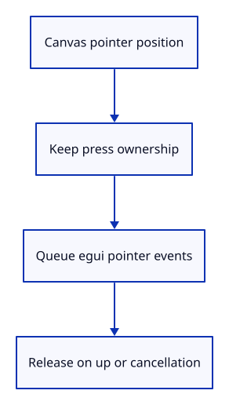

# 03ck · Click the command dock

**Typing: 26–51 minutes.** [Estimate](typing-load.md).

Translate mouse positions into canvas coordinates. Keep a press owned until release or cancellation. collapse changes layout while retained history stays in the model.

## Type

Continue from [Remember where the dock is drawn](03ck-rects.md). [Save or recover your work](recovery.md).

### 1. `src/browser.rs`

Dispatch keyboard and pointer events through one retained callback.

<details>
<summary>Locate the existing block</summary>

```rust
    let input_canvas = canvas.clone();
    let redraw = wasm_bindgen::closure::Closure::<dyn FnMut(web_sys::KeyboardEvent)>::new(move |event| {
        if panel.key(&event) {
            if let Err(error) = present(&surface, &renderer, &mut panel) {
```

</details>

Replace that block with:

```rust
--8<-- "journey/code/03ck-pointer-direct-01.rs"
```

### 2. `src/browser.rs`

Register pointer press, movement, release and cancellation.

<details>
<summary>Locate the existing block</summary>

```rust
    });
    for name in ["keydown", "keyup"] {
        window.add_event_listener_with_callback(name, redraw.as_ref().unchecked_ref())?;
```

</details>

Replace that block with:

```rust
--8<-- "journey/code/03ck-pointer-direct-02.rs"
```

### 3. `src/browser.rs`

Report that mouse input is connected.

<details>
<summary>Locate the existing block</summary>

```rust
    redraw.forget();
    report("The dock records its actual rectangles.");
    Ok(())
```

</details>

Replace that block with:

```rust
--8<-- "journey/code/03ck-pointer-direct-03.rs"
```

### 4. `src/panel.rs`

Retain pointer ownership between press and release.

<details>
<summary>Locate the existing block</summary>

```rust
    commands: Commands,
    top: f32,
```

</details>

Replace that block with:

```rust
--8<-- "journey/code/03ck-pointer-direct-04.rs"
```

### 5. `src/panel.rs`

Initialize pointer ownership.

<details>
<summary>Locate the existing block</summary>

```rust
        let painter = egui_wgpu::Renderer::new(&renderer.device, format, Default::default());
        Self { commands: Commands(commands), top: f32::INFINITY, controls: None, context, painter, events: Vec::new(), output: None,
            screen: egui_wgpu::ScreenDescriptor { size_in_pixels: [640, 480], pixels_per_point: 1.0 }, model: CommandLine {
```

</details>

Replace that block with:

```rust
--8<-- "journey/code/03ck-pointer-direct-05.rs"
```

### 6. `src/panel.rs`

Translate canvas coordinates, preserve drag ownership and release cancelled buttons.

<details>
<summary>Locate the existing block</summary>

```rust

    pub fn inspect(&self) -> String {
```

</details>

Replace that block with:

```rust
--8<-- "journey/code/03ck-pointer-direct-06.rs"
```

### 7. `src/panel.rs`

Expose pointer ownership so cancellation can be checked against the actual event handler.

<details>
<summary>Locate the existing block</summary>

```rust
            "top": self.top, "focused": self.context.egui_wants_keyboard_input(),
```

</details>

Replace that block with:

```rust
--8<-- "journey/code/03ck-pointer-owned-inspection.rs"
```

## Run and check

In your project:

```sh
cd workspace/journey
cargo build --lib --locked --target wasm32-unknown-unknown -j4
CARGO_BUILD_JOBS=4 trunk serve --port 8780
```

Open `http://127.0.0.1:8780/`. Keep an existing Trunk server running; saving rebuilds it.

Click the history fold control. History folds away; click again to restore it.

**Verified checkpoint in Chrome.**


[Verification scope](release.md).

<details>
<summary>Code explanation and diagram</summary>


Use pointer ownership to edit, choose a name and fold history.



Why retain pointer ownership?

A drag must stay with the widget even after leaving its rectangle.

Study estimate, including typing and experiments: 0.5–1.25 hours.

</details>

<details>
<summary>Optional experiment</summary>

Press the history fold control, drag outside it, and release. The cancelled click should leave history expanded.

</details>

<details>
<summary>Check and save your work</summary>

Restore experimental edits, then run from `session_viewer`:

```sh
npm --prefix ../session_tests run course -- check 03ck-pointer
npm --prefix ../session_tests run course -- save 03ck-pointer
```

Source comparison leaves your project untouched. [Save and recovery instructions](recovery.md).

</details>

<details>
<summary>Viewer coverage and verification</summary>

This step connects one responsibility of the production command dock. Scene commands are added in the following lessons.


[Full validation scope](release.md).

To reproduce the scripted acceptance of the reference checkpoint, run from `session_viewer` with the [course bundle server](release.md#reproduce) running on port 8781:

```sh
npm --prefix ../session_tests run course -- capture 03ck-pointer
```

This uses the verified reference bundle; it does not check or change your typed project.

</details>
