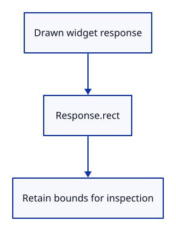

# 03ck · Remember where the dock is drawn

**Typing: 20–40 minutes.** [Estimate](typing-load.md).

Record the real field and collapse-control rectangles. The inspector reads these bounds from egui responses rather than guessing their positions.

## Type

Continue from [Prepare the dock before painting](03cj-prepare.md). [Save or recover your work](recovery.md).

### 1. `src/browser.rs`

Expose actual dock state and rectangles for inspection.

<details>
<summary>Locate the existing block</summary>

```rust
            }
            if let Err(error) = input_canvas.set_attribute("data-command", panel.command()) {
```

</details>

Replace that block with:

```rust
--8<-- "journey/code/03ck-rects-direct-01.rs"
```

### 2. `src/browser.rs`

Report that drawn bounds are recorded.

<details>
<summary>Locate the existing block</summary>

```rust
    redraw.forget();
    report("The prepared dock is painted once.");
    Ok(())
```

</details>

Replace that block with:

```rust
--8<-- "journey/code/03ck-rects-direct-02.rs"
```

### 3. `src/command_dock/mod.rs`

Record the fold control and toggle expanded history on click.

<details>
<summary>Locate the existing block</summary>

```rust
    false
}
```

</details>

Replace that block with:

```rust
--8<-- "journey/code/03ck-rects-direct-03.rs"
```

### 4. `src/panel.rs`

Store current control bounds and the panel’s top edge.

<details>
<summary>Locate the existing block</summary>

```rust
    commands: Commands,
    context: egui::Context,
```

</details>

Replace that block with:

```rust
--8<-- "journey/code/03ck-rects-direct-04.rs"
```

### 5. `src/panel.rs`

Initialize inspection storage and the top edge.

<details>
<summary>Locate the existing block</summary>

```rust
        let painter = egui_wgpu::Renderer::new(&renderer.device, format, Default::default());
        Self { commands: Commands(commands), context, painter, events: Vec::new(), output: None,
            screen: egui_wgpu::ScreenDescriptor { size_in_pixels: [640, 480], pixels_per_point: 1.0 }, model: CommandLine {
```

</details>

Replace that block with:

```rust
--8<-- "journey/code/03ck-rects-direct-05.rs"
```

### 6. `src/panel.rs`

Serialize actual widget bounds, text, history and focus.

<details>
<summary>Locate the existing block</summary>

```rust

    fn prepare(&mut self) {
```

</details>

Replace that block with:

```rust
--8<-- "journey/code/03ck-rects-direct-06.rs"
```

### 7. `src/panel.rs`

Start a fresh control list for each layout.

<details>
<summary>Locate the existing block</summary>

```rust
        self.model.completion_rect = None;
        let output = self.context.run_ui(input, |root| {
```

</details>

Replace that block with:

```rust
--8<-- "journey/code/03ck-rects-direct-07.rs"
```

### 8. `src/panel.rs`

Keep the panel response to read its drawn bounds.

<details>
<summary>Locate the existing block</summary>

```rust
        let output = self.context.run_ui(input, |root| {
            view::panel(root, self.model.command_expanded, 0.0).show_inside(root, |ui| {
                view::prepare(ui);
```

</details>

Replace that block with:

```rust
--8<-- "journey/code/03ck-rects-direct-08.rs"
```

### 9. `src/panel.rs`

Collect controls while drawing history.

<details>
<summary>Locate the existing block</summary>

```rust
                view::prepare(ui);
                command_dock::history(ui, &self.model, &mut None);
                ui.horizontal(|ui| {
```

</details>

Replace that block with:

```rust
--8<-- "journey/code/03ck-rects-direct-09.rs"
```

### 10. `src/panel.rs`

Record the actual field rectangle.

<details>
<summary>Locate the existing block</summary>

```rust
                    let response = view::field(ui, &mut self.model.command, placeholder("", &self.model.status, self.model.command_expanded), 0.0, self.model.command_open);
                    command_dock::refresh(ui, &mut self.model, &response, &self.commands, id, keys.deletes);
```

</details>

Replace that block with:

```rust
--8<-- "journey/code/03ck-rects-direct-10.rs"
```

### 11. `src/panel.rs`

Collect controls while drawing suggestions.

<details>
<summary>Locate the existing block</summary>

```rust
                    let mut line = None;
                    let complete = command_dock::browse(ui, &mut self.model, &mut None, &self.commands, &response, &keys, id);
                    command_dock::finish(ui, &mut self.model, &response, &mut line, &self.commands, complete, &keys, true);
```

</details>

Replace that block with:

```rust
--8<-- "journey/code/03ck-rects-direct-11.rs"
```

### 12. `src/panel.rs`

Draw the recorded fold control.

<details>
<summary>Locate the existing block</summary>

```rust
                    if let Some(line) = line { if line != "Escape" { self.commands.reply(&mut self.model, &line); } }
                    let _ = ui.button(if self.model.command_expanded { "–" } else { "+" }).on_hover_text("Collapse or expand history");
                });
```

</details>

Replace that block with:

```rust
--8<-- "journey/code/03ck-rects-direct-12.rs"
```

### 13. `src/panel.rs`

Retain the panel’s top edge for pointer ownership.

<details>
<summary>Locate the existing block</summary>

```rust
            });
        });
```

</details>

Replace that block with:

```rust
--8<-- "journey/code/03ck-rects-direct-13.rs"
```

### 14. `src/panel.rs`

Prepare the updated layout before painting.

<details>
<summary>Locate the existing block</summary>

```rust
        self.prepare();
        let Some(output) = self.output.take() else { return; };
```

</details>

Replace that block with:

```rust
--8<-- "journey/code/03ck-rects-direct-14.rs"
```

## Run and check

In your project:

```sh
cd workspace/journey
cargo build --lib --locked --target wasm32-unknown-unknown -j4
CARGO_BUILD_JOBS=4 trunk serve --port 8780
```

Open `http://127.0.0.1:8780/`. Keep an existing Trunk server running; saving rebuilds it.

Type He. The field and suggestion remain correctly placed above the history.

**Verified checkpoint in Chrome.**


[Verification scope](release.md).

<details>
<summary>Code explanation and diagram</summary>


Record actual widget bounds for mouse ownership.



Why use response rectangles?

They reflect the actual layout and scale used for this frame.

Study estimate, including typing and experiments: 0.5–1 hours.

</details>

<details>
<summary>Optional experiment</summary>

Compare the inspector’s command/input rectangle with the visible field. Its bounds should describe the drawn widget.

</details>

<details>
<summary>Check and save your work</summary>

Restore experimental edits, then run from `session_viewer`:

```sh
npm --prefix ../session_tests run course -- check 03ck-rects
npm --prefix ../session_tests run course -- save 03ck-rects
```

Source comparison leaves your project untouched. [Save and recovery instructions](recovery.md).

</details>

<details>
<summary>Viewer coverage and verification</summary>

This step connects one responsibility of the production command dock. Scene commands are added in the following lessons.


[Full validation scope](release.md).

To reproduce the scripted acceptance of the reference checkpoint, run from `session_viewer` with the [course bundle server](release.md#reproduce) running on port 8781:

```sh
npm --prefix ../session_tests run course -- capture 03ck-rects
```

This uses the verified reference bundle; it does not check or change your typed project.

</details>
