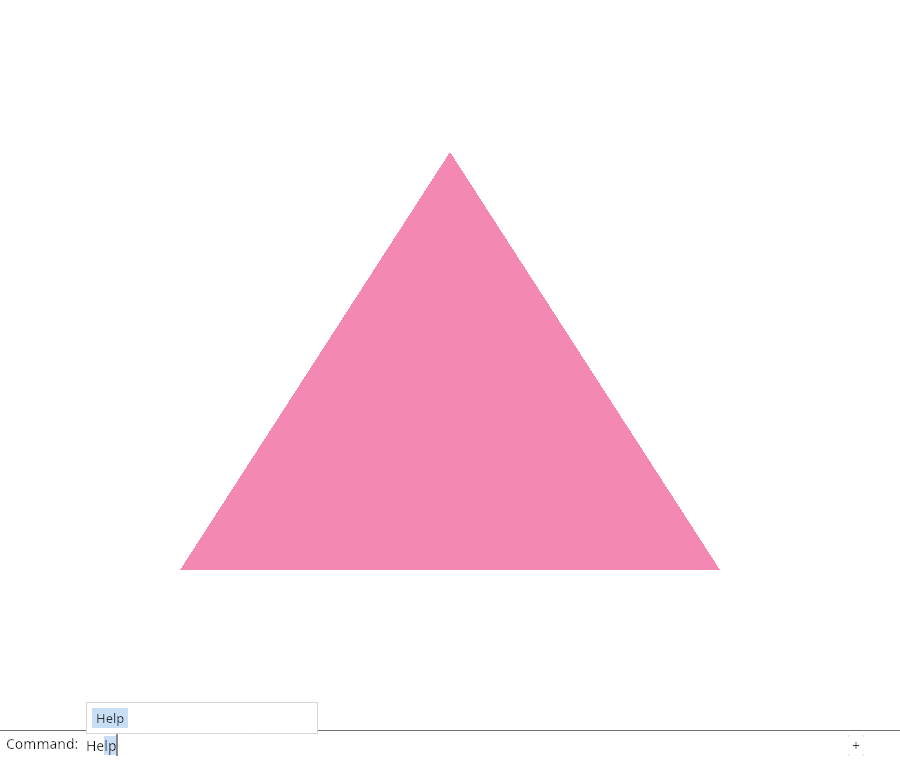
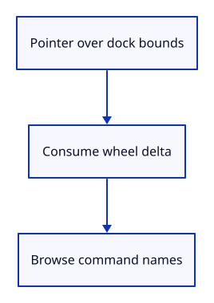

# 03cl · Scroll through command names

**Typing: 25–50 minutes.** [Estimate](typing-load.md).

Queue wheel input with the pointer position. Consume scrolling over the field or previous suggestion rectangle before it can reach the scene.

## Type

Continue from [Click the command dock](03ck-pointer.md). [Save or recover your work](recovery.md).

### 1. `src/browser.rs`

Dispatch wheel events to Panel.

<details>
<summary>Locate the existing block</summary>

```rust
        if let Some(key) = event.dyn_ref::<web_sys::KeyboardEvent>() { panel.key(key); }
        if let Some(pointer) = event.dyn_ref::<web_sys::PointerEvent>() { panel.pointer(pointer, &input_canvas); }
```

</details>

Replace that block with:

```rust
--8<-- "journey/code/03cl-wheel-direct-01.rs"
```

### 2. `src/browser.rs`

Register wheel input with preventDefault enabled.

<details>
<summary>Locate the existing block</summary>

```rust
    }
    redraw.forget();
```

</details>

Replace that block with:

```rust
--8<-- "journey/code/03cl-wheel-direct-02.rs"
```

### 3. `src/browser.rs`

Report that scrolling selects command names.

<details>
<summary>Locate the existing block</summary>

```rust
    redraw.forget();
    report("The mouse operates the command dock.");
    Ok(())
```

</details>

Replace that block with:

```rust
--8<-- "journey/code/03cl-wheel-direct-03.rs"
```

### 4. `src/command_dock/mod.rs`

Consume wheel movement over the field or previous popup.

<details>
<summary>Locate the existing block</summary>

```rust

pub(crate) fn suffix_space(ui: &egui::Ui, model: &mut CommandLine, id: egui::Id, focused: bool) {
```

</details>

Replace that block with:

```rust
--8<-- "journey/code/03cl-wheel-direct-04.rs"
```

### 5. `src/command_dock/mod.rs`

Focus the field when scrolling its command names.

<details>
<summary>Locate the existing block</summary>

```rust
    }
    let focused = ui.memory(|memory| memory.has_focus(id));
```

</details>

Replace that block with:

```rust
--8<-- "journey/code/03cl-wheel-direct-05.rs"
```

### 6. `src/command_dock/mod.rs`

Give wheel browsing priority over arrow browsing.

<details>
<summary>Locate the existing block</summary>

```rust
    let focused = ui.memory(|memory| memory.has_focus(id));
    let browse = if focused {
        ui.input_mut(|input| {
```

</details>

Replace that block with:

```rust
--8<-- "journey/code/03cl-wheel-direct-06.rs"
```

### 7. `src/panel.rs`

Queue wheel units and deltas at the canvas pointer position.

<details>
<summary>Locate the existing block</summary>

```rust

    pub fn inspect(&self) -> String {
```

</details>

Replace that block with:

```rust
--8<-- "journey/code/03cl-wheel-direct-07.rs"
```

### 8. `src/panel.rs`

Take the previous popup rectangle before drawing.

<details>
<summary>Locate the existing block</summary>

```rust
        };
        self.model.completion_rect = None;
        self.controls = Some(Vec::new());
```

</details>

Replace that block with:

```rust
--8<-- "journey/code/03cl-wheel-direct-08.rs"
```

### 9. `src/panel.rs`

Pass previous popup bounds to key and wheel handling.

<details>
<summary>Locate the existing block</summary>

```rust
                    let id = egui::Id::new("command-input");
                    let keys = command_dock::keys(ui, &mut self.model, None, id);
                    let response = view::field(ui, &mut self.model.command, placeholder("", &self.model.status, self.model.command_expanded), 0.0, self.model.command_open);
```

</details>

Replace that block with:

```rust
--8<-- "journey/code/03cl-wheel-direct-09.rs"
```

## Run and check

In your project:

```sh
cd workspace/journey
cargo build --lib --locked --target wasm32-unknown-unknown -j4
CARGO_BUILD_JOBS=4 trunk serve --port 8780
```

Open `http://127.0.0.1:8780/`. Keep an existing Trunk server running; saving rebuilds it.

Move the mouse over the field and scroll. Help is selected in the command list.

**Verified checkpoint in Chrome.**



[Verification scope](release.md).

<details>
<summary>Code explanation and diagram</summary>


Keep scrolling over the dock inside the command list.



Why remember the previous popup rectangle?

Input arrives before this frame draws the new popup.

Study estimate, including typing and experiments: 0.5–1.25 hours.

</details>

<details>
<summary>Optional experiment</summary>

Scroll in both directions over the empty field. The one-item list should wrap to Help without submitting it.

</details>

<details>
<summary>Check and save your work</summary>

Restore experimental edits, then run from `session_viewer`:

```sh
npm --prefix ../session_tests run course -- check 03cl-wheel
npm --prefix ../session_tests run course -- save 03cl-wheel
```

Source comparison leaves your project untouched. [Save and recovery instructions](recovery.md).

</details>

<details>
<summary>Viewer coverage and verification</summary>

This step connects one responsibility of the production command dock. Scene commands are added in the following lessons.


[Full validation scope](release.md).

To reproduce the scripted acceptance of the reference checkpoint, run from `session_viewer` with the [course bundle server](release.md#reproduce) running on port 8781:

```sh
npm --prefix ../session_tests run course -- capture 03cl-wheel
```

This uses the verified reference bundle; it does not check or change your typed project.

</details>
