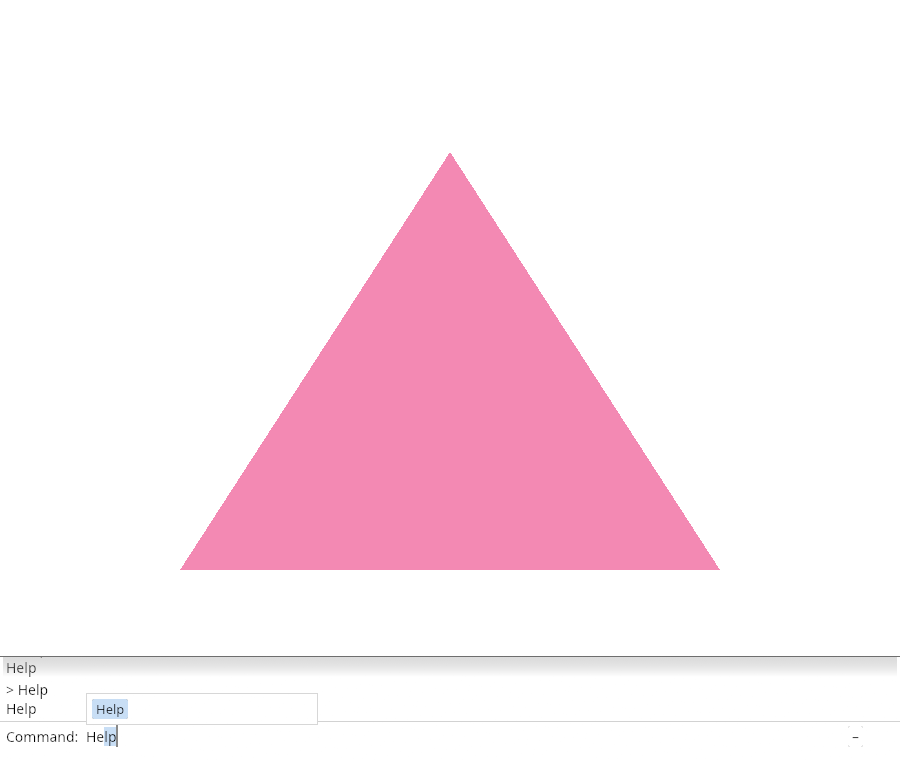
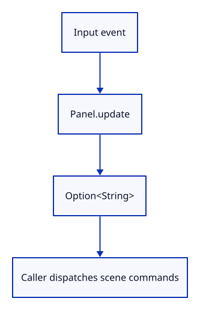

# 03cn · Return accepted application commands

**Typing: 29–57 minutes.** [Estimate](typing-load.md).

Panel.update prepares input and returns an accepted application name. Help and unknown-command replies stay local; the caller will handle scene actions.

## Type

Continue from [Align and measure the command row](03co-align.md). [Save or recover your work](recovery.md).

### 1. `src/browser.rs`

Prepare the initial dock before presenting.

<details>
<summary>Locate the existing block</summary>

```rust
    let mut panel = crate::panel::Panel::new(&renderer, config.format.add_srgb_suffix(), &["Help"]);
    present(&surface, &renderer, &mut panel)?;
```

</details>

Replace that block with:

```rust
--8<-- "journey/code/03cn-handoff-direct-01.rs"
```

### 2. `src/browser.rs`

Use Panel.update for input and the final layout pass.

<details>
<summary>Locate the existing block</summary>

```rust
    let redraw = wasm_bindgen::closure::Closure::<dyn FnMut(web_sys::Event)>::new(move |event: web_sys::Event| {
        if let Some(key) = event.dyn_ref::<web_sys::KeyboardEvent>() { panel.key(key); }
        if let Some(wheel) = event.dyn_ref::<web_sys::WheelEvent>() { panel.wheel(wheel, &input_canvas); }
        if let Some(pointer) = event.dyn_ref::<web_sys::PointerEvent>() { panel.pointer(pointer, &input_canvas); }
        {
```

</details>

Replace that block with:

```rust
--8<-- "journey/code/03cn-handoff-direct-02.rs"
```

### 3. `src/browser.rs`

Remove inspection writes now handled inside update.

<details>
<summary>Locate the existing block</summary>

```rust
            }
            if let Err(error) = input_canvas.set_attribute("data-command-ui", &panel.inspect()) {
                report(&format!("Cannot inspect dock: {error:?}"));
            }
            if let Err(error) = input_canvas.set_attribute("data-command", panel.command()) {
                report(&format!("Cannot inspect text: {error:?}"));
            }
            if let Err(error) = input_canvas.set_attribute("data-history", &serde_json::to_string(panel.history()).unwrap()) {
                report(&format!("Cannot inspect history: {error:?}"));
            }
        }
```

</details>

Replace that block with:

```rust
--8<-- "journey/code/03cn-handoff-direct-03.rs"
```

### 4. `src/browser.rs`

Report that Panel returns application commands.

<details>
<summary>Locate the existing block</summary>

```rust
    redraw.forget();
    report("The shared production dock is drawn.");
    Ok(())
```

</details>

Replace that block with:

```rust
--8<-- "journey/code/03cn-handoff-direct-04.rs"
```

### 5. `src/panel.rs`

Remove replies now handled by Panel.update.

<details>
<summary>Locate the existing block</summary>

```rust

impl Commands {
    fn reply(&self, model: &mut CommandLine, line: &str) {
        let line = self.canonical(line);
        let message = if line.eq_ignore_ascii_case("Help") { self.0.join(" · ") }
            else { "Unknown command. Type Help.".into() };
        model.status = message;
        model.remember(format!("> {line}\n{}", model.status));
    }
}

pub struct Panel {
```

</details>

Replace that block with:

```rust
--8<-- "journey/code/03cn-handoff-direct-05.rs"
```

### 6. `src/panel.rs`

Expose whether the dock consumed this event.

<details>
<summary>Locate the existing block</summary>

```rust
    commands: Commands,
    pointer_owned: bool,
```

</details>

Replace that block with:

```rust
--8<-- "journey/code/03cn-handoff-direct-06.rs"
```

### 7. `src/panel.rs`

Initialize event consumption.

<details>
<summary>Locate the existing block</summary>

```rust
        let painter = egui_wgpu::Renderer::new(&renderer.device, format, Default::default());
        Self { commands: Commands(commands), pointer_owned: false, top: f32::INFINITY, controls: None, context, painter, events: Vec::new(), output: None,
            screen: egui_wgpu::ScreenDescriptor { size_in_pixels: [640, 480], pixels_per_point: 1.0 }, model: CommandLine {
```

</details>

Replace that block with:

```rust
--8<-- "journey/code/03cn-handoff-direct-07.rs"
```

### 8. `src/panel.rs`

Start with folded history and focus the command field.

<details>
<summary>Locate the existing block</summary>

```rust
            screen: egui_wgpu::ScreenDescriptor { size_in_pixels: [640, 480], pixels_per_point: 1.0 }, model: CommandLine {
            command_expanded: true,
            history: ["Command history lives here.".into()].into(),
            ..Default::default()
```

</details>

Replace that block with:

```rust
--8<-- "journey/code/03cn-handoff-direct-08.rs"
```

### 9. `src/panel.rs`

Answer local commands; return accepted application names from update.

<details>
<summary>Locate the existing block</summary>

```rust

    fn prepare(&mut self) {
        let size = self.screen.size_in_pixels;
```

</details>

Replace that block with:

```rust
--8<-- "journey/code/03cn-handoff-direct-09.rs"
```

### 10. `src/panel.rs`

Allow prepare to set viewport input scale.

<details>
<summary>Locate the existing block</summary>

```rust
        let size = self.screen.size_in_pixels;
        let input = egui::RawInput {
            focused: true,
```

</details>

Replace that block with:

```rust
--8<-- "journey/code/03cn-handoff-direct-10.rs"
```

### 11. `src/panel.rs`

Supply the physical pixel scale to egui.

<details>
<summary>Locate the existing block</summary>

```rust
        };
        self.controls = Some(Vec::new());
```

</details>

Replace that block with:

```rust
--8<-- "journey/code/03cn-handoff-direct-11.rs"
```

### 12. `src/panel.rs`

Move command answers out of prepare.

<details>
<summary>Locate the existing block</summary>

```rust
        }
        if let Some(line) = line { if line != "Escape" { self.commands.reply(&mut self.model, &line); } }
        if let Some(previous) = self.output.as_mut() { previous.append(output); }
```

</details>

Replace that block with:

```rust
--8<-- "journey/code/03cn-handoff-direct-12.rs"
```

### 13. `src/panel.rs`

Return the accepted line from prepare.

<details>
<summary>Locate the existing block</summary>

```rust
        else { self.output = Some(output); }
    }
```

</details>

Replace that block with:

```rust
--8<-- "journey/code/03cn-handoff-direct-13.rs"
```

### 14. `src/panel.rs`

Paint prepared output without replaying input.

<details>
<summary>Locate the existing block</summary>

```rust
    pub fn draw(&mut self, renderer: &Renderer, target: &wgpu::TextureView) {
        self.screen.size_in_pixels = [target.texture().width(), target.texture().height()];
        self.prepare();
        self.prepare();
        let Some(output) = self.output.take() else { return; };
```

</details>

Replace that block with:

```rust
--8<-- "journey/code/03cn-handoff-direct-14.rs"
```

## Run and check

In your project:

```sh
cd workspace/journey
cargo build --lib --locked --target wasm32-unknown-unknown -j4
CARGO_BUILD_JOBS=4 trunk serve --port 8780
```

Open `http://127.0.0.1:8780/`. Keep an existing Trunk server running; saving rebuilds it.

Type Help and press Enter. The field clears and exactly one answer appears.

**Verified checkpoint in Chrome.**



[Verification scope](release.md).

<details>
<summary>Code explanation and diagram</summary>


Keep editing local and return accepted names to the caller.



Why return Option<String>?

Most input edits the field; only an accepted application command needs dispatch.

Study estimate, including typing and experiments: 0.75–1.25 hours.

</details>

<details>
<summary>Optional experiment</summary>

Submit an unknown name. The dock should answer locally and leave the triangle unchanged.

</details>

<details>
<summary>Check and save your work</summary>

Restore experimental edits, then run from `session_viewer`:

```sh
npm --prefix ../session_tests run course -- check 03cn-handoff
npm --prefix ../session_tests run course -- save 03cn-handoff
```

Source comparison leaves your project untouched. [Save and recovery instructions](recovery.md).

</details>

<details>
<summary>Viewer coverage and verification</summary>

This step connects one responsibility of the production command dock. Scene commands are added in the following lessons.


[Full validation scope](release.md).

To reproduce the scripted acceptance of the reference checkpoint, run from `session_viewer` with the [course bundle server](release.md#reproduce) running on port 8781:

```sh
npm --prefix ../session_tests run course -- capture 03cn-handoff
```

This uses the verified reference bundle; it does not check or change your typed project.

</details>
