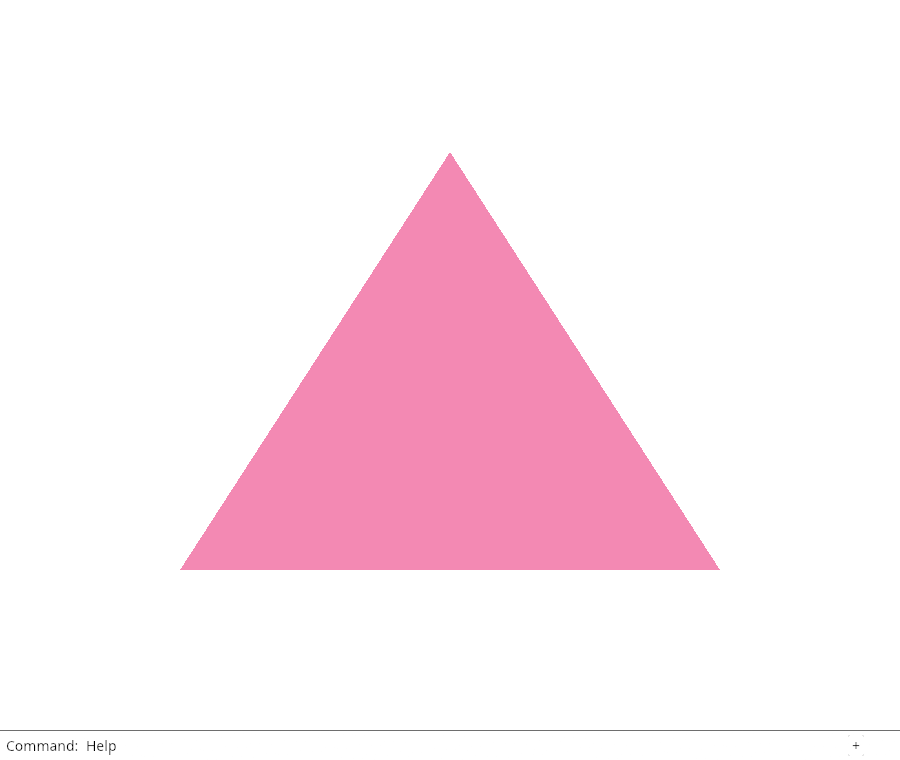
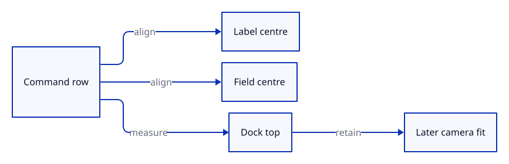

# 03co · Align and measure the command row

**Typing: 5–9 minutes.** [Estimate](typing-load.md).

Give the shared row the field’s height and centre its children vertically. Store the drawn dock edge on the existing model.

## Type

Continue from [Share the production dock layout](03c-layout.md). [Save or recover your work](recovery.md).

### 1. `src/command_dock/mod.rs`

Use the field height and centre the row’s children.

<details>
<summary>Locate the existing block</summary>

```rust
    let mut focus_canvas = false;
    ui.horizontal(|ui| {
```

</details>

Replace that block with:

```rust
--8<-- "journey/code/03co-align-01.rs"
```

### 2. `src/command_dock/mod.rs`

Keep the actual dock edge as optional layout metadata.

<details>
<summary>Locate the existing block</summary>

```rust
    pub(crate) focus_command: bool,                 // give the field focus next frame
```

</details>

Replace that block with:

```rust
--8<-- "journey/code/03co-align-02.rs"
```

### 3. `src/command_dock/mod.rs`

Record the dock edge from the current drawn rectangle.

<details>
<summary>Locate the existing block</summary>

```rust
        view::prepare(ui);
        history(ui, model, controls);
```

</details>

Replace that block with:

```rust
--8<-- "journey/code/03co-align-03.rs"
```

## Run and check

In your project:

```sh
cd workspace/journey
cargo build --lib --locked --target wasm32-unknown-unknown -j4
CARGO_BUILD_JOBS=4 trunk serve --port 8780
```

Open `http://127.0.0.1:8780/`. Keep an existing Trunk server running; saving rebuilds it.

Type Help, then click the drawing. The Command label and field text share a centre line; the dock retains its current top edge.

**Verified checkpoint in Chrome.**



[Verification scope](release.md).

<details>
<summary>Code explanation and diagram</summary>

The row still returns accepted commands to its caller. The new optional edge is layout metadata, not scene state. Later fitting uses it to keep geometry above the dock.

22 px row → centred layout → drawn dock edge → future usable viewport.



Why record the dock edge while drawing instead of assuming a fixed footer height?

The current layout knows the actual edge. Later fitting can use that value when history or other panels change the visible canvas.

Study estimate, including typing and experiments: 0.25–0.5 hours.

</details>

<details>
<summary>Optional experiment</summary>

Temporarily change the row height, redraw, then restore 22 px. Compare the label and typed text.

</details>

<details>
<summary>Check and save your work</summary>

Restore experimental edits, then run from `session_viewer`:

```sh
npm --prefix ../session_tests run course -- check 03co-align
npm --prefix ../session_tests run course -- save 03co-align
```

Source comparison leaves your project untouched. [Save and recovery instructions](recovery.md).

</details>

<details>
<summary>Viewer coverage and verification</summary>

This implements the current production row alignment and dock-top measurement. Fitting around panels is taught later.

Visible Chrome verifies command input, completion, history, ownership and preserved scene pixels, then checks label and field text positions.

Chrome checks the inherited command route and compares actual label and field ink after dismissing the caret.

[Full validation scope](release.md).

To reproduce the scripted acceptance of the reference checkpoint, run from `session_viewer` with the [course bundle server](release.md#reproduce) running on port 8781:

```sh
npm --prefix ../session_tests run course -- capture 03co-align
```

This uses the verified reference bundle; it does not check or change your typed project.

</details>
