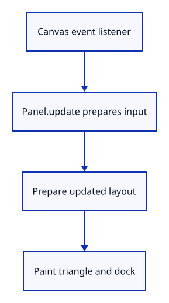

# 03d · Hand commands to the application

**Typing: 22–44 minutes.** [Estimate](typing-load.md).

Listen on the canvas and hand events to Panel.update. Prepare the dock again after input, then paint one frame. Typing after a scene click focuses the field immediately.

## Type

Continue from [Return accepted application commands](03cn-handoff.md). [Save or recover your work](recovery.md).

### 1. `src/browser.rs`

Import the retained Closure type.

<details>
<summary>Locate the existing block</summary>

```rust
use crate::renderer::Renderer;
use wasm_bindgen::{JsCast, JsValue};
```

</details>

Replace that block with:

```rust
--8<-- "journey/code/03d-input-direct-01.rs"
```

### 2. `src/browser.rs`

Keep canvas acquisition ready for canvas-owned input.

<details>
<summary>Locate the existing block</summary>

```rust
    let canvas: web_sys::HtmlCanvasElement = document
        .get_element_by_id("canvas").ok_or("Missing canvas")?.dyn_into()?;
    let instance = wgpu::Instance::new(wgpu::InstanceDescriptor {
```

</details>

Replace that block with:

```rust
--8<-- "journey/code/03d-input-direct-02.rs"
```

### 3. `src/browser.rs`

Keep GPU setup with the final browser event owner.

<details>
<summary>Locate the existing block</summary>

```rust
    });
    let surface = instance.create_surface(wgpu::SurfaceTarget::Canvas(canvas.clone()))
        .map_err(|error| JsValue::from_str(&error.to_string()))?;
```

</details>

Replace that block with:

```rust
--8<-- "journey/code/03d-input-direct-03.rs"
```

### 4. `src/browser.rs`

Remove the intermediate event callback setup.

<details>
<summary>Locate the existing block</summary>

```rust
        .map_err(|error| JsValue::from_str(&error.to_string()))?;
    let adapter = instance.request_adapter(&wgpu::RequestAdapterOptions {
        compatible_surface: Some(&surface),
        ..Default::default()
    }).await.map_err(|error| JsValue::from_str(&error.to_string()))?;
    let (device, queue) = adapter.request_device(&wgpu::DeviceDescriptor::default())
        .await.map_err(|error| JsValue::from_str(&error.to_string()))?;
    device.on_uncaptured_error(std::sync::Arc::new(|error| report(&error.to_string())));
```

</details>

Replace that block with:

```rust
--8<-- "journey/code/03d-input-direct-04.rs"
```

### 5. `src/browser.rs`

Keep surface configuration before the canvas input owner.

<details>
<summary>Locate the existing block</summary>

```rust
    canvas.set_height(height);
    let mut config = surface.get_default_config(&adapter, width, height)
        .ok_or("No compatible surface format")?;
```

</details>

Replace that block with:

```rust
--8<-- "journey/code/03d-input-direct-05.rs"
```

### 6. `src/browser.rs`

Handle command update errors in the canvas callback.

<details>
<summary>Locate the existing block</summary>

```rust
    let input_canvas = canvas.clone();
    let redraw = wasm_bindgen::closure::Closure::<dyn FnMut(web_sys::Event)>::new(move |event: web_sys::Event| {
        if let Err(error) = panel.update(Some(&event), &input_canvas) {
            report(&format!("Cannot read command: {error:?}"));
        }
        if let Err(error) = panel.update(None, &input_canvas) {
```

</details>

Replace that block with:

```rust
--8<-- "journey/code/03d-input-direct-06.rs"
```

### 7. `src/browser.rs`

Stop the callback after a layout failure.

<details>
<summary>Locate the existing block</summary>

```rust
            report(&format!("Cannot lay out commands: {error:?}"));
        }
```

</details>

Replace that block with:

```rust
--8<-- "journey/code/03d-input-direct-07.rs"
```

### 8. `src/browser.rs`

Present after preparing the final command layout.

<details>
<summary>Locate the existing block</summary>

```rust
        }
        {
            if let Err(error) = present(&surface, &renderer, &mut panel) {
                report(&format!("Cannot redraw: {error:?}"));
            }
        }
```

</details>

Replace that block with:

```rust
--8<-- "journey/code/03d-input-direct-08.rs"
```

### 9. `src/browser.rs`

Register drawing and keyboard events on the canvas.

<details>
<summary>Locate the existing block</summary>

```rust
    });
    for name in ["keydown", "keyup", "pointerdown", "pointermove", "pointerup", "pointercancel"] {
        window.add_event_listener_with_callback(name, redraw.as_ref().unchecked_ref())?;
    }
```

</details>

Replace that block with:

```rust
--8<-- "journey/code/03d-input-direct-09.rs"
```

### 10. `src/browser.rs`

Retain the wheel callback for the page lifetime.

<details>
<summary>Locate the existing block</summary>

```rust
    options.set_passive(false);
    canvas.add_event_listener_with_callback_and_add_event_listener_options("wheel", redraw.as_ref().unchecked_ref(), &options)?;
    redraw.forget();
    report("Panel returns accepted application commands.");
    Ok(())
```

</details>

Replace that block with:

```rust
--8<-- "journey/code/03d-input-direct-10.rs"
```

### 11. `src/browser.rs`

Give surface presentation its complete function.

<details>
<summary>Locate the existing block</summary>

```rust

fn present(surface: &wgpu::Surface<'_>, renderer: &Renderer, panel: &mut crate::panel::Panel) -> Result<(), JsValue> {
    let frame = match surface.get_current_texture() {
```

</details>

Replace that block with:

```rust
--8<-- "journey/code/03d-input-direct-11.rs"
```

### 12. `src/browser.rs`

Return a useful error when the surface is unavailable.

<details>
<summary>Locate the existing block</summary>

```rust
        | wgpu::CurrentSurfaceTexture::Suboptimal(frame) => frame,
        other => return Err(JsValue::from_str(&format!("Surface unavailable: {other:?}"))),
    };
```

</details>

Replace that block with:

```rust
--8<-- "journey/code/03d-input-direct-12.rs"
```

## Run and check

In your project:

```sh
cd workspace/journey
cargo build --lib --locked --target wasm32-unknown-unknown -j4
CARGO_BUILD_JOBS=4 trunk serve --port 8780
```

Open `http://127.0.0.1:8780/`. Keep an existing Trunk server running; saving rebuilds it.

Click the scene, type Help and press Enter. One answer appears in the real dock.

**Verified checkpoint in Chrome.**


[Verification scope](release.md).

<details>
<summary>Code explanation and diagram</summary>


Return accepted commands while keeping editing inside Panel.



Why prepare again before painting?

Input can change layout or history; the final frame must show the updated model.

Study estimate, including typing and experiments: 0.5–1 hours.

</details>

<details>
<summary>Optional experiment</summary>

Click the scene between two Help submissions. Each submission should add one answer without requiring a field click.

</details>

<details>
<summary>Check and save your work</summary>

Restore experimental edits, then run from `session_viewer`:

```sh
npm --prefix ../session_tests run course -- check 03d-input
npm --prefix ../session_tests run course -- save 03d-input
```

Source comparison leaves your project untouched. [Save and recovery instructions](recovery.md).

</details>

<details>
<summary>Viewer coverage and verification</summary>

This step connects one responsibility of the production command dock. Scene commands are added in the following lessons.


[Full validation scope](release.md).

To reproduce the scripted acceptance of the reference checkpoint, run from `session_viewer` with the [course bundle server](release.md#reproduce) running on port 8781:

```sh
npm --prefix ../session_tests run course -- capture 03d-input
```

This uses the verified reference bundle; it does not check or change your typed project.

</details>
