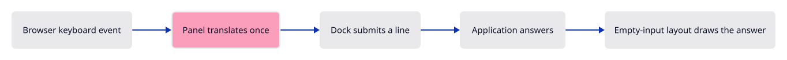
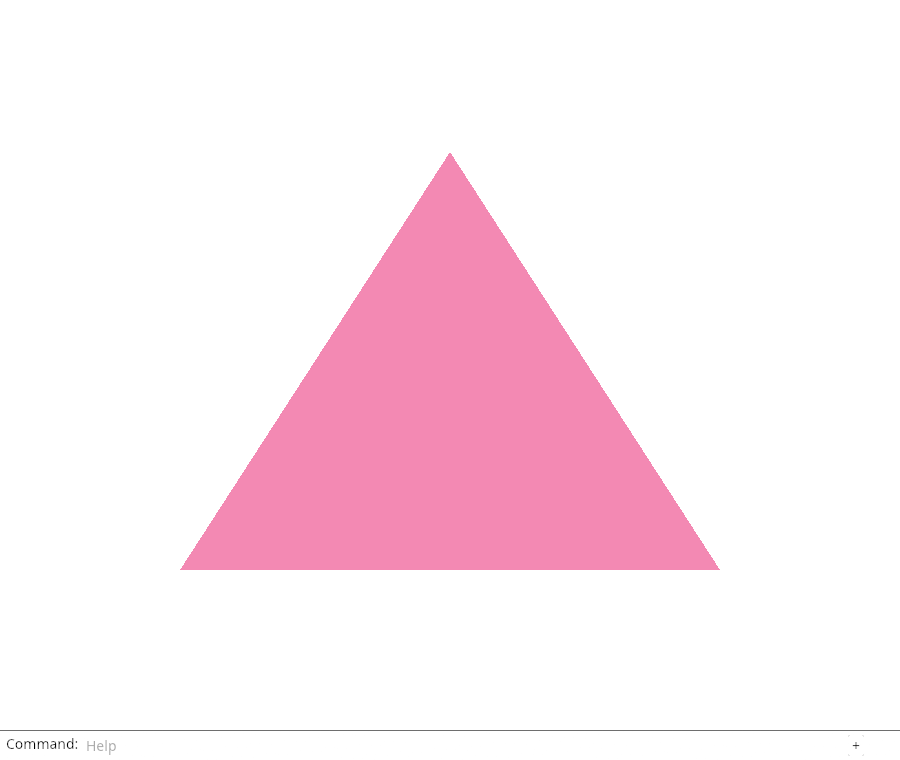

# 03d · Type into the real command dock

**Combined study estimate: 5–8 hours.** Includes reading, typing, reasoning and experiments.

**Typing estimate: 68–136 minutes.** 149 added or changed lines; unchanged context is excluded. [How this is estimated](typing-load.md).

**Splitting required:** this verified checkpoint exceeds the one-hour typing target. Smaller runnable lessons are still being prepared.

**Today:** Send browser events to the dock and submit Help.

**In the whole viewer:** Connect the browser, drawing and input, then extend the same project. [See the destination](../journey.md#the-destination).

**Follow:** Browser → Panel → CommandLine → layout → existing GPU.

**Before you finish, explain:** Why do we lay out again without replaying the event?

Now the field becomes usable. A browser key is not automatically an egui key: Panel translates it and passes it to the context. Enter produces a submitted line. Help writes an answer into history. In lesson 04, the same path will change the scene.

Follow one letter: KeyboardEvent → egui Text event → CommandLine.command → layout → GPU triangles. Follow Enter separately: the dock returns the line, the vocabulary accepts it, and the answer joins history.

The scene and dock share one canvas. consumed means this event belongs to the dock. Mouse navigation must check it before reacting. Clicking outside the dock releases text focus; the next printable key requests focus before its Text event reaches the field. This ordering keeps the first letter. There are no keyboard feature shortcuts.

The second update receives no event. It lays out the cleared field and new answer after submission. Sending the same key twice would type duplicate letters. FullOutput.append keeps texture uploads from the earlier layout while retaining the latest shapes.



`Result<Option<String>, JsValue>` distinguishes three outcomes: an error, an ordinary event with no submitted line, or one submitted line. `dyn_ref` checks which browser event we received and borrows it as that type. The callback uses `move` to keep its owners alive after setup returns. `tabindex="0"` makes the canvas focusable; drawing an input field alone does not make the browser deliver keyboard events to it.

## Type the change

Continue [Draw completion and history](03c-layout.md). From `session_viewer`, save your files with `npm --prefix ../session_tests run course -- save before-03d-input`. A save keeps your own work; it does not fill in the next lesson.

### 1. `src/panel.rs`

Keep one Panel alive beside the Renderer. Read the layout, input and painting paths separately; they communicate through the stored model and FullOutput.

Find this exact block:

```rust
            top: f32::INFINITY,
            context,
            model: CommandLine {
                command_expanded: true,
                history: ["Command history lives here.".into()].into(),
                ..Default::default()
            },
            painter: egui_wgpu::Renderer::new(&renderer.device, format, Default::default()),
```

Replace that block with:

```rust
--8<-- "journey/code/03d-input-scale-1.rs"
```

### 2. `src/panel.rs`

Keep one Panel alive beside the Renderer. Read the layout, input and painting paths separately; they communicate through the stored model and FullOutput.

Find this exact block:

```rust

    pub fn update(
        &mut self,
        _event: Option<&web_sys::Event>,
        canvas: &web_sys::HtmlCanvasElement,
    ) -> Result<Option<String>, JsValue> {
        let rect = canvas.get_bounding_client_rect();
```

Replace that block with:

```rust
--8<-- "journey/code/03d-input-scale-2.rs"
```

### 3. `src/panel.rs`

Keep one Panel alive beside the Renderer. Read the layout, input and painting paths separately; they communicate through the stored model and FullOutput.

Find this exact block:

```rust
            focused: true,
            ..Default::default()
        };
        self.screen.size_in_pixels = [canvas.width(), canvas.height()];
        self.screen.pixels_per_point = canvas.width() as f32 / size.x;
        input.viewports.get_mut(&egui::ViewportId::ROOT).unwrap().native_pixels_per_point =
```

Replace that block with:

```rust
--8<-- "journey/code/03d-input-scale-3.rs"
```

### 4. `src/browser.rs`

Connect this checkpoint to the existing owners. The event callback retains Panel and Renderer for the lifetime of the page.

Find this exact block:

```rust
use crate::renderer::Renderer;
use wasm_bindgen::{JsCast, JsValue};

pub fn report(message: &str) {
    if let Some(document) = web_sys::window().and_then(|window| window.document()) {
```

Replace that block with:

```rust
--8<-- "journey/code/03d-input-window-1.rs"
```

### 5. `src/browser.rs`

Connect this checkpoint to the existing owners. The event callback retains Panel and Renderer for the lifetime of the page.

Find this exact block:

```rust
    let mut panel = crate::panel::Panel::new(&renderer, config.format.add_srgb_suffix(), &["Help"]);
    panel.update(None, &canvas)?;
    present(&surface, &renderer, &mut panel)?;
    report("The real dock lays out history and the command field.");
    Ok(())
}
```

Replace that block with:

```rust
--8<-- "journey/code/03d-input-window-2.rs"
```

## Run and look

From `session_viewer`, enter your project folder:

```sh
cd workspace/journey
cargo build --lib --locked --target wasm32-unknown-unknown -j4
CARGO_BUILD_JOBS=4 trunk serve --port 8780
```

Open `http://127.0.0.1:8780/`. If Trunk is already running in this project, leave it running; it rebuilds when you save.

Click inside the Command field, type Help, then press Enter. The field clears and history records the answer. Type He: the viewer’s completion fills Help. Escape cancels it. No feature buttons are added.

**Actual Chrome screenshot.**

Actual Chrome capture of this checkpoint. The result described above distinguishes drawing-only stages from connected input.



*Captured from this checkpoint’s browser bundle after its browser checks passed. [Check scope and environment](release.md).*

## Try one small experiment

Type an unknown word and press Enter. The dock should explain that it is unknown while leaving the triangle unchanged. Type Help again. Explain why input and document changes are separate.

## Explain it in your own words

Trace the values through the files without reading the answer first. If you lose the connection, stop at the last value you can follow.

<details>
<summary>Compare your explanation</summary>

Submitting a line changes the field and history after the first layout. An empty-input update draws that new state while processing the key exactly once.

</details>

## Keep your working result

Return to `session_viewer` in a second terminal. Restore experimental edits before comparing:

```sh
npm --prefix ../session_tests run course -- check 03d-input
npm --prefix ../session_tests run course -- save 03d-input
```

The comparison spots typing differences; it does not prove behaviour. Keep three notes: what I changed; the values I followed; the question I still have. [Recover a checkpoint](recovery.md) if an experiment gets tangled.

## Where this grows

This is the production command dock and styling. Its vocabulary grows with the course; the scene renderer stays independent of text editing.

[Validation status and course release](release.md).
