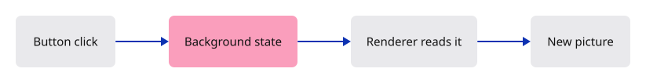
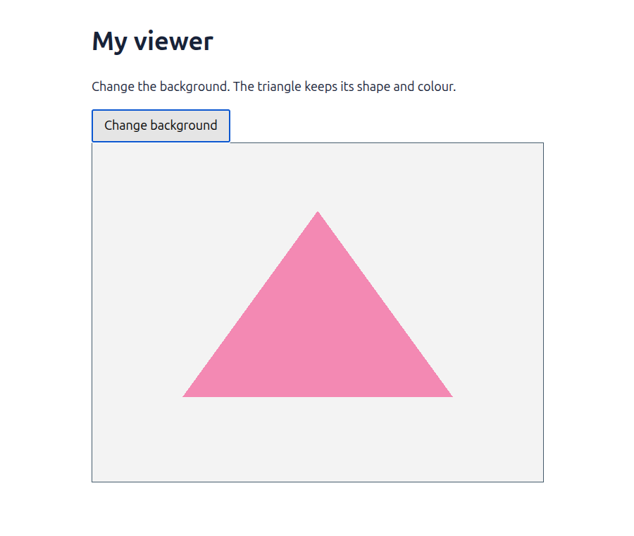

# 04 · Make a choice change the picture

**Plan about 1–2 hours.** 47 lines to type, including comments and blank lines. Allow time to read, predict and experiment; this is an estimate, not a deadline.

**Today:** Use a button to switch backgrounds without changing the triangle.

**In the whole viewer:** Connect the browser, drawing and input, then extend the same project. [See the destination](../journey.md#the-destination).

**Follow:** Button event → Background changes → renderer clears → same triangle is drawn again.

**Before you finish, explain:** Why does changing the background not require rebuilding the shader or pipeline?

Let us make the picture respond to a choice. The button will change the background while the triangle keeps the same shape and colour. This is our first complete input → state → drawing path.

`Background` owns one boolean. The browser owns the click handler and asks that state to change. The renderer reads the state when drawing. The state does not know what a browser or GPU is; that makes its behaviour easy to reason about.



`mut` permits a binding to change. `&mut self` lets `toggle` change its own state. `!` reverses a boolean. A **closure** is a function that can retain values from where it was created. Here, `move` transfers the surface, renderer and background into the callback so they outlive the setup function.

The listener lasts for this page's lifetime. `forget` deliberately leaves it registered; there is only one. Later, when tools and windows can come and go, we must give their listeners an owner that unregisters them. Keeping that lifetime explicit is part of maintaining the application.

The browser expects a JavaScript function. `Closure` wraps our Rust callback for that boundary, and `FnMut` says calling it may change retained state. `as_ref().unchecked_ref()` supplies the JavaScript function reference expected by the event-listener API; this particular value came from that callback wrapper. The button is enabled only after this connection succeeds.

## Type the change

Continue [Give the GPU three corners](03-triangle.md). From `session_viewer`, save your files with `npm --prefix ../session_tests run course -- save before-04-input`. A save keeps your own work; it does not fill in the next lesson.

### 1. `index.html`

Add a native HTML button. It remains disabled until GPU setup and the first frame succeed; keyboard activation works too.

Find this exact block:

```html
  <canvas id="canvas" width="640" height="480" aria-label="Viewer drawing"></canvas>
```

Replace that block with:

```html
--8<-- "journey/code/04-input-01.html"
```

### 2. `src/background.rs`

Create the small piece of application state. It knows colours, but knows nothing about HTML or GPU resources.

Create the file and type:

```rust
--8<-- "journey/code/04-input-02.rs"
```

### 3. `src/lib.rs`

Register the state module so both the browser and the renderer can use it.

Find this exact block:

```rust
pub mod renderer;
```

Replace that block with:

```rust
--8<-- "journey/code/04-input-03.rs"
```

### 4. `src/renderer.rs`

The renderer now reads a background passed by its caller. & borrows it for this call; drawing does not take ownership or change the choice.

Find this exact block:

```rust
    pub fn draw(&self, view: &wgpu::TextureView) {
```

Replace that block with:

```rust
--8<-- "journey/code/04-input-04.rs"
```

### 5. `src/renderer.rs`

Use the three values just read instead of a colour fixed inside the renderer.

Find this exact block:

```rust
                            r: 0.03, g: 0.09, b: 0.20, a: 1.0,
```

Replace that block with:

```rust
--8<-- "journey/code/04-input-05.rs"
```

### 6. `src/browser.rs`

The browser is the coordinator: it knows the input, state and renderer, then connects them.

Find this exact block:

```rust
use wasm_bindgen::{JsCast, JsValue};
```

Replace that block with:

```rust
--8<-- "journey/code/04-input-06.rs"
```

### 7. `src/browser.rs`

Replace the first present call and status message with this block. move lets the callback own the objects after run returns. No shared mutable global state is needed.

Find this exact block:

```rust
    present(&surface, &renderer)?;
    report("Three corners became a triangle.");
```

Replace that block with:

```rust
--8<-- "journey/code/04-input-07.rs"
```

### 8. `src/browser.rs`

Give present the same state for the first frame and for every button click.

Find this exact block:

```rust
fn present(surface: &wgpu::Surface<'_>, renderer: &Renderer) -> Result<(), JsValue> {
```

Replace that block with:

```rust
--8<-- "journey/code/04-input-08.rs"
```

### 9. `src/browser.rs`

Forward that state to the renderer. This completes the path from a user action to new pixels.

Find this exact block:

```rust
    renderer.draw(&view);
```

Replace that block with:

```rust
--8<-- "journey/code/04-input-09.rs"
```

## Run and look

From `session_viewer`, enter your project folder:

```sh
cd workspace/journey
cargo build --lib --locked --target wasm32-unknown-unknown -j4
CARGO_BUILD_JOBS=4 trunk serve --port 8780
```

Open `http://127.0.0.1:8780/`. If Trunk is already running in this project, leave it running; it rebuilds when you save.

The button becomes enabled after the first frame. One click gives a light background; another returns to blue. The triangle stays pink. Tab to the button and press Enter: this should make the same change.

**Actual Chrome screenshot.**



*Captured from this checkpoint’s browser bundle after its browser checks passed. [Check scope and environment](release.md).*

## Try one small experiment

Before clicking twice, predict the final picture. Then add a temporary sentence to `toggle` in your notebook: “I change ___; I do not create ___.” Fill the blanks with “one boolean” and “a GPU pipeline”. Check that every click reuses the renderer constructed once in `run`.

## Explain it in your own words

Trace the values through the files without reading the answer first. If you lose the connection, stop at the last value you can follow.

<details>
<summary>Compare your explanation</summary>

The pipeline describes how to draw the triangle and does not depend on the clear colour. Each new frame reads the current background and reuses that pipeline.

</details>

## Keep your working result

Return to `session_viewer` in a second terminal. Restore experimental edits before comparing:

```sh
npm --prefix ../session_tests run course -- check 04-input
npm --prefix ../session_tests run course -- save 04-input
```

The comparison spots typing differences; it does not prove behaviour. Keep three notes: what I changed; the values I followed; the question I still have. [Recover a checkpoint](recovery.md) if an experiment gets tangled.

## Where this grows

In the full viewer, input similarly requests a change before a new frame reads the result. This background is view state, not geometry. Moving an object will instead change the document and refresh its display data.

[Validation status and course release](release.md).
