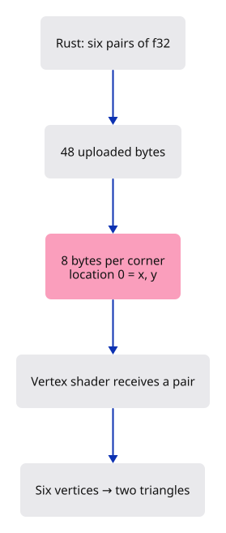
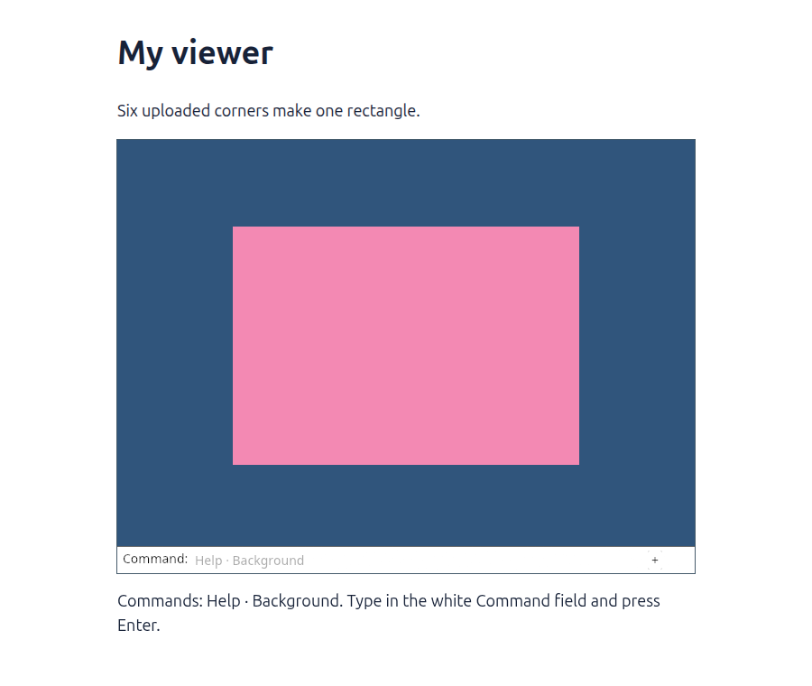

# 05 · Let Rust supply the corners

**Plan about 1–2 hours.** 42 lines to type, including comments and blank lines. Allow time to read, predict and experiment; this is an estimate, not a deadline.

**Today:** Draw a rectangle from six positions stored in a GPU buffer.

**In the whole viewer:** Connect the browser, drawing and input, then extend the same project. [See the destination](../journey.md#the-destination).

**Follow:** Rust positions → bytes → vertex buffer → vertex layout → shader location 0 → two triangles.

**Before you finish, explain:** Who owns the positions, and how does the shader know where each pair of numbers begins?

Our triangle kept its corners inside the shader. That made the first draw easy to follow. A viewer needs to draw geometry supplied by a document, so let us move those corners into data that Rust supplies.

Today we make two triangles that meet along a diagonal. Together they form a rectangle. For the moment, we deliberately write the shared corners twice; the next lesson will give those corners reusable numbers.



A **vertex buffer** holds the bytes read for each corner. The buffer does not remember that we meant “x, then y”. Our pipeline must describe that arrangement: two 32-bit floats, eight bytes per corner. The shader's `@location(0)` must match the layout's location zero. Buffer slot zero and shader location zero are different settings; they happen to both be zero here.

Read `POSITIONS.iter().flatten()` as “visit each number in each pair”. `flat_map` turns every number into its four bytes, and `collect` gathers those bytes into a vector. This deliberately shows the byte conversion. Later we can use a checked byte-casting library once we understand the layout it must preserve.

`DeviceExt` is a trait provided by wgpu. Bringing it into scope makes `create_buffer_init` available on the device. That method creates GPU storage and fills it with our bytes. The local byte vector can then be dropped: the GPU buffer retains the uploaded data.

## Type the change

Continue [Make a choice change the picture](04-input.md). From `session_viewer`, save your files with `npm --prefix ../session_tests run course -- save before-05-vertices`. A save keeps your own work; it does not fill in the next lesson.

### 1. `src/triangle.wgsl`

Replace the shader. It now receives one position per invocation instead of looking up a hard-coded corner.

Find this exact block:

```wgsl
@vertex
fn vertex(@builtin(vertex_index) index: u32) -> @builtin(position) vec4<f32> {
    let corners = array<vec2<f32>, 3>(
        vec2<f32>(-0.6, -0.5),
        vec2<f32>(0.6, -0.5),
        vec2<f32>(0.0, 0.6),
    );
    return vec4<f32>(corners[index], 0.0, 1.0);
}

@fragment
fn fragment() -> @location(0) vec4<f32> {
    return vec4<f32>(0.9, 0.25, 0.45, 1.0);
}
```

Replace that block with:

```wgsl
--8<-- "journey/code/05-vertices-01.wgsl"
```

### 2. `src/renderer.rs`

Add the six positions above the renderer. Each consecutive group of three forms one triangle.

Find this exact block:

```rust
pub struct Renderer {
```

Replace that block with:

```rust
--8<-- "journey/code/05-vertices-02.rs"
```

### 3. `src/renderer.rs`

Keep the uploaded vertex buffer for later redraws.

Find this exact block:

```rust
    pipeline: wgpu::RenderPipeline,
```

Replace that block with:

```rust
--8<-- "journey/code/05-vertices-03.rs"
```

### 4. `src/renderer.rs`

Upload the positions once, during renderer construction.

Find this exact block:

```rust
        let shader = device.create_shader_module(wgpu::ShaderModuleDescriptor {
```

Replace that block with:

```rust
--8<-- "journey/code/05-vertices-04.rs"
```

### 5. `src/renderer.rs`

Describe the bytes: two f32 values at location zero, repeated every eight bytes.

Find this exact block:

```rust
                buffers: &[],
```

Replace that block with:

```rust
--8<-- "journey/code/05-vertices-05.rs"
```

### 6. `src/renderer.rs`

Transfer the buffer into the renderer with the pipeline.

Find this exact block:

```rust
        Self { device, queue, pipeline }
```

Replace that block with:

```rust
--8<-- "journey/code/05-vertices-06.rs"
```

### 7. `src/renderer.rs`

Bind the whole vertex buffer to slot zero and draw its six vertices.

Find this exact block:

```rust
            pass.draw(0..3, 0..1);
```

Replace that block with:

```rust
--8<-- "journey/code/05-vertices-07.rs"
```

### 8. `src/browser.rs`

Connect let rust supply the corners to the typed command path. Keep the scene state in its existing owner and redraw the dock after applying an action.

Find this exact block:

```rust
    )?;
    // The page has one listener for its lifetime; JavaScript must retain the Rust callback.
    click.forget();
    report("Change the background. The triangle keeps its shape and colour.");
    Ok(())
}
```

Replace that block with:

```rust
--8<-- "journey/code/05-vertices-dock-01.rs"
```

## Run and look

From `session_viewer`, enter your project folder:

```sh
cd workspace/journey
cargo build --lib --locked --target wasm32-unknown-unknown -j4
CARGO_BUILD_JOBS=4 trunk serve --port 8780
```

Open `http://127.0.0.1:8780/`. If Trunk is already running in this project, leave it running; it rebuilds when you save.

A pink rectangle replaces the triangle. Type `Background` and press Enter: only the background changes. The shared diagonal is invisible because both triangles have the same colour.

**Actual Chrome screenshot.**



*Captured from this checkpoint’s browser bundle after its browser checks passed. [Check scope and environment](release.md).*

## Try one small experiment

Predict which triangle changes if you move only the first position to [-0.9, -0.5]. Try it. The other occurrence of that corner stays put, opening a mismatch along the shared edge. Restore the value. This is the duplication that indices will remove.

## Explain it in your own words

Trace the values through the files without reading the answer first. If you lose the connection, stop at the last value you can follow.

<details>
<summary>Compare your explanation</summary>

Rust supplies the positions and uploads their bytes. The renderer retains the GPU buffer. Its vertex layout says that a vertex occupies eight bytes and location 0 contains two f32 values starting at byte zero. The shader reads that location; it no longer chooses corners from its own array.

</details>

## Keep your working result

Return to `session_viewer` in a second terminal. Restore experimental edits before comparing:

```sh
npm --prefix ../session_tests run course -- check 05-vertices
npm --prefix ../session_tests run course -- save 05-vertices
```

The comparison spots typing differences; it does not prove behaviour. Keep three notes: what I changed; the values I followed; the question I still have. [Recover a checkpoint](recovery.md) if an experiment gets tangled.

## Where this grows

The maintained viewer uploads mesh vertices into shared GPU storage. This lesson establishes the CPU-to-GPU byte contract used by those uploads. Document identity and shared allocation are separate jobs introduced later.

[Validation status and course release](release.md).
