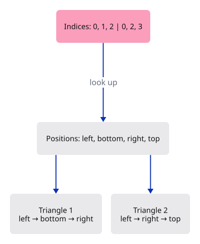
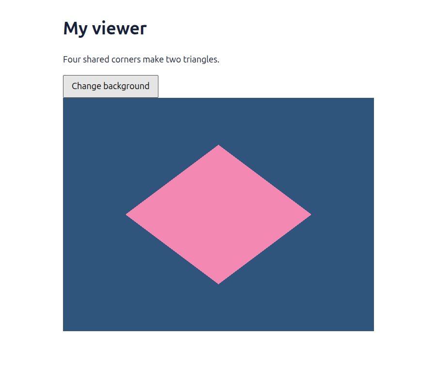

# 06 · Share a corner between triangles

**Combined study estimate: 1–2 hours.** Includes reading, typing, reasoning and experiments.

**Typing estimate: 8–15 minutes.** 14 added or changed lines; unchanged context is excluded. [How this is estimated](typing-load.md).

**Today:** Draw a diamond from four positions and six small index numbers.

**Follow:** Six indices → four shared positions → vertex shader → two joined triangles.

Imagine numbering the corners of a paper diamond. To name its bottom triangle, say “0, 1, 2”. To name its top triangle, say “0, 2, 3”. The numbers tell us how to connect corners; they do not contain coordinates themselves.

That is an **index buffer**. The position buffer answers “where is corner 2?” The index buffer answers “which corners make this triangle?” Changing one shared position now changes both triangles consistently.



We use `u16`, an unsigned 16-bit integer, for these four indices. The draw call must read the buffer as `Uint16`. Each index takes two bytes; each position still takes eight. Larger meshes may need `u32` indices, but the idea is unchanged.

In `draw_indexed`, the first range chooses index entries. The middle argument, zero, is added to each index before looking up a vertex; later a shared buffer can use that base to locate another mesh. The last range still draws one instance.

The shader does not need an “indexed” version. It receives a position in exactly the same layout as before. We change the Rust resources and draw command that supply those positions.

## Type the change

Continue from [Let Rust supply the corners](05-vertices.md). Save your own work first: `npm --prefix ../session_tests run course -- save before-06-indices` (from `session_viewer`).

### 1. `src/renderer.rs`

Replace the positions and add their connections. The diamond makes the four distinct corners easy to identify.

Find this exact block:

```rust
use wgpu::util::DeviceExt;

const POSITIONS: [[f32; 2]; 6] = [
    [-0.6, -0.5], [0.6, -0.5], [0.6, 0.6],
    [-0.6, -0.5], [0.6, 0.6], [-0.6, 0.6],
];

pub struct Renderer {
    pub device: wgpu::Device,
    pub queue: wgpu::Queue,
    pipeline: wgpu::RenderPipeline,
    vertices: wgpu::Buffer,
}

impl Renderer {
```

Replace that block with:

```rust
--8<-- "journey/code/06-indices-fullscreen-2.rs"
```

### 2. `src/renderer.rs`

Replace the positions and add their connections. The diamond makes the four distinct corners easy to identify.

Find this exact block:

```rust
            contents: &bytes,
            usage: wgpu::BufferUsages::VERTEX,
        });
        let shader = device.create_shader_module(wgpu::ShaderModuleDescriptor {
            label: Some("triangle"),
            source: wgpu::ShaderSource::Wgsl(include_str!("triangle.wgsl").into()),
```

Replace that block with:

```rust
--8<-- "journey/code/06-indices-fullscreen-3.rs"
```

### 3. `src/renderer.rs`

Replace the positions and add their connections. The diamond makes the four distinct corners easy to identify.

Find this exact block:

```rust
            multiview_mask: None,
            cache: None,
        });
        Self { device, queue, pipeline, vertices }
    }

    pub fn draw(&self, view: &wgpu::TextureView, background: &crate::background::Background) {
```

Replace that block with:

```rust
--8<-- "journey/code/06-indices-fullscreen-4.rs"
```

### 4. `src/renderer.rs`

Replace the positions and add their connections. The diamond makes the four distinct corners easy to identify.

Find this exact block:

```rust
            });
            pass.set_pipeline(&self.pipeline);
            pass.set_vertex_buffer(0, self.vertices.slice(..));
            pass.draw(0..POSITIONS.len() as u32, 0..1);
        }
        self.queue.submit([encoder.finish()]);
    }
```

Replace that block with:

```rust
--8<-- "journey/code/06-indices-fullscreen-5.rs"
```

### 5. `src/browser.rs`

Connect share a corner between triangles to the typed command path. Keep the scene state in its existing owner and redraw the dock after applying an action.

Find this exact block:

```rust
    )?;
    // The page has one listener for its lifetime; JavaScript must retain the Rust callback.
    click.forget();
    report("Six uploaded corners make one rectangle.");
    Ok(())
}
```

Replace that block with:

```rust
--8<-- "journey/code/06-indices-window-1.rs"
```

## Run and look

From `session_viewer`, enter your project folder:

```sh
cd workspace/journey
cargo build --lib --locked --target wasm32-unknown-unknown -j4
CARGO_BUILD_JOBS=4 trunk serve --port 8780
```

Open `http://127.0.0.1:8780/`. If Trunk is already running in this project, leave it running; it rebuilds when you save.

A diamond is drawn from four vertices. Follow the six indices into those vertices: they must describe two triangles that share the middle edge.

**Verified checkpoint in Chrome.**



[What this screenshot checks](release.md).

<details>
<summary>Optional experiment</summary>

Move position 0 from [-0.6, 0.0] to [-0.9, 0.0]. Predict which triangles change. Both should move their left corner together, leaving no crack. Then restore the coordinate and temporarily draw only 0..3 indices: only the lower triangle should remain. Restore 0..6 before comparing.

</details>

## Explain the change

Why do we draw six indices when there are only four positions?

<details>
<summary>Compare your explanation</summary>

Each triangle needs three corner references. The first triangle reads positions 0, 1 and 2; the second reads 0, 2 and 3. Positions 0 and 2 are shared. Six index entries describe two triangles while only four coordinate pairs are stored.

</details>

## Keep your working result

Return to `session_viewer` in a second terminal. Restore experimental edits before comparing:

```sh
npm --prefix ../session_tests run course -- check 06-indices
npm --prefix ../session_tests run course -- save 06-indices
```

Check compares your typed source; run the focused check above for behavior. [Recover your work](recovery.md).

<details>
<summary>Where this fits in the finished viewer</summary>

Mesh topology uses indices to share vertices. The production mesh lane uses the same distinction between a vertex range and an index range; its shared allocations add offsets without changing what an index means.

</details>
